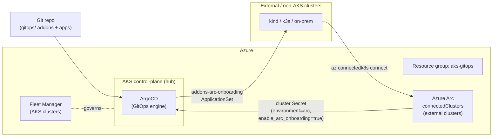

# Azure Arc-enabled Kubernetes (Phase 2)

This guide explains how to onboard **external / non-AKS** Kubernetes clusters to
**Azure Arc** and manage them as first-class clusters from the existing
**control-plane ArgoCD**, reusing the GitOps Bridge pattern already in this repo.

## Boundary rule

> **Azure Arc is for non-AKS / external clusters only** — on-prem, edge, kind/k3s,
> other clouds. **AKS clusters are governed by Azure Kubernetes Fleet Manager**
> (see `terraform/arc-fleet.tf`). Do **not** Arc-connect the AKS control-plane hub.

| Cluster type                         | Managed by                       |
| ------------------------------------ | -------------------------------- |
| AKS (hub + AKS workload clusters)    | Azure Kubernetes Fleet Manager   |
| External / non-AKS (on-prem, kind …) | Azure Arc-enabled Kubernetes     |
| GitOps for **all** of the above      | Control-plane ArgoCD (this repo) |

## Architecture



## How the integration works

1. **Terraform (`terraform/arc-onboarding.tf`)** grants the `akspe` workload identity
   the RBAC needed to onboard and use Arc clusters (resource-group scoped):
   - *Kubernetes Cluster - Azure Arc Onboarding*
   - *Azure Arc Enabled Kubernetes Cluster User Role*

   It also emits a consolidated `arc_onboarding` output that the onboarding script
   consumes. It does **not** run `az connectedk8s connect` (that needs the target
   cluster kubeconfig + an agent Helm install, so it is script-driven).

   Resource-provider registration (`Microsoft.Kubernetes`,
   `Microsoft.KubernetesConfiguration`, `Microsoft.ExtendedLocation`,
   `Microsoft.PolicyInsights`) is handled in `terraform/arc-fleet.tf`, gated behind
   `var.register_providers`.

2. **Onboarding script (`scripts/arc-onboard.{ps1,sh}`)** is idempotent and:
   - onboards the target cluster with `az connectedk8s connect`,
   - enables the **cluster-connect** feature,
   - creates a `cluster-admin` ServiceAccount + token in the target cluster,
   - renders an **ArgoCD cluster Secret** and applies it to the control-plane
     `argocd` namespace.

   The Secret carries labels (`environment: arc`, `enable_arc_onboarding: "true"`)
   and annotations (`addons_repo_*`, Azure IDs) — exactly the contract the
   ApplicationSets expect.

3. **GitOps selection.** Two changes wire Arc clusters into ArgoCD:
   - `terraform/bootstrap/addons.yaml` (the broad `cluster-addons` sweep) now
     **excludes** `environment: arc`, so external clusters do **not** receive the
     full hub addon stack.
   - `gitops/bootstrap/control-plane/addons/azure/addons-arc-onboarding-appset.yaml`
     selects clusters labelled `enable_arc_onboarding=true` and deploys a curated
     **baseline** (`gitops/apps/arc-demo`, a small podinfo workload) to prove sync.

## Prerequisites

- An external Kubernetes cluster and a kubeconfig context that can reach it.
- Azure CLI (`az`) with the `connectedk8s` extension, `kubectl`, and (for the bash
  script) `jq`.
- Terraform applied so the `arc_onboarding` output and RBAC exist.
- `az login` with rights to create `Microsoft.Kubernetes/connectedClusters` in the
  `aks-gitops` resource group.

## Declare your external clusters

Add each external cluster to `var.arc_external_clusters` (a `map(string)` keyed by
logical cluster name; the value is an **optional Azure region override** — empty uses
`var.location`):

```hcl
# terraform.tfvars
register_providers  = true
arc_external_clusters = {
  "arc-demo"   = ""         # use var.location
  "edge-site1" = "westus2"  # region override
}
```

Then:

```bash
cd terraform
terraform apply
terraform output -json arc_onboarding   # what the onboarding script reads
```

## Onboard a cluster

PowerShell:

```powershell
./scripts/arc-onboard.ps1 -ClusterName arc-demo -KubeContext <target-context> `
    -ControlPlaneContext <aks-hub-context>
```

Bash:

```bash
./scripts/arc-onboard.sh --cluster-name arc-demo --kube-context <target-context> \
    --control-plane-context <aks-hub-context>
```

Omit the control-plane context to have the script only render the cluster Secret to
`scripts/.arc-out/` (apply it yourself). **The rendered Secret contains a bearer
token — never commit it.** `scripts/.gitignore` already excludes `.arc-out/`.

After registration, ArgoCD's `addons-arc-onboarding` ApplicationSet syncs the
baseline into the cluster's `arc-demo` namespace.

## Local kind demo

To exercise the wiring on your workstation without an Azure subscription:

```powershell
./scripts/arc-demo-kind.ps1            # creates kind cluster 'arc-demo'
```

The script installs `kind`/`kubectl`/`az` via winget, creates the cluster, and prints
the exact `az login` + `arc-onboard` commands. It **stops before `az login`** so it
never touches Azure without your consent.

**Reachability:** a kind cluster is reachable from your workstation but **not** from
the AKS-hosted ArgoCD when its API server is registered as `https://127.0.0.1:<port>`.
In AKS, `127.0.0.1` points to the ArgoCD pod, not your laptop. The local demo proves
the onboarding + registration wiring, but not remote sync from AKS-hosted ArgoCD.

## Azure VM-hosted kind demo (private API reachable from AKS)

For an end-to-end ArgoCD sync demo, run kind on a private Azure VM in the same VNet
as the AKS control plane. The kind API binds to the VM private IP on TCP `6443`,
and the VM NIC NSG allows only VNet traffic to that port. No public Kubernetes API
or broad SSH exposure is required.

```hcl
# terraform.tfvars or a temporary tfvars file
enable_arc_kind_vm = true
arc_external_clusters = {
  "arc-demo-vm" = ""
}
```

Apply Terraform, then bootstrap/onboard the VM-hosted kind cluster:

```powershell
cd terraform
terraform apply -var-file=tfvars -var-file=<your-arc-kind-vm-overrides.tfvars>

cd ..
./scripts/arc-kind-vm-onboard.ps1 -ClusterName arc-demo-vm -ControlPlaneContext gitops-aks
```

The script uses Azure VM Run Command to:

1. Install Docker, Azure CLI, kubectl, Helm, and kind on the VM.
2. Create `arc-demo-vm` with `apiServerAddress=<vm-private-ip>` and
   `apiServerPort=6443`.
3. Set the kind control-plane container restart policy to `unless-stopped`.
4. Run `az login --identity` on the VM and Arc-connect the cluster.
5. Create the ArgoCD service-account token and register an ArgoCD cluster Secret
   using `https://<vm-private-ip>:6443`.
6. Test AKS-to-kind API reachability from an AKS pod.

After registration, ArgoCD should create `arc-baseline-arc-demo-vm` and sync the
baseline into the VM-hosted kind cluster.

**Persistence caveat:** the VM and Docker state persist, and the kind node container
is configured to restart after VM reboot. This is still a demo cluster, not a
production-grade external Kubernetes platform. For a more durable non-AKS demo,
consider k3s on the VM.

## Teardown

```bash
# Remove the Arc registration
az connectedk8s delete --name arc-demo --resource-group aks-gitops

# Remove the ArgoCD cluster registration
kubectl --context <aks-hub-context> -n argocd delete secret arc-demo

# Delete the local demo cluster
kind delete cluster --name arc-demo

# Remove the VM-hosted kind Arc registration and ArgoCD registration
az connectedk8s delete --name arc-demo-vm --resource-group aks-gitops
kubectl --context <aks-hub-context> -n argocd delete secret arc-demo-vm

# Remove the Azure VM demo resources
terraform apply -var-file=tfvars -var 'enable_arc_kind_vm=false'
```

## Files

| Path                                                                          | Purpose                                            |
| ----------------------------------------------------------------------------- | -------------------------------------------------- |
| `terraform/arc-onboarding.tf`                                                 | Arc RBAC + `arc_onboarding` output                 |
| `terraform/arc-fleet.tf`                                                       | Fleet hub + provider registration (Phase 1)        |
| `terraform/bootstrap/addons.yaml`                                             | Broad sweep, now excludes `environment: arc`       |
| `gitops/clusters/arc/`                                                         | Cluster Secret template + README                   |
| `gitops/bootstrap/control-plane/addons/azure/addons-arc-onboarding-appset.yaml` | Arc baseline ApplicationSet                      |
| `gitops/apps/arc-demo/`                                                        | Sample workload synced to Arc clusters             |
| `scripts/arc-onboard.{ps1,sh}`                                                 | Idempotent onboarding + ArgoCD registration        |
| `scripts/arc-demo-kind.ps1`                                                    | Local kind demo up to the `az login` boundary      |
| `terraform/arc-kind-vm.tf`                                                     | Optional private Azure VM for reachable kind demo  |
| `scripts/arc-kind-vm-onboard.ps1`                                              | VM Run Command bootstrap + Arc/ArgoCD registration |
