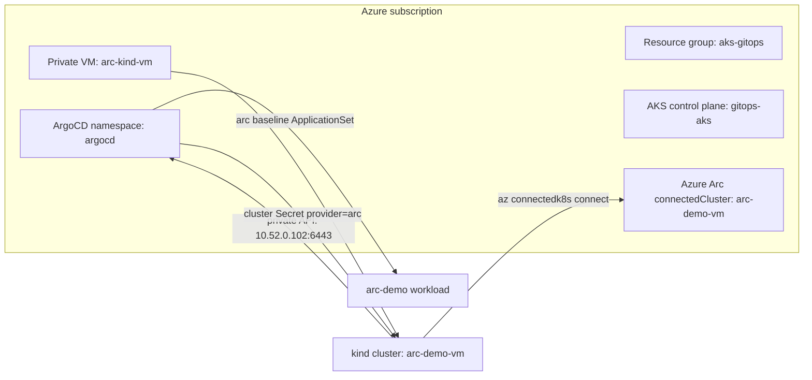

# Runbook: Arc-enabled Kubernetes onboarding

This runbook describes how to onboard a non-AKS Kubernetes cluster to Azure Arc
and register it with the AKS-hosted control-plane ArgoCD in this repository.

Use this runbook for external Kubernetes clusters such as kind, k3s, on-premises,
edge, or other-cloud clusters. Do not use Azure Arc for AKS clusters in this
demo; AKS clusters are governed through Azure Kubernetes Fleet Manager.

## Current verified demo state

The current environment has a VM-hosted kind cluster onboarded to Arc:

| Item | Value |
| --- | --- |
| Resource group | `aks-gitops` |
| Control-plane AKS context | `gitops-aks` |
| VM name | `arc-kind-vm` |
| VM subnet | `vnet1/subnets/aks` |
| VM private IP | `10.52.0.102` |
| Arc cluster name | `arc-demo-vm` |
| kind API endpoint | `https://10.52.0.102:6443` |
| ArgoCD baseline app | `arc-baseline-arc-demo-vm` |

Verified results:

- Azure VM is running.
- Azure Arc connected cluster is `Succeeded` and `Connected`.
- Control-plane AKS can reach the kind API over the private VNet.
- ArgoCD cluster Secret `arc-demo-vm` exists in namespace `argocd`.
- ArgoCD Application `arc-baseline-arc-demo-vm` is `Synced` and `Healthy`.
- Baseline workload is running in namespace `arc-demo` on the VM-hosted kind
  cluster.

## Architecture



## Boundary rule

| Cluster type | Governance path |
| --- | --- |
| AKS control-plane and AKS workload clusters | Azure Kubernetes Fleet Manager |
| Non-AKS clusters such as kind, k3s, on-premises, edge, other clouds | Azure Arc-enabled Kubernetes |
| GitOps for both | Control-plane ArgoCD |

## Important files

| File | Purpose |
| --- | --- |
| `terraform/arc-onboarding.tf` | Arc RBAC and `arc_onboarding` Terraform output |
| `terraform/arc-kind-vm.tf` | Optional private Azure VM that hosts the kind demo |
| `terraform/arc-fleet.tf` | Fleet Manager and Arc provider registration |
| `scripts/arc-kind-vm-onboard.ps1` | Bootstraps VM-hosted kind, connects Arc, registers ArgoCD |
| `scripts/arc-onboard.ps1` | Onboards an existing external Kubernetes cluster |
| `scripts/arc-onboard.sh` | Bash equivalent for existing external clusters |
| `gitops/bootstrap/control-plane/addons/azure/addons-arc-onboarding-appset.yaml` | Selects Arc cluster Secrets and deploys baseline |
| `gitops/apps/arc-demo/` | Baseline workload used to validate Arc GitOps |
| `docs/arc-k8s-onboarding-runbook.md` | Arc onboarding operating runbook |

## Prerequisites

From the workstation:

```powershell
az account show -o table
kubectl config get-contexts
terraform -chdir=terraform version
```

Required tools:

- Azure CLI authenticated to the target subscription.
- `kubectl`.
- Terraform.
- Azure CLI extension `connectedk8s`.

Install or update the Arc extension if needed:

```powershell
az extension add --name connectedk8s --upgrade --only-show-errors
```

Confirm resource providers are registered:

```powershell
az provider show -n Microsoft.Kubernetes --query registrationState -o tsv
az provider show -n Microsoft.KubernetesConfiguration --query registrationState -o tsv
az provider show -n Microsoft.ExtendedLocation --query registrationState -o tsv
```

Expected output for each provider:

```text
Registered
```

Refresh the management AKS kubeconfig:

```powershell
az aks get-credentials -g aks-gitops -n gitops-aks --overwrite-existing
kubectl --context gitops-aks get nodes
kubectl --context gitops-aks -n argocd get pods
```

## Procedure A: Onboard the private VM-hosted kind demo

Use this flow for an end-to-end demo where the AKS-hosted ArgoCD can reach the
external Kubernetes API over the private `aks-gitops` VNet.

### 1. Enable the Arc kind VM in Terraform

Create a local ignored file at `terraform/arc-demo.auto.tfvars`:

```hcl
enable_arc_kind_vm = true

arc_external_clusters = {
  arc-demo-vm = ""
}
```

The repository `.gitignore` excludes `*.tfvars`, so this file stays local. Do
not put secrets in it.

### 2. Apply Terraform

Use the same variables used for the current environment:

```powershell
terraform -chdir=terraform apply `
  -var build_backstage=true `
  -var location=eastus2 `
  -var postgres_location=westus3 `
  -var gitops_addons_org=https://github.com/zhangchl007 `
  -var gitops_addons_revision=zhangchl007-azure-arc-onboarding
```

Expected Terraform output includes:

```text
arc_kind_vm = {
  api_server   = "https://<vm-private-ip>:6443"
  cluster_name = "arc-demo-vm"
  private_ip   = "<vm-private-ip>"
  vm_name      = "arc-kind-vm"
}
```

For the current environment, the private IP is `10.52.0.102`.

### 3. Confirm the VM uses the AKS subnet

```powershell
az network nic show `
  -g aks-gitops `
  -n arc-kind-vm-nic `
  --query "{privateIp:ipConfigurations[0].privateIPAddress,subnet:ipConfigurations[0].subnet.id}" `
  -o json
```

Expected:

- `privateIp` is in the AKS VNet range.
- `subnet` ends with `/virtualNetworks/vnet1/subnets/aks`.

### 4. Run the VM-hosted kind onboarding script

```powershell
powershell.exe -ExecutionPolicy Bypass `
  -File .\scripts\arc-kind-vm-onboard.ps1 `
  -ClusterName arc-demo-vm `
  -ControlPlaneContext gitops-aks `
  -ResourceGroup aks-gitops `
  -VmName arc-kind-vm
```

The script performs these operations:

1. Reads Terraform outputs `arc_onboarding` and `arc_kind_vm`.
2. Uses Azure VM Run Command against `arc-kind-vm`.
3. Installs Docker, Azure CLI, `kubectl`, Helm, and kind on the VM.
4. Creates a kind cluster named `arc-demo-vm`.
5. Binds the kind API to the VM private IP on TCP `6443`.
6. Logs in on the VM using the VM system-assigned managed identity.
7. Runs `az connectedk8s connect`.
8. Enables the `cluster-connect` feature.
9. Creates an `argocd-manager` service account in the target cluster.
10. Applies an ArgoCD cluster Secret in the management cluster namespace
    `argocd`.
11. Tests API reachability from AKS to the private kind API endpoint.

The script writes the generated ArgoCD cluster Secret under
`scripts/.arc-out/`. That file contains a bearer token and must not be committed.
The folder is ignored by `scripts/.gitignore`.

## Procedure B: Onboard an existing external Kubernetes cluster

Use this flow when the cluster already exists, for example k3s, on-premises, or
another-cloud Kubernetes.

### 1. Declare the external cluster in Terraform

Add the cluster name to local Terraform variables:

```hcl
arc_external_clusters = {
  edge-site1 = "eastus2"
}
```

The map key is the logical Arc and ArgoCD cluster name. The value is an optional
Azure region override. Use an empty string to default to `var.location`.

Apply Terraform:

```powershell
terraform -chdir=terraform apply `
  -var build_backstage=true `
  -var location=eastus2 `
  -var postgres_location=westus3 `
  -var gitops_addons_org=https://github.com/zhangchl007 `
  -var gitops_addons_revision=zhangchl007-azure-arc-onboarding
```

### 2. Verify target kubeconfig context

```powershell
kubectl config get-contexts
kubectl --context <target-context> get nodes
```

### 3. Run the generic onboarding script

```powershell
powershell.exe -ExecutionPolicy Bypass `
  -File .\scripts\arc-onboard.ps1 `
  -ClusterName edge-site1 `
  -KubeContext <target-context> `
  -ControlPlaneContext gitops-aks
```

If you omit `-ControlPlaneContext`, the script only renders the ArgoCD cluster
Secret to `scripts/.arc-out/`; apply it yourself later.

## Validation checklist

### Azure Arc

```powershell
az connectedk8s show `
  -g aks-gitops `
  -n arc-demo-vm `
  --query "{name:name,provisioningState:provisioningState,connectivityStatus:connectivityStatus,kubernetesVersion:kubernetesVersion,totalNodeCount:totalNodeCount}" `
  -o table
```

Expected:

```text
Name         ProvisioningState    ConnectivityStatus    KubernetesVersion    TotalNodeCount
-----------  -------------------  --------------------  -------------------  ----------------
arc-demo-vm  Succeeded            Connected             1.31.0               1
```

### ArgoCD cluster registration

```powershell
kubectl --context gitops-aks -n argocd get secret arc-demo-vm
kubectl --context gitops-aks -n argocd get secret arc-demo-vm -o jsonpath='{.metadata.labels}'
```

Expected labels include:

```json
{"argocd.argoproj.io/secret-type":"cluster","enable_arc_onboarding":"true","environment":"arc","provider":"arc"}
```

### ArgoCD baseline sync

```powershell
kubectl --context gitops-aks -n argocd get application arc-baseline-arc-demo-vm `
  -o custom-columns=NAME:.metadata.name,SYNC:.status.sync.status,HEALTH:.status.health.status,DEST:.spec.destination.name
```

Expected:

```text
NAME                       SYNC     HEALTH    DEST
arc-baseline-arc-demo-vm   Synced   Healthy   arc-demo-vm
```

### AKS-to-kind API reachability

```powershell
kubectl --context gitops-aks -n argocd run arc-kind-vm-netcheck `
  --rm -i `
  --restart=Never `
  --image=curlimages/curl:8.11.1 `
  --command -- sh -c "curl -k -sS --connect-timeout 5 -m 10 https://10.52.0.102:6443/version"
```

Expected output contains Kubernetes version JSON.

### Workload running in the VM-hosted kind cluster

Use VM Run Command:

```powershell
$script = @'
export KUBECONFIG=/root/.kube/config
kubectl --context kind-arc-demo-vm get nodes -o wide
kubectl --context kind-arc-demo-vm get ns arc-demo --ignore-not-found
kubectl --context kind-arc-demo-vm get all -n arc-demo
'@

az vm run-command invoke `
  -g aks-gitops `
  -n arc-kind-vm `
  --command-id RunShellScript `
  --scripts $script `
  --query "value[0].message" `
  -o tsv
```

Expected:

- Node `arc-demo-vm-control-plane` is `Ready`.
- Namespace `arc-demo` exists.
- Deployment `arc-demo` is available.
- Pod is `Running`.

## Troubleshooting

### Arc connected cluster is not `Connected`

Check:

```powershell
az connectedk8s show -g aks-gitops -n arc-demo-vm -o json
```

Then inspect the VM-hosted kind cluster:

```powershell
$script = @'
export KUBECONFIG=/root/.kube/config
kubectl --context kind-arc-demo-vm get pods -A
kubectl --context kind-arc-demo-vm get nodes -o wide
'@

az vm run-command invoke -g aks-gitops -n arc-kind-vm --command-id RunShellScript --scripts $script
```

Common causes:

- VM managed identity does not have the Arc onboarding roles.
- `connectedk8s` extension is missing or outdated on the VM.
- Arc agent pods are not running.
- The target cluster was recreated but the old Arc resource still exists.

### ArgoCD Application is missing

Check the cluster Secret:

```powershell
kubectl --context gitops-aks -n argocd get secret arc-demo-vm -o yaml
```

Required labels:

```yaml
argocd.argoproj.io/secret-type: cluster
environment: arc
enable_arc_onboarding: "true"
provider: arc
```

Check the ApplicationSet:

```powershell
kubectl --context gitops-aks -n argocd get applicationset addons-arc-onboarding
kubectl --context gitops-aks -n argocd describe applicationset addons-arc-onboarding
```

### ArgoCD Application is unhealthy or cannot connect

Check AKS-to-kind private API reachability:

```powershell
kubectl --context gitops-aks -n argocd run arc-kind-vm-netcheck `
  --rm -i `
  --restart=Never `
  --image=curlimages/curl:8.11.1 `
  --command -- sh -c "curl -k -sS --connect-timeout 5 -m 10 https://10.52.0.102:6443/version"
```

If it fails, check:

- VM NIC is in `vnet1/subnets/aks`.
- `arc-kind-vm-nsg` allows inbound TCP `6443` from the AKS VNet CIDR.
- kind API server is bound to the VM private IP.
- Docker and the kind control-plane container are running.

VM checks:

```powershell
$script = @'
docker ps
ss -lntp | grep 6443 || true
export KUBECONFIG=/root/.kube/config
kubectl --context kind-arc-demo-vm get nodes
'@

az vm run-command invoke -g aks-gitops -n arc-kind-vm --command-id RunShellScript --scripts $script
```

### `kubectl apply` fails with OpenAPI or DNS errors

Symptom:

```text
failed to download openapi
lookup <old-aks-api-endpoint>: no such host
```

Fix:

```powershell
az aks get-credentials -g aks-gitops -n gitops-aks --overwrite-existing
kubectl --context gitops-aks get nodes
kubectl --context gitops-aks apply --validate=false -f .\scripts\.arc-out\cluster-secret-arc-demo-vm.json
```

The onboarding script now uses `--validate=false` when applying the generated
cluster Secret.

### Do not expose generated tokens

The generated file under `scripts/.arc-out/` contains an ArgoCD bearer token for
the target cluster. Do not paste it into chat, do not commit it, and do not store
it in Terraform state.

Verify it is ignored:

```powershell
git check-ignore -v scripts\.arc-out\cluster-secret-arc-demo-vm.json
```

## Re-run behavior

The onboarding scripts are intended to be idempotent:

- If the VM exists, Terraform leaves it in place.
- If the kind cluster exists, the VM bootstrap step reuses it.
- If the Arc connected cluster exists, `az connectedk8s connect` is skipped.
- The ArgoCD cluster Secret is reapplied.
- The AKS-to-kind reachability test is rerun.

## Teardown

Remove the ArgoCD cluster registration:

```powershell
kubectl --context gitops-aks -n argocd delete secret arc-demo-vm --ignore-not-found
```

Remove the Arc connected cluster:

```powershell
az connectedk8s delete `
  -g aks-gitops `
  -n arc-demo-vm `
  --yes
```

Disable the VM-hosted kind demo in local Terraform variables:

```hcl
enable_arc_kind_vm = false

arc_external_clusters = {}
```

Apply Terraform:

```powershell
terraform -chdir=terraform apply `
  -var build_backstage=true `
  -var location=eastus2 `
  -var postgres_location=westus3 `
  -var gitops_addons_org=https://github.com/zhangchl007 `
  -var gitops_addons_revision=zhangchl007-azure-arc-onboarding
```

Clean generated local artifacts:

```powershell
Remove-Item .\scripts\.arc-out\cluster-secret-arc-demo-vm.json -Force -ErrorAction SilentlyContinue
```

## Quick command summary

```powershell
# Refresh management cluster access
az aks get-credentials -g aks-gitops -n gitops-aks --overwrite-existing

# Create or update Arc VM infrastructure
terraform -chdir=terraform apply `
  -var build_backstage=true `
  -var location=eastus2 `
  -var postgres_location=westus3 `
  -var gitops_addons_org=https://github.com/zhangchl007 `
  -var gitops_addons_revision=zhangchl007-azure-arc-onboarding

# Bootstrap VM-hosted kind, Arc-connect, and register ArgoCD
powershell.exe -ExecutionPolicy Bypass `
  -File .\scripts\arc-kind-vm-onboard.ps1 `
  -ClusterName arc-demo-vm `
  -ControlPlaneContext gitops-aks `
  -ResourceGroup aks-gitops `
  -VmName arc-kind-vm

# Validate Arc
az connectedk8s show -g aks-gitops -n arc-demo-vm -o table

# Validate ArgoCD
kubectl --context gitops-aks -n argocd get application arc-baseline-arc-demo-vm
```
