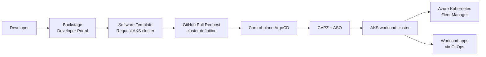

# Demo: Backstage developer portal for AKS platform engineering

This demo shows how Backstage becomes the self-service front door for the
`aks-platform-engineering` platform. Developers request a new AKS workload
cluster from a Backstage Software Template, and the platform team keeps control
through GitOps review, ArgoCD, CAPZ, and Fleet Manager.

## What the customer will see

1. Backstage provides one developer portal for platform documentation, catalog
   entities, and golden-path templates.
2. A developer opens the **Request AKS Workload Cluster** Software Template.
3. The template generates a GitOps pull request that adds a CAPZ cluster
   definition.
4. The platform team reviews and merges the pull request.
5. Control-plane ArgoCD syncs the cluster definition.
6. CAPZ provisions the AKS workload cluster.
7. The platform team joins the cluster to Azure Kubernetes Fleet Manager and can
   register it as a central ArgoCD target.



## Demo prerequisites

- Backstage is deployed or available for UI walkthrough.
- Backstage has GitHub integration configured with a token that can create pull
  requests in the GitOps repository.
- Backstage catalog includes the template location:

```yaml
catalog:
  locations:
    - type: file
      target: ./template-cluster/template.yaml
      rules:
        - allow: [Template]
```

- The control-plane AKS cluster and ArgoCD are running.
- The GitOps repo branch watched by ArgoCD includes the current CAPZ cluster
  definition flow.
- Fleet Manager exists as `gitops-fleet` in resource group `aks-gitops`.

## Demo assets in this repository

| Asset | Purpose |
| --- | --- |
| `backstage/packages/template-cluster/template.yaml` | Backstage Software Template shown to developers |
| `backstage/packages/template-cluster/content/gitops/clusters/capz/cluster-definitions/template.yaml` | Cluster definition file rendered by the template |
| `gitops/clusters/capz/aks-appset.yaml` | ArgoCD ApplicationSet that turns cluster-definition files into CAPZ applications |
| `gitops/clusters/capz/cluster-definitions/customer-demo.yaml` | Example workload cluster definition |
| `docs/create-aks-cluster-argocd-fleet-demo.md` | AKS/Fleet runbook used after the Backstage PR is merged |

## Demo flow

### 1. Open Backstage and explain the developer portal role

Talking point:

> Backstage gives developers a single portal for documentation, service catalog
> entries, ownership, and paved-road automation. It does not replace GitOps; it
> makes GitOps easier and safer to consume.

Show:

- **Catalog** for platform/service discovery.
- **Docs** for onboarding guidance.
- **Create** for Software Templates.

### 2. Show the AKS workload cluster template

Open **Create** and select:

```text
Request AKS Workload Cluster
```

The template collects the fields needed to create a GitOps cluster definition:

| Field | Demo value |
| --- | --- |
| Cluster name | `aks-customer-demo` |
| Resource group | `aks-customer-demo` |
| Region | `westus3` |
| Kubernetes version | `v1.33.12` |
| System node pool | `sys` |
| Node SKU | `Standard_D4s_v5` |
| Node count | `1` |
| Fleet member | `aks-customer-demo-fleet-member` |
| Fleet group | `customer-demo` |

The ApplicationSet sets the system pool OS disk type to `Managed`, which is
required for this demo SKU in `westus3`.

### 3. Run the template and create a GitOps pull request

Use the GitOps repository picker value for this repo:

```text
github.com?owner=zhangchl007&repo=aks-platform-engineering
```

Expected output:

- Backstage creates a pull request.
- The pull request adds a file similar to:

```text
gitops/clusters/capz/cluster-definitions/aks-customer-demo.yaml
```

The generated file follows this shape:

```yaml
workloadClusterName: aks-customer-demo
resourceGroupName: aks-customer-demo
location: westus3
kubernetesVersion: v1.33.12
agentSku: Standard_D4s_v5
agentCount: 1
systemPoolName: sys
fleetMemberName: aks-customer-demo-fleet-member
fleetGroup: customer-demo
sshPublicKey: ''
```

Talking point:

> Developers do not need direct Azure permissions. The template produces a
> reviewable Git change, and the platform team keeps policy and approval in the
> pull request workflow.

### 4. Merge the pull request and let ArgoCD reconcile

After review, merge the pull request. Then check the control-plane ArgoCD
cluster:

```powershell
kubectl --context gitops-aks -n argocd get applications
kubectl --context gitops-aks -n workload get cluster,azuremanagedcontrolplane,azuremanagedcluster,machinepool,azuremanagedmachinepool
```

Expected result:

- ArgoCD creates or updates the workload cluster application.
- CAPZ creates the `Cluster`, `AzureManagedControlPlane`,
  `AzureManagedCluster`, and `MachinePool`.
- Azure starts provisioning the AKS workload cluster.

### 5. Verify AKS and node pool settings

```powershell
az aks show `
  -g aks-customer-demo `
  -n aks-customer-demo `
  --query "{name:name,provisioningState:provisioningState,powerState:powerState.code,kubernetesVersion:kubernetesVersion}" `
  -o table

az aks nodepool show `
  -g aks-customer-demo `
  --cluster-name aks-customer-demo `
  -n sys `
  --query "{name:name,vmSize:vmSize,osDiskType:osDiskType,count:count,provisioningState:provisioningState,mode:mode}" `
  -o table
```

Expected values:

| Check | Expected |
| --- | --- |
| AKS provisioning state | `Succeeded` |
| AKS power state | `Running` |
| Kubernetes version | `1.33.12` |
| Node pool VM size | `Standard_D4s_v5` |
| Node pool OS disk type | `Managed` |
| Node pool mode | `System` |

### 6. Join the workload cluster to Fleet Manager

For this demo, Fleet membership is created after AKS is ready. This avoids
depending on the older Fleet member API used by the installed CAPZ release.

```powershell
$aksId = az aks show `
  -g aks-customer-demo `
  -n aks-customer-demo `
  --query id `
  -o tsv

az fleet member create `
  -g aks-gitops `
  --fleet-name gitops-fleet `
  -n aks-customer-demo-fleet-member `
  --update-group customer-demo `
  --member-cluster-id $aksId

az fleet member list `
  -g aks-gitops `
  --fleet-name gitops-fleet `
  -o table
```

Expected result:

```text
Name                            Group          ProvisioningState
------------------------------  -------------  -------------------
aks-customer-demo-fleet-member  customer-demo  Succeeded
```

### 7. Optional: register the workload cluster in central ArgoCD

If the customer wants the control-plane ArgoCD to target the workload cluster
directly, use:

```powershell
./scripts/register-aks-workload-cluster.ps1 `
  -ClusterName aks-customer-demo `
  -ResourceGroupName aks-customer-demo `
  -ControlPlaneContext gitops-aks
```

Verify:

```powershell
kubectl --context gitops-aks -n argocd get secret aks-customer-demo --show-labels
```

Expected labels:

```text
argocd.argoproj.io/secret-type=cluster,environment=workload,provider=aks
```

## Presenter talking points

- **Backstage is the portal, Git is the API**: developers submit structured
  requests; platform automation reconciles desired state.
- **Templates encode platform standards**: Kubernetes version, node SKU, node
  pool name, Fleet group, and repository paths are controlled by the platform
  team.
- **GitOps keeps auditability**: every cluster request becomes a pull request.
- **ArgoCD/CAPZ keep operations declarative**: cluster creation is reconciled
  from versioned manifests.
- **Fleet Manager is the multi-cluster AKS control plane**: AKS clusters join
  Fleet for grouping and update orchestration.

## Troubleshooting

### Template does not appear in Backstage

Check that `app-config.yaml` includes the template location:

```yaml
- type: file
  target: ./template-cluster/template.yaml
  rules:
    - allow: [Template]
```

If using a custom Backstage image, rebuild the image after changing
`backstage/packages/template-cluster`.

### Pull request creation fails

Common causes:

- GitHub token is missing repository contents or pull request permissions.
- The repository picker points to a repo Backstage cannot access.
- Branch protection blocks the template branch name.

### ArgoCD does not create the workload application

Check:

```powershell
kubectl --context gitops-aks -n argocd get applicationset aks-workload-clusters -o yaml
kubectl --context gitops-aks -n argocd get application aks-customer-demo -o yaml
```

Common causes:

- ArgoCD is watching a different branch than the merged pull request.
- The generated file is not under `gitops/clusters/capz/cluster-definitions/`.
- YAML fields do not match what `aks-appset.yaml` expects.

### Fleet membership fails

Check AKS state before rerunning Fleet join:

```powershell
az aks show -g aks-customer-demo -n aks-customer-demo --query provisioningState -o tsv
```

If the state is `Updating`, wait for `Succeeded` and rerun
`az fleet member create`.

## Cleanup

Remove the Fleet member first:

```powershell
az fleet member delete `
  -g aks-gitops `
  --fleet-name gitops-fleet `
  --name aks-customer-demo-fleet-member `
  --yes
```

Then remove or revert the generated cluster-definition file and let ArgoCD/CAPZ
delete the workload cluster. If needed, use the Azure fallback:

```powershell
az aks delete -g aks-customer-demo -n aks-customer-demo --yes
az group delete -n aks-customer-demo --yes
az group delete -n aks-customer-demonodes --yes
```
