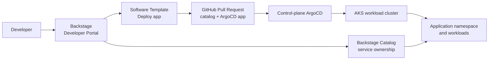

# Demo: Backstage application deployment with ArgoCD

This customer demo shows Backstage as the developer portal for **application
deployment** on AKS. Developers use a Software Template to request an app
deployment, Backstage creates a reviewable GitOps pull request, and ArgoCD
syncs the application after the pull request is approved.

The demo is intentionally app-focused. AKS cluster provisioning, Fleet Manager,
and CAPZ are separate platform demos; this walkthrough starts after a target AKS
environment and control-plane ArgoCD are already available.

## What the customer will see

1. Backstage provides one portal for application catalog, docs, ownership, and
   golden-path templates.
2. A developer opens **Create** and selects **Deploy Application with ArgoCD**.
3. The template collects app details, source repo, manifest path, and target
   namespace.
4. Backstage creates a GitOps pull request with:
   - a Backstage `Component` catalog entity,
   - an ArgoCD `Application` manifest under `gitops/apps/<app-name>/`.
5. The platform team reviews and merges the pull request.
6. ArgoCD deploys the app to AKS and Backstage can show ownership plus
   Kubernetes visibility through the catalog entity.



## Demo prerequisites

- Backstage is deployed by Terraform with `build_backstage=true` or is otherwise
  available for UI walkthrough.
- Backstage GitHub integration has permission to create pull requests in the
  GitOps repository. For this repo, Terraform passes `github_token` into the
  Backstage Helm release as `GITHUB_TOKEN`.
- Microsoft Entra authentication is configured for Backstage, and admin consent
  has been granted to the Backstage app registration. If users do not appear
  immediately, wait for the Microsoft Graph catalog sync or check the Backstage
  pod logs.
- Backstage catalog includes the application deployment template:

```yaml
catalog:
  locations:
    - type: file
      target: ./examples/template/template.yaml
      rules:
        - allow: [Template]
```

- Control-plane ArgoCD is running and watching this GitOps repository.
- The target app repository contains Kubernetes manifests or a Kustomize overlay.
  The default demo app uses:

```text
https://github.com/Azure-Samples/aks-store-demo.git
kustomize/overlays/dev
```

## Demo assets in this repository

| Asset | Purpose |
| --- | --- |
| `backstage/packages/examples/template/template.yaml` | Backstage Software Template shown in the **Create** page |
| `backstage/packages/examples/template/content/catalog-info.yaml` | Backstage service catalog entity rendered by the template |
| `backstage/packages/examples/template/content/gitops/apps/myapp/petArgoApp.yaml` | Template source for the generated ArgoCD `Application` |
| `gitops/apps/myapp/AKSStoreDemoArgoApp.yaml` | Checked-in sample ArgoCD app for the AKS Store Demo |

## Demo flow

### 1. Find the Backstage URL

Backstage is exposed through a `LoadBalancer` service in the `backstage`
namespace. From the repo root or any shell with the `gitops-aks` kube context:

```powershell
kubectl --context gitops-aks -n backstage get pods
kubectl --context gitops-aks -n backstage get svc
```

Look for the Backstage service external IP. With the Terraform-deployed Helm
release, the service is usually:

```powershell
kubectl --context gitops-aks -n backstage get svc backstage-backstagechart
```

Open Backstage with HTTPS:

```text
https://<BACKSTAGE_EXTERNAL_IP>
```

If the browser shows a certificate warning, continue for the demo. The sample
uses a self-signed certificate unless you replace it with a trusted certificate.

You can also get the Terraform-managed public IP from Azure. First get the AKS
node resource group:

```powershell
$nodeResourceGroup = az aks show -g aks-gitops -n gitops-aks --query nodeResourceGroup -o tsv
```

Then query the Backstage public IP:

```powershell
az network public-ip show `
  -g $nodeResourceGroup `
  -n backstage-public-ip `
  --query ipAddress `
  -o tsv
```

### 2. Log in to Backstage

1. Open `https://<BACKSTAGE_EXTERNAL_IP>`.
2. On the Backstage sign-in page, choose the Microsoft / Azure Entra sign-in
   provider.
3. Complete the Microsoft Entra login flow with a tenant user.
4. After login, confirm that the Backstage home page loads.

If login succeeds but your user is not recognized, check the Microsoft Graph
catalog provider:

```powershell
kubectl --context gitops-aks -n backstage logs deploy/backstage-backstagechart
```

Common fixes:

- Grant admin consent to the Backstage app registration API permissions.
- Confirm the user has a mail-enabled Entra profile.
- Wait for the catalog sync schedule to run.
- Restart Backstage after consent or configuration changes:

  ```powershell
  kubectl --context gitops-aks -n backstage rollout restart deploy/backstage-backstagechart
  ```

### 3. Explain the developer portal role

Talking point:

> Backstage does not replace GitOps or ArgoCD. It gives developers a guided,
> self-service front door that produces standardized Git changes for the
> platform team to review.

Show:

- **Catalog** for service ownership and runtime discovery.
- **Docs** for onboarding and operational guidance.
- **Create** for paved-road application deployment templates.

### 4. Open the application deployment template

In Backstage, go to **Create** and select:

```text
Deploy Application with ArgoCD
```

This template is registered from:

```text
backstage/packages/examples/template/template.yaml
```

Use these demo values:

| Field | Demo value |
| --- | --- |
| Application name | `aks-store-demo` |
| Kubernetes namespace | `aks-store-demo` |
| Service owner | `platform-engineering` |
| Application repository | `github.com?owner=Azure-Samples&repo=aks-store-demo` |
| Manifest path | `kustomize/overlays/dev` |
| Target revision | `HEAD` |
| GitOps repository | `github.com?owner=zhangchl007&repo=aks-platform-engineering` |
| Pull request title | `Add AKS Store Demo application` |
| Commit message | `Add AKS Store Demo application GitOps definition` |

### 5. Run the template and review the pull request

1. Click **Next** through the template form.
2. Review the collected values.
3. Click **Create**.
4. Wait for the scaffolder task to finish.

Expected Backstage output:

- A GitHub pull request link.
- A generated catalog entity at:

```text
catalog-info.yaml
```

- A generated ArgoCD app manifest at:

```text
gitops/apps/aks-store-demo/aks-store-demo-argocd-app.yaml
```

The generated ArgoCD `Application` uses:

```yaml
metadata:
  name: aks-store-demo
  namespace: argocd
  annotations:
    backstage.io/kubernetes-id: aks-store-demo
spec:
  source:
    repoURL: https://github.com/Azure-Samples/aks-store-demo.git
    targetRevision: HEAD
    path: kustomize/overlays/dev
  destination:
    namespace: aks-store-demo
    server: https://kubernetes.default.svc
  syncPolicy:
    automated:
      prune: true
      selfHeal: true
    syncOptions:
      - CreateNamespace=true
```

Talking point:

> The developer does not need to hand-write ArgoCD YAML or request direct
> cluster permissions. Backstage generates the expected GitOps contract, and the
> platform team keeps review, policy, and audit in GitHub.

### 6. Merge the pull request and let ArgoCD reconcile

Open the pull request from the Backstage task output, review the generated files,
and merge it into the branch that control-plane ArgoCD watches.

Then check the control-plane ArgoCD cluster:

```powershell
kubectl --context gitops-aks -n argocd get applications
kubectl --context gitops-aks -n argocd get application aks-store-demo -o wide
```

Expected result:

```text
NAME             SYNC STATUS   HEALTH STATUS
aks-store-demo   Synced        Healthy
```

If automated sync is disabled in your environment, trigger a sync manually:

```powershell
argocd app sync aks-store-demo
```

If the `argocd` CLI is not logged in, use the ArgoCD UI to sync the app or log in
with the control-plane ArgoCD endpoint and admin password.

### 7. Verify the workload in Kubernetes

```powershell
kubectl --context gitops-aks -n aks-store-demo get all
```

Expected result:

- Namespace `aks-store-demo` exists.
- AKS Store Demo deployments, services, and pods are created.
- Pods eventually reach `Running`.

If the application exposes a service, list it with:

```powershell
kubectl --context gitops-aks -n aks-store-demo get svc
```

### 8. Show the Backstage catalog entry

Open **Catalog** and search for:

```text
aks-store-demo
```

Highlight:

- service ownership,
- source repository link,
- Kubernetes annotation `backstage.io/kubernetes-id: aks-store-demo`,
- how platform teams can add TechDocs, scorecards, dependencies, and runtime
  health around the same service entity.

## Customer talking points

- **Standardization:** every app follows the same ArgoCD manifest pattern.
- **Governance:** deployment changes are pull requests, not ad hoc cluster
  changes.
- **Developer experience:** developers use a form and catalog instead of
  learning every GitOps file path.
- **Extensibility:** the same template can add policy labels, namespaces,
  secrets integration, OpenTelemetry defaults, or environment promotion.

## Troubleshooting

| Symptom | What to check |
| --- | --- |
| Template is not visible in Backstage | Confirm `./examples/template/template.yaml` is registered in `catalog.locations`. |
| Pull request creation fails | Check GitHub token permissions for repository contents and pull requests. |
| ArgoCD app stays `OutOfSync` | Confirm the generated file is under the repo path watched by ArgoCD and the PR was merged to the watched branch. |
| ArgoCD app is `Degraded` | Check the app repo path, image pull status, and Kubernetes events in the target namespace. |
| Backstage catalog does not show Kubernetes data | Confirm the generated `catalog-info.yaml` and ArgoCD manifest use the same `backstage.io/kubernetes-id` value. |

## Optional CLI validation

Validate the template YAML and generated source files before presenting:

```powershell
& 'C:\Program Files\nodejs\npx.cmd' --yes js-yaml backstage\packages\examples\template\template.yaml
& 'C:\Program Files\nodejs\npx.cmd' --yes js-yaml backstage\packages\examples\template\content\catalog-info.yaml
& 'C:\Program Files\nodejs\npx.cmd' --yes js-yaml backstage\packages\examples\template\content\gitops\apps\myapp\petArgoApp.yaml
```
