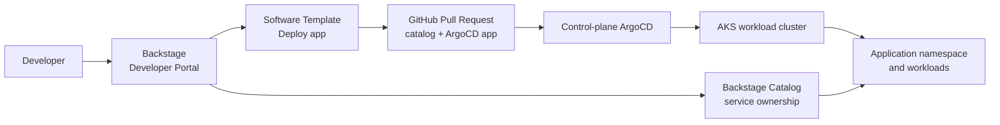

# Demo: Backstage application deployment with ArgoCD

This customer demo shows Backstage as the developer portal for **application
deployment** on AKS. Developers use a Software Template to request an app
deployment, Backstage creates a reviewable GitOps pull request, and ArgoCD
syncs the application after the pull request is approved.

The demo is intentionally app-focused. AKS cluster provisioning, Fleet Manager,
and CAPZ are separate platform demos; this walkthrough starts after a target AKS
environment and control-plane ArgoCD are already available.

## Position Backstage and ArgoCD together

Backstage is the supported developer entry point. It creates reviewable GitOps
changes, and ArgoCD reconciles approved state.

| Customer need | Entry point | What the user does | Control boundary |
| --- | --- | --- | --- |
| Discover services, documentation, ownership, and a governed golden path | Backstage | Creates a standardized GitOps pull request for an approved application target | Pull request review, ArgoCD reconciliation, and Kubernetes RBAC |
| Deploy and operate an approved team application | ArgoCD | Reconciles the approved GitOps definition | Git review, ArgoCD project policy, and namespace-scoped Kubernetes RBAC |
| Inspect or make a simple namespace-scoped change on an external cluster | Azure Portal / Azure Arc | Browses Arc Kubernetes resources | Azure RBAC, Arc cluster-connect, and Kubernetes RBAC |
| Reconcile platform add-ons and approved GitOps definitions | ArgoCD | Platform operator view and reconciliation | Git as source of truth and ArgoCD RBAC |

Do not demonstrate Backstage as a replacement for ArgoCD:

- **Backstage** is the developer experience and governance front door. It turns
  a guided request into a reviewable Git change.
- **ArgoCD** reconciles the approved GitOps state and owns platform baseline
  resources.
- **Azure Arc** provides the Azure management plane view for the two external
  kind clusters.

## Customer presentation story

Start with the problem rather than individual tools:

> Teams need a simple way to deploy safely across AKS and external Kubernetes
> clusters without receiving cluster-admin credentials or learning every GitOps
> convention. The platform therefore offers a single Entra identity, clear
> self-service entry points, and two enforcement layers: portal permissions and
> namespace-scoped Kubernetes permissions.

Use this sequence for a 10-15 minute walkthrough:

1. **Establish the platform view.** Show `gitops-aks` as the management cluster,
   the two connected Arc clusters (`arc-demo-vm` and `arc-demo-vm-2`), and
   explain that Fleet governs AKS while Arc governs external Kubernetes.
2. **Show shared identity.** Explain that Backstage and ArgoCD use
   the shared Microsoft Entra app registration. The
   application is shared; authorization remains specific to each component.
   Backstage uses one common SSO entry group, `akspe-backstage-users`, rather
   than a growing list of per-tool groups.
3. **Show the governed developer path in Backstage.** Sign in to Backstage,
   open **Catalog**, then **Create**, and select **Deploy Application with
   ArgoCD**. Emphasize that the template collects standardized inputs and
   creates a pull request rather than granting direct cluster write access.
4. **Show review and reconciliation.** Open the generated pull request, point
   out the catalog entity and ArgoCD `Application`, then show the application
   in ArgoCD. Explain that Git review, policy, and the ArgoCD audit trail are
   retained.
5. **Show Catalog ownership.** In **Catalog**, open `gitops-aks`,
   `arc-demo-vm`, or `arc-demo-vm-2`. Each cluster Resource is owned by the
   Entra-synchronized `k8sadmin` group; no static image-local Group is used.
6. **Close with the isolation proof.** Show the two Arc clusters connected in
   Azure and the approved GitOps pull request. Explain that namespace-scoped
   Kubernetes RBAC remains the final enforcement boundary.

### Live presentation endpoints

| Component | URL | Audience |
| --- | --- | --- |
| Backstage | `https://20.69.107.137` | Developers requesting the governed GitOps path |
| ArgoCD | `https://172.179.107.194` | Platform operators and AKS deployer group |
| Azure Portal / Arc | Azure Portal | External-cluster discovery and simple Arc resource operations |

## What the customer will see

1. Backstage provides one portal for application catalog, docs, ownership, and
   golden-path templates.
2. A developer opens **Create** and selects the AKS or Arc/kind create template.
3. The template collects app details, source repo, manifest path, and target
   namespace.
4. Backstage creates a GitOps pull request with:
   - a Backstage `Component` catalog entity,
   - an ArgoCD `Application` manifest under
     `gitops/apps/backstage-delivery/<app-name>/`.
5. The platform team reviews and merges the pull request.
6. The PR must target the branch watched by ArgoCD. In the current demo that is
   `zhangchl007-arc-multi-cluster-access`.
7. ArgoCD deploys the app and Backstage can show ownership plus Kubernetes
   visibility through the catalog entity.


```mermaid
flowchart LR
  Dev["Developer"] --> Portal["Backstage<br/>Developer Portal"]
  Portal --> Template["Software Template<br/>Deploy app"]
  Template --> PR["GitHub Pull Request<br/>catalog + ArgoCD app"]
  PR --> Argo["Control-plane ArgoCD"]
  Argo --> AKS["AKS workload cluster"]
  AKS --> App["Application namespace<br/>and workloads"]
  Portal --> Catalog["Backstage Catalog<br/>service ownership"]
  Catalog --> App
```

## Demo prerequisites

- Backstage is deployed by Terraform with `build_backstage=true` or is otherwise
  available for UI walkthrough. The live POC endpoint is
  `https://20.69.107.137`.
- Backstage GitHub integration has permission to create pull requests in the
  GitOps repository. For this repo, Terraform passes `github_token` into the
  Backstage Helm release as `GITHUB_TOKEN`.
- Microsoft Entra SSO is configured with the shared demo app registration
  the shared Microsoft Entra application. The Backstage callback URL is
  `https://20.69.107.137/api/auth/microsoft/handler/frame`.
- Backstage allows Microsoft Entra sign-in through the common
  `akspe-backstage-users` entry group. The shared Enterprise Application has
  assignment required enabled and is assigned to that group. ArgoCD's
  `platform-access` app reconciles Backstage `BACKSTAGE_ALLOWED_GROUP_IDS` from
  the private `backstage/platform-backstage-sso` Secret so Backstage checks only
  the common group ID.
- The Backstage resolver maps the email local part to a Backstage identity and
  resolves approved Entra group membership through Microsoft Graph. Users and
  groups are not maintained in `backstage/packages/examples/org.yaml`.
- Backstage catalog includes separate application deployment templates for AKS
  and Arc/kind delivery:

```yaml
catalog:
  locations:
    - type: url
      target: ${BACKSTAGE_CATALOG_URL}
      rules:
        - allow: [Location]
```

- Control-plane ArgoCD is running and watching this GitOps repository.
- The target app repository contains Kubernetes manifests or a Kustomize overlay.
  The default demo app uses:

```text
https://github.com/zhangchl007/aks-platform-engineering
gitops/apps/platform-demo/aks
gitops/apps/platform-demo/kind
```

## Demo assets in this repository

| Asset | Purpose |
| --- | --- |
| `backstage/packages/templates/deploy-aks-application/template.yaml` | AKS-only Backstage Software Template shown in the **Create** page |
| `backstage/packages/templates/deploy-kind-application/template.yaml` | Arc/kind-only Backstage Software Template shown in the **Create** page |
| `backstage/packages/templates/update-aks-application/template.yaml` | Day-2 template that updates an existing AKS delivery Application through a PR |
| `backstage/packages/templates/update-kind-application/template.yaml` | Day-2 template that updates an existing Arc/kind delivery ApplicationSet through a PR |
| `backstage/packages/templates/*/content/catalog-info.yaml` | Backstage service catalog entity rendered by each template |
| `backstage/packages/templates/deploy-aks-application/content/gitops/apps/myapp/petArgoApp.yaml` | Template source for the generated AKS ArgoCD `Application` |
| `backstage/packages/templates/deploy-kind-application/content/gitops/apps/myapp/application-set.yaml` | Template source for the generated Arc/kind ArgoCD `ApplicationSet` |
| `gitops/apps/myapp/AKSStoreDemoArgoApp.yaml` | Checked-in sample ArgoCD app for the AKS Store Demo |

## Demo flow

### 1. Find the Backstage URL

Backstage is exposed through a `LoadBalancer` service in the `backstage`
namespace. From the repo root or any shell with the `gitops-aks-admin` kube context:

```powershell
kubectl --context gitops-aks-admin -n backstage get pods
kubectl --context gitops-aks-admin -n backstage get svc
```

Look for the Backstage service external IP. With the Terraform-deployed Helm
release, the service is usually:

```powershell
kubectl --context gitops-aks-admin -n backstage get svc backstage-backstagechart
```

Open Backstage with HTTPS:

```text
https://<BACKSTAGE_EXTERNAL_IP>
```

For the live POC, open:

```text
https://20.69.107.137
```

Only use the public IP directly for a short-lived demo after Microsoft Entra
authentication is configured. Do not expose an unauthenticated Backstage instance
at this address. For shared or production environments, place Backstage behind an
authenticated ingress or application gateway, restrict source networks, and
prefer a DNS name with a trusted certificate over direct public-IP access.

If the browser shows a certificate warning, continue for the demo. The sample
uses a self-signed certificate unless you replace it with a trusted certificate.

You can also get the Terraform-managed public IP from Azure. First get the AKS
node resource group:

```powershell
$nodeResourceGroup = az aks show -g aks-gitops -n gitops-aks --query nodeResourceGroup -o tsv
```

Then query the Backstage public IP:

```powershell
az network public-ip show `
  -g $nodeResourceGroup `
  -n backstage-public-ip `
  --query ipAddress `
  -o tsv
```

### 2. Log in to Backstage

1. Open `https://20.69.107.137`.
2. On the Backstage sign-in page, choose **Microsoft Entra ID**.
3. Complete the Entra sign-in flow with an account that belongs to the allowed
   Backstage demo Entra group.
4. After login, confirm that the Backstage home page loads.

If login succeeds but your user is not recognized, check the Backstage logs:

```powershell
kubectl --context gitops-aks-admin -n backstage logs deploy/backstage-backstagechart
```

Common fixes:

- Confirm the shared Entra app has callback URL
  `https://20.69.107.137/api/auth/microsoft/handler/frame`.
- Confirm `AZURE_CLIENT_ID`, `AZURE_CLIENT_SECRET`, and `AZURE_TENANT_ID` were
  rendered into the Backstage Helm release.
- Confirm `BACKSTAGE_ALLOWED_GROUP_IDS` is configured from private tfvars and
  the shared Entra app registration emits `SecurityGroup` claims.
- Restart Backstage after OAuth or catalog configuration changes:

  ```powershell
  kubectl --context gitops-aks-admin -n backstage rollout restart deploy/backstage-backstagechart
  ```

### 3. Explain the developer portal role

Talking point:

> Backstage does not replace GitOps or ArgoCD. It gives developers a guided,
> self-service front door that produces standardized Git changes for the
> platform team to review.

Show:

- **Catalog** for service ownership and runtime discovery.
- **Docs** for onboarding and operational guidance.
- **Create** for paved-road application deployment templates.

### 4. Open the application deployment template

In Backstage, go to **Create** and select:

```text
Deploy AKS Application with ArgoCD
```

For Arc/kind targets, select:

```text
Deploy Arc Kind Application with ArgoCD
```

These templates are registered from
`backstage/packages/templates/deploy-aks-application/template.yaml` and
`backstage/packages/templates/deploy-kind-application/template.yaml`.

Use these demo values:

| Field | Demo value |
| --- | --- |
| Application name | `aks-store-demo` |
| Kubernetes namespace | `group2-aks-apps` for AKS, `group1-apps` for Arc/kind |
| Approved target | `gitops-aks/group2-aks-apps` for AKS, or `kind-arc-demo-vms-group1` for all approved Arc/kind clusters selected by ArgoCD cluster labels |
| Service owner | `k8sadmin` |
| Application repository | `github.com?owner=zhangchl007&repo=aks-platform-engineering` |
| Manifest path | `gitops/apps/platform-demo/aks` for AKS, `gitops/apps/platform-demo/kind` for Arc/kind |
| Target revision | `zhangchl007-arc-multi-cluster-access` |
| GitOps repository | `github.com?owner=zhangchl007&repo=aks-platform-engineering` |
| Pull request title | `Add AKS Store Demo application` |
| Commit message | `Add AKS Store Demo application GitOps definition` |

### 5. Run the template and review the pull request

1. Click **Next** through the template form.
2. Review the collected values.
3. Click **Create**.
4. Wait for the scaffolder task to finish.

Expected Backstage output:

- A GitHub pull request link.
- A generated catalog entity at:

```text
catalog-info.yaml
```

- Generated ArgoCD delivery manifests at:

```text
gitops/apps/backstage-delivery/aks-store-demo/aks-store-demo-argocd-app.yaml
gitops/apps/backstage-delivery/kind-store-demo/kind-store-demo-applicationset.yaml
```

The generated ArgoCD `Application` uses:

```yaml
metadata:
  name: aks-store-demo
  namespace: argocd
  annotations:
    backstage.io/kubernetes-id: aks-store-demo
spec:
  source:
    repoURL: https://github.com/zhangchl007/aks-platform-engineering
    targetRevision: zhangchl007-arc-multi-cluster-access
    path: gitops/apps/platform-demo/aks
  destination:
    namespace: group2-aks-apps
    name: gitops-aks
  syncPolicy:
    automated:
      prune: true
      selfHeal: true
    syncOptions:
      - CreateNamespace=true
```

Talking point:

> The developer does not need to hand-write ArgoCD YAML or request direct
> cluster permissions. Backstage generates the expected GitOps contract, and the
> platform team keeps review, policy, and audit in GitHub.

Do not rerun the create template with the same application name after the app
already exists. The create path intentionally writes a new generated folder under
`gitops/apps/backstage-delivery/<app-name>/`; reusing the same name should go
through the update template so the pull request clearly represents a day-2
change instead of an accidental overwrite.

### 6. Merge the pull request and let ArgoCD reconcile

Open the pull request from the Backstage task output, review the generated files,
and merge it into the branch that control-plane ArgoCD watches.

The merge only proves that the desired state is on the branch ArgoCD watches; it
does not prove that ArgoCD has already finished deployment. Backstage delivery
is asynchronous after merge:

1. GitHub merges the PR.
2. The `backstage-delivery-apps` ArgoCD Application detects the watched branch
   update and applies the generated delivery manifest.
3. For Arc/kind delivery, the parent ApplicationSet evaluates approved ArgoCD
   cluster Secret labels and creates one child Application per matching cluster.
4. Each child Application syncs the workload to the remote cluster and waits for
   Kubernetes resources to become healthy.

This can take several minutes without indicating failure, especially for
ApplicationSet-based Arc/kind delivery. Treat the PR as complete when CI passes;
treat the deployment as complete only when the ArgoCD Applications and target
workloads below are healthy.

Then check the control-plane ArgoCD cluster:

```powershell
kubectl --context gitops-aks-admin -n argocd get applications
kubectl --context gitops-aks-admin -n argocd get application aks-store-demo -o wide
```

Expected result:

```text
NAME             SYNC STATUS   HEALTH STATUS
aks-store-demo   Synced        Healthy
```

If automated sync is disabled in your environment, trigger a sync manually:

```powershell
argocd app sync aks-store-demo
```

If the `argocd` CLI is not logged in, use the ArgoCD UI to sync the app or log in
with the control-plane ArgoCD endpoint and admin password.

### 7. Verify the workload in Kubernetes

For the AKS template, verify both the control-plane ArgoCD `Application` and the
target namespace:

```powershell
$appName = "aks-store-demo"

kubectl --context gitops-aks-admin -n argocd get application $appName -o wide
kubectl --context gitops-aks-admin -n argocd describe application $appName

kubectl --context gitops-aks-admin -n group2-aks-apps get deploy,sts,svc,cm,secret,pod
kubectl --context gitops-aks-admin -n group2-aks-apps get events --sort-by=.lastTimestamp
```

Expected result:

- Namespace `group2-aks-apps` exists.
- AKS Store Demo deployments, services, and pods are created.
- Pods eventually reach `Running`.

If the application exposes a service, list it with:

```powershell
kubectl --context gitops-aks-admin -n group2-aks-apps get svc
```

For the Arc/kind template, verify both target contexts:

```powershell
$appName = "kind-store-demo"

kubectl --context gitops-aks-admin -n argocd get application backstage-delivery-apps `
  -o jsonpath="{.status.sync.status} {.status.health.status} {.status.sync.revision}{'\n'}"
kubectl --context gitops-aks-admin -n argocd get applicationset $appName -o wide
kubectl --context gitops-aks-admin -n argocd get application "$appName-arc-demo-vm" -o wide
kubectl --context gitops-aks-admin -n argocd get application "$appName-arc-demo-vm-2" -o wide
kubectl --context gitops-aks-admin -n argocd describe application "$appName-arc-demo-vm"
kubectl --context gitops-aks-admin -n argocd describe application "$appName-arc-demo-vm-2"

kubectl --context arc-demo-vm-admin -n group1-apps get deploy,sts,svc,cm,secret,pod
kubectl --context arc-demo-vm-2-admin -n group1-apps get deploy,sts,svc,cm,secret,pod
```

For Arc/kind delivery, the expected completion signal is:

- `backstage-delivery-apps` has reconciled the merge revision.
- The parent ApplicationSet exists.
- Child Applications exist for `arc-demo-vm` and `arc-demo-vm-2`.
- Both child Applications are `Synced` / `Healthy`.
- Workloads in `group1-apps` are ready on both kind clusters.

To speed up a live demo after the PR is merged, ask ArgoCD to refresh the
Backstage delivery root immediately instead of waiting for the next poll:

```powershell
.\scripts\refresh-backstage-delivery.ps1 -ApplicationName kind-store-demo
```

This is not a separate deployment controller; it only triggers an immediate
ArgoCD refresh/sync of the Git-owned desired state.

Do not merge before the validation check finishes. ArgoCD watches the target
branch, not the pull request status, so a manually merged PR can start
reconciling before CI has proven the delivery/Catalog shape is valid.

The Arc/kind Backstage target is a logical target. It maps to an ArgoCD
ApplicationSet `clusters` generator, not to hardcoded cluster names in the
Backstage template. To add another approved Arc/kind cluster later, register it
in ArgoCD with:

```yaml
provider: arc
platform_cluster_type: kind
platform_access_enabled: "true"
platform_backstage_delivery_enabled: "true"
```

### 8. Show the Backstage catalog entry

Open **Catalog** and search for:

```text
aks-store-demo
```

Highlight:

- service ownership,
- source repository link,
- Kubernetes annotation `backstage.io/kubernetes-id: aks-store-demo`,
- how platform teams can add TechDocs, scorecards, dependencies, and runtime
  health around the same service entity.

## Day-2 updates through Backstage

Backstage is not a one-time deployment tool. The supported lifecycle is:

| Lifecycle action | Backstage template | GitOps result |
| --- | --- | --- |
| First deployment | `deploy-aks-application` or `deploy-kind-application` | Adds a Git-managed Catalog descriptor and ArgoCD delivery manifest; the kind template creates one ApplicationSet that expands to approved Arc/kind clusters |
| Update existing deployment | `update-aks-application` or `update-kind-application` | Replaces an existing generated ArgoCD delivery manifest in a PR; fails when the application is absent or the rendered manifest is unchanged |

Use the update templates for safe day-2 changes such as changing the app source
revision, manifest path, or approved destination. The update templates fetch the
current GitOps branch, replace only the existing generated delivery manifest
under `gitops/apps/backstage-delivery/<app-name>/`, and create a reviewable PR.
For Arc/kind, the ApplicationSet cluster generator expands the logical target to
all ArgoCD cluster Secrets labeled `platform_backstage_delivery_enabled=true`.
ArgoCD still applies the Kubernetes change only after the PR is merged.

### Catalog lifecycle is Git-managed

Delivery templates do not call `catalog:register`. The create template adds the
generated descriptor to `backstage/catalog/catalog-info.yaml` in the same Git
pull request as the ArgoCD delivery manifest. Manual cleanup PRs must remove the
delivery directory, the descriptor directory, and the Catalog index target
together.

This keeps the Catalog's desired source in Git and prevents a deleted descriptor
URL from remaining as a persistent Backstage Catalog Location. Backstage's
Catalog refresh then discovers a merged descriptor and removes its entity after
the corresponding Git target is removed. Do not manually register generated
delivery descriptors in the Catalog database.

The repository validator enforces the same invariant on the final Git tree:
every generated delivery manifest must have a matching generated
`backstage/generated/<app-name>/catalog-info.yaml` descriptor and
`../generated/<app-name>/catalog-info.yaml` target in
`backstage/catalog/catalog-info.yaml`; orphan descriptors or orphan Catalog
targets are invalid.

## Cleanup for repeated demos

Use a unique application name for every customer rehearsal, for example
`contoso-aks-store-demo` or `contoso-kind-store-demo`. This avoids reusing the
same Backstage branch, ArgoCD `Application`, and Kubernetes labels across demos.

Cleanup is a manual platform pull request because ArgoCD owns the deployed
resources. Remove the generated GitOps and catalog files in one PR, merge it,
and let ArgoCD automated prune remove the target resources:

```powershell
$appName = "aks-store-demo"

git rm -r gitops/apps/backstage-delivery/$appName
# Also remove the generated catalog descriptor shown in the PR diff.
# Common path: backstage/generated/<app-name>/catalog-info.yaml.
git rm <generated-catalog-info-path>
git commit -m "Remove $appName demo application"
git push
```

Before merging any cleanup PR, confirm its **Files changed** tab includes:

```text
gitops/apps/backstage-delivery/<app-name>/
backstage/generated/<app-name>/
backstage/catalog/catalog-info.yaml
```

A zero-diff or partial cleanup PR is invalid. A Catalog-only delete is invalid
because ArgoCD will still reconcile any generated delivery manifest left under
`gitops/apps/backstage-delivery/<app-name>/`.

After the cleanup PR is merged, verify that ArgoCD and the target namespace no
longer contain the demo app:

```powershell
$appName = "aks-store-demo"

kubectl --context gitops-aks-admin -n argocd get application $appName
kubectl --context gitops-aks-admin -n group2-aks-apps get deploy,sts,svc,pod
kubectl --context arc-demo-vm-admin -n group1-apps get deploy,sts,svc,pod
kubectl --context arc-demo-vm-2-admin -n group1-apps get deploy,sts,svc,pod
```

If the generated PR branch remains after merge, delete only the stale branch:

```powershell
git push origin --delete backstage/aks/<app-name>
git push origin --delete backstage/kind/<app-name>
```

Do not use `kubectl delete` as the normal cleanup mechanism while the GitOps
files still exist. ArgoCD may recreate the resources from Git. Manual deletion is
only an emergency demo reset after the desired state has been removed or while
explaining that Git is still the source of truth.

## Customer talking points

- **Standardization:** every app follows the same ArgoCD manifest pattern.
- **Governance:** deployment changes are pull requests, not ad hoc cluster
  changes.
- **Developer experience:** developers use a form and catalog instead of
  learning every GitOps file path.
- **Extensibility:** the same template can add policy labels, namespaces,
  secrets integration, OpenTelemetry defaults, or environment promotion.

## Troubleshooting

| Symptom | What to check |
| --- | --- |
| Template is not visible in Backstage | Confirm `BACKSTAGE_CATALOG_URL` points to the GitHub `blob` URL for `backstage/catalog/catalog-info.yaml`, not the `raw.githubusercontent.com` URL, and confirm the two split templates are listed in that catalog Location. |
| Template is visible but opening it fails with `Failed to load template` or HTTP 500 for ordinary deployers | Confirm the user belongs to `akspe-aks-cluster-deployers` or `akspe-kind-cluster-deployers` through the Entra-to-Backstage mapping. Scaffolder parameter and step permissions must use only the `aks-delivery` and `kind-delivery` tags; Catalog annotations such as `platform-access.akspe.io/allow-*` are for Catalog entity visibility, not Scaffolder parameter/step authorization. Check Backstage logs for `/api/permission/authorize` and rerun `platformAccessPermissionPolicy.test.ts` before publishing a new image. |
| Pull request creation fails | Check GitHub token permissions for repository contents and pull requests. |
| Create template fails with `dest already exists` | The app already exists. Use `update-aks-application` or `update-kind-application` for day-2 changes, or use a new application name for another customer rehearsal. |
| Update or cleanup task fails before a PR is created | The named generated delivery manifest is absent, the generated Catalog descriptor or Catalog index target is absent, or the update would not change the rendered manifest. Confirm the application name and watched branch; do not create or merge an empty PR. |
| Cleanup PR has zero changed files or removes only the Catalog target | It is invalid and cannot cause an ArgoCD prune. Confirm the generated Application/ApplicationSet, generated descriptor, and Catalog index target all exist in the watched branch, then use the strict cleanup template or a reviewed manual Git deletion. |
| Pull request merged but no ArgoCD Application appears | Confirm the PR targeted the branch watched by ArgoCD, currently `zhangchl007-arc-multi-cluster-access`, and confirm `backstage-delivery-apps` is `Synced/Healthy`. Generated Application manifests must be under `gitops/apps/backstage-delivery/<app-name>/`. |
| ArgoCD app stays `OutOfSync` | Confirm the generated file is under the repo path watched by ArgoCD and the PR was merged to the watched branch. |
| ArgoCD app is `Degraded` | Check the app repo path, image pull status, and Kubernetes events in the target namespace. |
| Backstage catalog does not show Kubernetes data | Confirm the generated `catalog-info.yaml` and ArgoCD manifest use the same `backstage.io/kubernetes-id` value. |
| A cluster Resource reports a missing `k8sadmin` owner | Confirm the Microsoft Graph provider has logged `Committed ... msgraph groups`; wait for the hourly refresh if the Entra group changed, then sign out and sign in again. Do not add a static Catalog Group. |

## Optional CLI validation

Validate the template YAML and generated source files before presenting:

```powershell
& 'C:\Program Files\nodejs\npx.cmd' --yes js-yaml backstage\packages\templates\deploy-aks-application\template.yaml
& 'C:\Program Files\nodejs\npx.cmd' --yes js-yaml backstage\packages\templates\deploy-kind-application\template.yaml
& 'C:\Program Files\nodejs\npx.cmd' --yes js-yaml backstage\packages\templates\update-aks-application\template.yaml
& 'C:\Program Files\nodejs\npx.cmd' --yes js-yaml backstage\packages\templates\update-kind-application\template.yaml
& 'C:\Program Files\nodejs\npx.cmd' --yes js-yaml backstage\packages\templates\deploy-aks-application\content\catalog-info.yaml
& 'C:\Program Files\nodejs\npx.cmd' --yes js-yaml backstage\packages\templates\deploy-kind-application\content\catalog-info.yaml
```

Validate the Catalog/delivery tree and the guarded Backstage backend behavior
before building an image:

```powershell
Set-Location backstage
yarn catalog:validate
yarn test --runInBand packages/backend/src/extensions/platformDeliveryActions.test.ts packages/backend/src/extensions/platformAccessPermissionPolicy.test.ts
```
