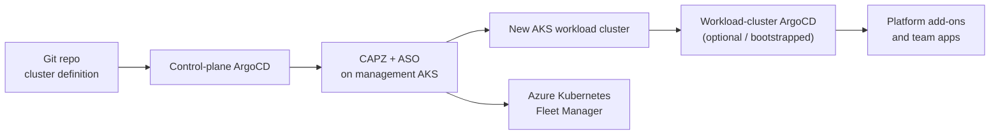

# Demo: Create a new AKS workload cluster with ArgoCD and Fleet Manager

This demo shows how `aks-platform-engineering` can create a new AKS workload
cluster from the management cluster, bring it under GitOps control, and join it to
Azure Kubernetes Fleet Manager.

## What the customer will see

1. Platform team commits a new workload-cluster definition to Git.
2. Control-plane ArgoCD detects the change and syncs CAPZ resources.
3. Cluster API Provider Azure (CAPZ) creates the AKS workload cluster.
4. The workload cluster joins Azure Kubernetes Fleet Manager.
5. ArgoCD bootstraps platform add-ons / workload apps for the new cluster.
6. The operator verifies the new AKS cluster, ArgoCD apps, and Fleet membership.



## Concepts

### Control-plane ArgoCD

The control-plane AKS cluster runs ArgoCD. It owns the platform control loop:

- syncs `gitops/bootstrap/control-plane/addons`,
- installs CAPZ / Cluster API components,
- syncs `gitops/clusters/<provider>`,
- creates workload AKS clusters through Kubernetes custom resources.

### CAPZ-managed AKS workload cluster

The CAPZ sample in this repository uses:

- `gitops/clusters/clusters-argo-applicationset.yaml` as the cluster provisioning
  entry point,
- `gitops/clusters/capz/aks-appset.yaml` to render an AKS cluster Application,
- `gitops/clusters/capz/charts/azure-managed-cluster` as the Helm chart that emits
  CAPZ resources such as `Cluster`, `AzureManagedControlPlane`,
  `AzureManagedCluster`, and managed agent pools.

### Fleet Manager membership

The CAPZ chart already supports Fleet Manager join through:

```yaml
controlplane:
  fleetsMember:
    enabled: true
    name: <cluster-name>-fleet-member
    group: <fleet-group>
    managerName: gitops-fleet
    managerResourceGroup: aks-gitops
```

When enabled, CAPZ asks Azure to join the new AKS cluster to the shared Fleet
Manager during cluster creation.

### ArgoCD registration options

There are two useful GitOps patterns:

| Pattern | What it means | When to use |
| --- | --- | --- |
| Control-plane ArgoCD provisions the cluster | ArgoCD syncs CAPZ resources that create AKS | Always for this demo |
| Workload cluster has its own ArgoCD | CAPZ HelmChartProxy installs ArgoCD into the new cluster | Team autonomy / app GitOps per cluster |
| Central ArgoCD also targets workload cluster | Create an ArgoCD cluster Secret in the control-plane ArgoCD | Single central view of all target clusters |

This repository already has the first two patterns. A central registration script can
be added for customers who want one ArgoCD instance to target all clusters.

## Prerequisites

- Terraform bootstrap has already created the management AKS cluster.
- ArgoCD is running in the `argocd` namespace of the management cluster.
- CAPZ / Cluster API operator add-ons are healthy.
- Fleet Manager exists:

```powershell
az fleet show -g aks-gitops -n gitops-fleet -o table
```

- The Git branch used by ArgoCD is pushed and matches
  `addons_repo_revision` in the management cluster Secret.

Check ArgoCD:

```powershell
kubectl --context gitops-aks -n argocd get pods
kubectl --context gitops-aks -n argocd get applications
```

## Demo flow

### 1. Show the existing management cluster

```powershell
az aks show -g aks-gitops -n gitops-aks --query "{name:name,location:location,powerState:powerState.code}" -o table
kubectl --context gitops-aks get nodes
```

Talking point:

> This is the platform control plane. Application teams do not need direct Azure
> permissions to create clusters; they submit declarative cluster definitions to Git.

### 2. Show Fleet Manager

```powershell
az fleet show -g aks-gitops -n gitops-fleet --query "{name:name,hubProfile:hubProfile.dnsPrefix,provisioningState:provisioningState}" -o table
az fleet member list -g aks-gitops --fleet-name gitops-fleet -o table
```

Expected at this point:

- `control-plane` is already a Fleet member.
- The new workload cluster member appears after CAPZ completes provisioning.

### 3. Apply the cluster provisioning ApplicationSet

The repository contains an entry point that tells control-plane ArgoCD to sync
cluster definitions:

```powershell
kubectl --context gitops-aks apply -f gitops/clusters/clusters-argo-applicationset.yaml
```

Then watch ArgoCD:

```powershell
kubectl --context gitops-aks -n argocd get applications
kubectl --context gitops-aks -n argocd get applications clusters -o yaml
```

Talking point:

> ArgoCD is now reconciling the cluster definitions path. CAPZ resources are created
> in the management cluster, and CAPZ turns them into Azure AKS resources.

### 4. Create or update a workload cluster definition

Reusable sample:

```text
gitops/clusters/capz/cluster-definitions/customer-demo.yaml
```

The `aks-workload-clusters` ApplicationSet reads files from
`gitops/clusters/capz/cluster-definitions/*.yaml` and creates one provisioning
Application per file. The included customer demo definition uses:

| Field | Demo value |
| --- | --- |
| Cluster name | `aks-customer-demo` |
| Resource group | `aks-customer-demo` |
| Fleet member | `aks-customer-demo-fleet-member` |
| Fleet group | `customer-demo` |
| Node SKU | `Standard_D2s_v3` |
| System pool name | `sys` |

ApplicationSet file:

```text
gitops/clusters/capz/aks-appset.yaml
```

> If demonstrating from a feature branch, keep the Git generator `revision` in
> `aks-appset.yaml` aligned with the branch ArgoCD can read. After merge, change it
> back to `main` if your control-plane GitOps Bridge tracks `main`.

### 5. Watch CAPZ create the cluster

```powershell
kubectl --context gitops-aks -n workload get clusters
kubectl --context gitops-aks -n workload get azuremanagedcontrolplanes
kubectl --context gitops-aks -n workload get azuremanagedclusters
```

Azure side:

```powershell
az aks list -g aks-customer-demo -o table
```

Expected result:

- AKS resource is created in Azure.
- CAPZ `Cluster` eventually becomes ready.

### 6. Verify Fleet Manager membership

```powershell
az fleet member list -g aks-gitops --fleet-name gitops-fleet -o table
```

Expected result:

```text
Name                            Group
------------------------------  -------------
control-plane                   control-plane
aks-customer-demo-fleet-member  customer-demo
```

Talking point:

> The workload cluster is now part of the shared Fleet Manager. Platform teams can
> use Fleet for grouped operations such as update orchestration and multi-cluster
> governance across AKS clusters.

### 7. Connect to the new workload cluster

```powershell
az aks get-credentials -g aks-customer-demo -n aks-customer-demo --overwrite-existing
kubectl config use-context aks-customer-demo
kubectl get nodes
```

### 8. Verify workload cluster GitOps

If using the existing CAPZ HelmChartProxy pattern, ArgoCD is installed into the
workload cluster:

```powershell
kubectl get pods -n argocd
kubectl get applications -n argocd
```

Get the workload ArgoCD admin password:

```powershell
kubectl get secret argocd-initial-admin-secret -n argocd --template="{{index .data.password | base64decode}}"
kubectl get svc -n argocd argo-cd-argocd-server
```

Talking point:

> The management cluster creates the workload cluster, and the workload cluster can
> then run its own ArgoCD instance for team-level application delivery.

### 9. Optional: register the workload cluster into central ArgoCD

Some customers prefer one central ArgoCD instance to target every cluster. In that
model, create a cluster Secret in the management ArgoCD namespace:

```yaml
apiVersion: v1
kind: Secret
metadata:
  name: aks-customer-demo
  namespace: argocd
  labels:
    argocd.argoproj.io/secret-type: cluster
    environment: customer-demo
    provider: aks
type: Opaque
stringData:
  name: aks-customer-demo
  server: https://<aks-api-server>
  config: |
    {
      "bearerToken": "<service-account-token>",
      "tlsClientConfig": {
        "insecure": false,
        "caData": "<base64-ca>"
      }
    }
```

For repeatable demos, automate this with:

```powershell
./scripts/register-aks-workload-cluster.ps1 `
  -ClusterName aks-customer-demo `
  -ResourceGroupName aks-customer-demo `
  -ControlPlaneContext gitops-aks
```

The script:

1. gets AKS credentials,
2. creates an `argocd-manager` service account,
3. mints a token,
4. reads the API server and CA,
5. applies the cluster Secret to the management ArgoCD namespace.

> Note: central registration may cause GitOps Bridge ApplicationSets to target the
> workload cluster, depending on the labels/selectors in the repo. Use it when you
> intentionally want the control-plane ArgoCD to manage the workload cluster as a
> destination.

## Validation checklist

| Check | Command | Expected |
| --- | --- | --- |
| Control-plane ArgoCD healthy | `kubectl -n argocd get pods` | All Running |
| Cluster provisioning app exists | `kubectl -n argocd get applications` | `clusters` and workload app |
| CAPZ resources exist | `kubectl -n workload get clusters` | Cluster Ready |
| AKS exists | `az aks list -g <rg> -o table` | New cluster present |
| Fleet membership | `az fleet member list -g aks-gitops --fleet-name gitops-fleet -o table` | Workload member present |
| Workload GitOps | `kubectl --context <workload> -n argocd get applications` | Apps synced |

## Troubleshooting

### ArgoCD does not create cluster resources

Check:

```powershell
kubectl --context gitops-aks -n argocd get application clusters -o yaml
kubectl --context gitops-aks -n argocd logs deploy/argo-cd-argocd-repo-server
```

Common causes:

- Git branch in `addons_repo_revision` does not contain the cluster definition.
- `clusters-argo-applicationset.yaml` has not been applied.
- CAPZ add-on is not healthy.

### Fleet member does not appear

Check the CAPZ control plane resource:

```powershell
kubectl --context gitops-aks -n workload describe azuremanagedcontrolplane <cluster-name>
```

Common causes:

- `controlplane.fleetsMember.enabled` is false.
- Fleet name/resource group are wrong.
- CAPZ identity lacks Fleet Manager permissions.

### Workload cluster exists but apps are not installed

Check HelmChartProxy:

```powershell
kubectl --context gitops-aks get helmchartproxy -A
kubectl --context gitops-aks describe helmchartproxy argocd -n default
```

Common causes:

- Cluster labels do not match HelmChartProxy selector.
- Workload cluster API is not reachable from the management cluster.

## Teardown

Delete the Git cluster definition or disable the generated ArgoCD Application, then
confirm CAPZ removes the Azure resources.

Manual Azure fallback:

```powershell
az fleet member delete -g aks-gitops --fleet-name gitops-fleet --name aks-customer-demo-fleet-member --yes
az aks delete -g aks-customer-demo -n aks-customer-demo --yes
az group delete -n aks-customer-demo --yes
```

## Presenter notes

- Emphasize Git as the API for platform teams.
- Show ArgoCD before and after the cluster definition is committed.
- Show Fleet membership after provisioning completes.
- Explain the difference between AKS workload clusters (Fleet) and external clusters
  (Azure Arc).
- Keep customer expectations clear: cluster creation can take several minutes and
  incurs Azure cost.
