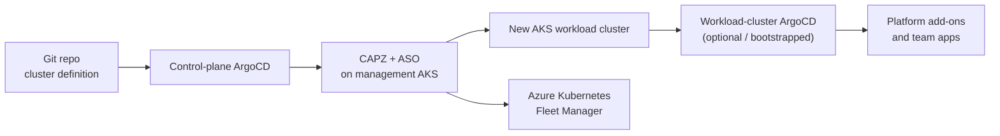

# Demo: Create a new AKS workload cluster with ArgoCD and Fleet Manager

This demo shows how `aks-platform-engineering` can create a new AKS workload
cluster from the management cluster, bring it under GitOps control, and join it to
Azure Kubernetes Fleet Manager.

## What the customer will see

1. Platform team commits a new workload-cluster definition to Git.
2. Control-plane ArgoCD detects the change and syncs CAPZ resources.
3. Cluster API Provider Azure (CAPZ) creates the AKS workload cluster.
4. The workload cluster joins Azure Kubernetes Fleet Manager.
5. ArgoCD bootstraps platform add-ons / workload apps for the new cluster.
6. The operator verifies the new AKS cluster, ArgoCD apps, and Fleet membership.


```mermaid
flowchart LR
  Git["Git repo<br/>cluster definition"] --> ArgoHub["Control-plane ArgoCD"]
  ArgoHub --> CAPZ["CAPZ + ASO<br/>on management AKS"]
  CAPZ --> AKS["New AKS workload cluster"]
  CAPZ --> Fleet["Azure Kubernetes<br/>Fleet Manager"]
  AKS --> WorkloadArgo["Workload-cluster ArgoCD<br/>(optional / bootstrapped)"]
  WorkloadArgo --> Apps["Platform add-ons<br/>and team apps"]
```

## Concepts

### Control-plane ArgoCD

The control-plane AKS cluster runs ArgoCD. It owns the platform control loop:

- syncs `gitops/bootstrap/control-plane/addons`,
- installs CAPZ / Cluster API components,
- syncs `gitops/clusters/<provider>`,
- creates workload AKS clusters through Kubernetes custom resources.

### CAPZ-managed AKS workload cluster

The CAPZ sample in this repository uses:

- `gitops/clusters/clusters-argo-applicationset.yaml` as the cluster provisioning
  entry point,
- `gitops/clusters/capz/aks-appset.yaml` to render an AKS cluster Application
  when cluster provisioning is enabled,
- `gitops/clusters/capz/charts/azure-managed-cluster` as the Helm chart that emits
  CAPZ resources such as `Cluster`, `AzureManagedControlPlane`,
  `AzureManagedCluster`, and managed agent pools.

### Fleet Manager membership

The CAPZ chart has a Fleet member block, but the demo keeps it disabled because
the installed CAPZ release uses an older Fleet member API:

```yaml
controlplane:
  fleetsMember:
    enabled: false
    name: <cluster-name>-fleet-member
    group: <fleet-group>
    managerName: gitops-fleet
    managerResourceGroup: aks-gitops
```

The workload cluster is joined to Fleet Manager after AKS is ready with
`az fleet member create`.

### ArgoCD registration options

There are two useful GitOps patterns:

| Pattern | What it means | When to use |
| --- | --- | --- |
| Control-plane ArgoCD provisions the cluster | ArgoCD syncs CAPZ resources that create AKS | Always for this demo |
| Workload cluster has its own ArgoCD | CAPZ HelmChartProxy installs ArgoCD into the new cluster | Team autonomy / app GitOps per cluster |
| Central ArgoCD also targets workload cluster | Create an ArgoCD cluster Secret in the control-plane ArgoCD | Single central view of all target clusters |

This repository already has the first two patterns. A central registration script can
be added for customers who want one ArgoCD instance to target all clusters.

### Relationship to Azure Arc external clusters

This demo is for AKS workload clusters. AKS clusters join Azure Kubernetes Fleet
Manager, while external / non-AKS clusters such as the VM-hosted kind clusters
use Azure Arc-enabled Kubernetes.

| Cluster type | Unified view | Application delivery path | Ordinary-user portal path |
| --- | --- | --- | --- |
| AKS control-plane and AKS workload clusters | Azure Kubernetes Fleet Manager | ArgoCD / GitOps | AKS resource view and AKS RBAC |
| VM-hosted kind / external Kubernetes | Azure Arc-enabled Kubernetes | Control-plane ArgoCD over private kind API | Azure Portal Arc Kubernetes resources through cluster-connect |

For the current Arc demo, two VM-hosted kind clusters can be shown side by side:

| VM | Arc cluster | Private kind API |
| --- | --- | --- |
| `arc-kind-vm` | `arc-demo-vm` | `https://10.52.0.4:6443` |
| `arc-kind-vm-2` | `arc-demo-vm-2` | `https://10.52.0.10:6443` |

Human Portal access should use the Microsoft Entra group
`akspe-arc-portal-users`. Platform automation and onboarding use managed
identities. The detailed Azure RBAC and Kubernetes RBAC model is documented in
[Runbook: Arc-enabled Kubernetes onboarding](./arc-k8s-onboarding-runbook.md).

## Prerequisites

- Terraform bootstrap has already created the management AKS cluster.
- ArgoCD is running in the `argocd` namespace of the management cluster.
- CAPZ / Cluster API operator add-ons are healthy.
- Fleet Manager exists:

```powershell
az fleet show -g aks-gitops -n gitops-fleet -o table
```

- The Git branch used by ArgoCD is pushed and matches
  `addons_repo_revision` in the management cluster Secret.

Check ArgoCD:

```powershell
kubectl --context gitops-aks -n argocd get pods
kubectl --context gitops-aks -n argocd get applications
```

## Demo flow

### 1. Show the existing management cluster

```powershell
az aks show -g aks-gitops -n gitops-aks --query "{name:name,location:location,powerState:powerState.code}" -o table
kubectl --context gitops-aks get nodes
```

Talking point:

> This is the platform control plane. Application teams do not need direct Azure
> permissions to create clusters; they submit declarative cluster definitions to Git.

### 2. Show Fleet Manager

```powershell
az fleet show -g aks-gitops -n gitops-fleet --query "{name:name,hubProfile:hubProfile.dnsPrefix,provisioningState:provisioningState}" -o table
az fleet member list -g aks-gitops --fleet-name gitops-fleet -o table
```

Expected at this point:

- `control-plane` is already a Fleet member.
- The new workload cluster member appears after AKS is ready and the Fleet
  member command is run.

### 2.1 Optional: show Arc-managed external kind clusters

Use this short side-by-side view when positioning AKS Fleet and Azure Arc in the
same customer conversation:

```powershell
az connectedk8s list `
  -g aks-gitops `
  --query "[?name=='arc-demo-vm' || name=='arc-demo-vm-2'].{name:name,provisioningState:provisioningState,connectivityStatus:connectivityStatus,kubernetesVersion:kubernetesVersion,totalNodeCount:totalNodeCount}" `
  -o table

kubectl --context gitops-aks -n argocd get application `
  arc-baseline-arc-demo-vm,arc-baseline-arc-demo-vm-2 `
  -o custom-columns=NAME:.metadata.name,SYNC:.status.sync.status,HEALTH:.status.health.status,DEST:.spec.destination.name
```

Expected:

```text
Name           ProvisioningState    ConnectivityStatus    KubernetesVersion    TotalNodeCount
-------------  -------------------  --------------------  -------------------  ----------------
arc-demo-vm    Succeeded            Connected             1.31.0               1
arc-demo-vm-2  Succeeded            Connected             1.31.0               1

NAME                         SYNC     HEALTH    DEST
arc-baseline-arc-demo-vm     Synced   Healthy   arc-demo-vm
arc-baseline-arc-demo-vm-2   Synced   Healthy   arc-demo-vm-2
```

Talking point:

> Fleet gives the AKS estate a unified management layer. Azure Arc gives external
> clusters, such as VM-hosted kind, a unified Azure resource view. ArgoCD is the
> common GitOps control plane that can target both.

### 3. Apply the cluster provisioning ApplicationSet

The repository contains an entry point that tells control-plane ArgoCD to sync
cluster definitions:

```powershell
kubectl --context gitops-aks apply -f gitops/clusters/clusters-argo-applicationset.yaml
```

Then watch ArgoCD:

```powershell
kubectl --context gitops-aks -n argocd get applications
kubectl --context gitops-aks -n argocd get applications clusters -o yaml
```

Talking point:

> ArgoCD is now reconciling the cluster definitions path. CAPZ resources are created
> in the management cluster, and CAPZ turns them into Azure AKS resources.

### 4. Create or update a workload cluster definition

Reusable sample:

```text
gitops/clusters/capz/cluster-definitions/customer-demo.yaml
```

The `aks-workload-clusters` ApplicationSet reads files from
`gitops/clusters/capz/cluster-definitions/*.yaml` and creates one provisioning
Application per file. The included customer demo definition uses:

| Field | Demo value |
| --- | --- |
| Cluster name | `aks-customer-demo` |
| Resource group | `aks-customer-demo` |
| Fleet member | `aks-customer-demo-fleet-member` |
| Fleet group | `customer-demo` |
| Node SKU | `Standard_D4as_v6` |
| OS disk type | `Managed` |
| System pool name | `sys` |

ApplicationSet file:

```text
gitops/clusters/capz/aks-appset.yaml
```

If the demo has been disabled by renaming the file to `aks-appset.bak`, restore
or apply that file intentionally before recreating `aks-customer-demo`. The file
rename only affects future Git rendering; it does not delete a live
`aks-workload-clusters` ApplicationSet that already exists in ArgoCD.

> If demonstrating from a feature branch, keep the Git generator `revision` in
> `aks-appset.yaml` aligned with the branch ArgoCD can read. After merge, change it
> back to `main` if your control-plane GitOps Bridge tracks `main`.

### 5. Watch CAPZ create the cluster

```powershell
kubectl --context gitops-aks -n workload get clusters
kubectl --context gitops-aks -n workload get azuremanagedcontrolplanes
kubectl --context gitops-aks -n workload get azuremanagedclusters
```

Azure side:

```powershell
az aks list -g aks-customer-demo -o table
```

Expected result:

- AKS resource is created in Azure.
- CAPZ `Cluster` eventually becomes ready.

### 6. Join and verify Fleet Manager membership

```powershell
az aks show -g aks-customer-demo -n aks-customer-demo --query provisioningState -o tsv

$aksId = az aks show -g aks-customer-demo -n aks-customer-demo --query id -o tsv
az fleet member create `
  -g aks-gitops `
  --fleet-name gitops-fleet `
  -n aks-customer-demo-fleet-member `
  --update-group customer-demo `
  --member-cluster-id $aksId

az fleet member show `
  -g aks-gitops `
  --fleet-name gitops-fleet `
  --name aks-customer-demo-fleet-member `
  --query "{name:name,group:group,provisioningState:provisioningState}" `
  -o table

az fleet member list -g aks-gitops --fleet-name gitops-fleet -o table
```

Run `az fleet member create` only after AKS provisioning state is `Succeeded`.

Expected result:

```text
Name                            Group
------------------------------  -------------
control-plane                   control-plane
aks-customer-demo-fleet-member  customer-demo
```

Talking point:

> The workload cluster is now part of the shared Fleet Manager. Platform teams can
> use Fleet for grouped operations such as update orchestration and multi-cluster
> governance across AKS clusters.

### 7. Connect to the new workload cluster

```powershell
az aks get-credentials -g aks-customer-demo -n aks-customer-demo --overwrite-existing
kubectl config use-context aks-customer-demo
kubectl get nodes
```

### 8. Verify workload cluster GitOps

If using the existing CAPZ HelmChartProxy pattern, ArgoCD is installed into the
workload cluster:

```powershell
kubectl get pods -n argocd
kubectl get applications -n argocd
```

Get the workload ArgoCD admin password:

```powershell
kubectl get secret argocd-initial-admin-secret -n argocd --template="{{index .data.password | base64decode}}"
kubectl get svc -n argocd argo-cd-argocd-server
```

Talking point:

> The management cluster creates the workload cluster, and the workload cluster can
> then run its own ArgoCD instance for team-level application delivery.

### 9. Optional: register the workload cluster into central ArgoCD

Some customers prefer one central ArgoCD instance to target every cluster. In that
model, register the workload cluster into the control-plane ArgoCD with the
helper script:

```powershell
powershell.exe -ExecutionPolicy Bypass -File .\scripts\register-aks-workload-cluster.ps1 `
  -ClusterName aks-customer-demo `
  -ResourceGroupName aks-customer-demo `
  -ControlPlaneContext gitops-aks
```

Verify the cluster is visible to control-plane ArgoCD:

```powershell
kubectl --context gitops-aks -n argocd get secret aks-customer-demo `
  -o jsonpath='{.metadata.labels.argocd\.argoproj\.io/secret-type}'

kubectl --context gitops-aks -n argocd get applications -o wide

kubectl --context gitops-aks -n argocd get application aks-store-demo `
  -o custom-columns=NAME:.metadata.name,SYNC:.status.sync.status,HEALTH:.status.health.status,DEST:.spec.destination.name
```

The script creates the equivalent ArgoCD cluster Secret in the management
ArgoCD namespace:

```yaml
apiVersion: v1
kind: Secret
metadata:
  name: aks-customer-demo
  namespace: argocd
  labels:
    argocd.argoproj.io/secret-type: cluster
    environment: customer-demo
    provider: aks
type: Opaque
stringData:
  name: aks-customer-demo
  server: https://<aks-api-server>
  config: |
    {
      "bearerToken": "<service-account-token>",
      "tlsClientConfig": {
        "insecure": false,
        "caData": "<base64-ca>"
      }
    }
```

The script:

1. gets AKS credentials,
2. creates an `argocd-manager` service account,
3. mints a token,
4. reads the API server and CA,
5. applies the cluster Secret to the management ArgoCD namespace,
6. validates the stored token from the control-plane ArgoCD Secret.

> Note: central registration may cause GitOps Bridge ApplicationSets to target the
> workload cluster, depending on the labels/selectors in the repo. Use it when you
> intentionally want the control-plane ArgoCD to manage the workload cluster as a
> destination.

## Validation checklist

| Check | Command | Expected |
| --- | --- | --- |
| Control-plane ArgoCD healthy | `kubectl -n argocd get pods` | All Running |
| Cluster provisioning app exists | `kubectl -n argocd get applications` | `clusters` and workload app |
| CAPZ resources exist | `kubectl -n workload get clusters` | Cluster Ready |
| AKS exists | `az aks list -g <rg> -o table` | New cluster present |
| Fleet membership | `az fleet member list -g aks-gitops --fleet-name gitops-fleet -o table` | Workload member present |
| Workload GitOps | `kubectl --context <workload> -n argocd get applications` | Apps synced |
| Arc external clusters | `az connectedk8s list -g aks-gitops -o table` | `arc-demo-vm` and `arc-demo-vm-2` Connected |
| Arc baseline GitOps | `kubectl -n argocd get application arc-baseline-arc-demo-vm arc-baseline-arc-demo-vm-2` | Both Synced / Healthy |

## Troubleshooting

### ArgoCD does not create cluster resources

Check:

```powershell
kubectl --context gitops-aks -n argocd get application clusters -o yaml
kubectl --context gitops-aks -n argocd logs deploy/argo-cd-argocd-repo-server
```

Common causes:

- Git branch in `addons_repo_revision` does not contain the cluster definition.
- `clusters-argo-applicationset.yaml` has not been applied.
- CAPZ add-on is not healthy.

### `aks-customer-demo` reappears after deleting it in ArgoCD

`aks-customer-demo` is generated by the live `aks-workload-clusters`
ApplicationSet. Deleting only the generated `Application` in the ArgoCD UI is
temporary; the ApplicationSet controller recreates it while both of these remain
true:

- live ApplicationSet `argocd/aks-workload-clusters` exists; and
- a matching cluster definition exists under
  `gitops/clusters/capz/cluster-definitions/*.yaml`.

Check the generator and owner:

```powershell
kubectl --context gitops-aks -n argocd get applicationset aks-workload-clusters -o yaml
kubectl --context gitops-aks -n argocd get application aks-customer-demo `
  -o custom-columns=NAME:.metadata.name,SYNC:.status.sync.status,HEALTH:.status.health.status,OWNER:.metadata.ownerReferences[*].name
```

If `OWNER` is `aks-workload-clusters`, remove or pause the generator before
deleting the generated application.

Renaming `gitops/clusters/capz/aks-appset.yaml` to `aks-appset.bak` in Git is
not enough by itself if the live `aks-workload-clusters` ApplicationSet already
exists. The parent `clusters` app must prune it, or you must delete the live
ApplicationSet explicitly:

```powershell
kubectl --context gitops-aks -n argocd delete applicationset aks-workload-clusters --ignore-not-found
```

Then delete the generated application if it remains:

```powershell
kubectl --context gitops-aks -n argocd delete application aks-customer-demo --ignore-not-found
```

If you want to stop future recreation from Git, also remove or rename the
cluster definition file and commit/push the change:

```text
gitops/clusters/capz/cluster-definitions/customer-demo.yaml
```

### Fleet member does not appear

Check Azure AKS and Fleet state:

```powershell
az aks show -g aks-customer-demo -n aks-customer-demo --query provisioningState -o tsv
az fleet member show `
  -g aks-gitops `
  --fleet-name gitops-fleet `
  --name aks-customer-demo-fleet-member `
  --query "{name:name,group:group,provisioningState:provisioningState}" `
  -o table
az fleet member list -g aks-gitops --fleet-name gitops-fleet -o table
```

Common causes:

- AKS is still `Updating`; wait for `Succeeded`, then rerun `az fleet member create`.
- Fleet name/resource group are wrong.
- The Azure CLI identity lacks Fleet Manager permissions.

### Workload cluster exists but apps are not installed

Check HelmChartProxy:

```powershell
kubectl --context gitops-aks get helmchartproxy -A
kubectl --context gitops-aks describe helmchartproxy argocd -n default
```

Common causes:

- Cluster labels do not match HelmChartProxy selector.
- Workload cluster API is not reachable from the management cluster.

## Delete the demo

Because this demo cluster is created by ArgoCD and CAPZ, deleting only the Azure
AKS resource is not enough. ArgoCD still has desired state and CAPZ may keep
showing failed/stale objects or try to recreate the cluster.

1. Remove the desired state from the Git branch ArgoCD tracks:

```powershell
Rename-Item .\gitops\clusters\capz\aks-appset.yaml aks-appset.bak
Rename-Item .\gitops\clusters\capz\cluster-definitions\customer-demo.yaml customer-demo.yaml.bak
git add -A .\gitops\clusters\capz
git commit -m "Disable aks-customer-demo provisioning"
git push
```

2. Delete ArgoCD and CAPZ objects from the control-plane cluster:

```powershell
kubectl --context gitops-aks -n argocd delete applicationset aks-workload-clusters --ignore-not-found
kubectl --context gitops-aks -n argocd delete application aks-customer-demo --ignore-not-found
kubectl --context gitops-aks -n argocd delete secret aks-customer-demo --ignore-not-found

kubectl --context gitops-aks -n workload delete cluster aks-customer-demo --ignore-not-found --wait=false
kubectl --context gitops-aks -n workload delete azuremanagedcontrolplane aks-customer-demo --ignore-not-found --wait=false
kubectl --context gitops-aks -n workload delete azuremanagedcluster aks-customer-demo --ignore-not-found --wait=false
```

3. Delete Fleet member and Azure resources:

```powershell
az fleet member delete `
  -g aks-gitops `
  --fleet-name gitops-fleet `
  --name aks-customer-demo-fleet-member `
  --yes

az aks delete -g aks-customer-demo -n aks-customer-demo --yes
az group delete -n aks-customer-demo --yes
```

4. Verify deletion:

```powershell
kubectl --context gitops-aks -n argocd get applications | Select-String aks-customer-demo
kubectl --context gitops-aks -n argocd get secrets -l argocd.argoproj.io/secret-type=cluster | Select-String aks-customer-demo
kubectl --context gitops-aks -n workload get cluster,azuremanagedcontrolplane,azuremanagedcluster | Select-String aks-customer-demo

az fleet member show -g aks-gitops --fleet-name gitops-fleet --name aks-customer-demo-fleet-member
az aks show -g aks-customer-demo -n aks-customer-demo
az group show -n aks-customer-demo
```

All commands should return no `aks-customer-demo` resources.

> If cluster creation fails with `AKSCapacityHeavyUsage`, update `location` in
> `customer-demo.yaml` to another AKS-supported region with available capacity
> before recreating the cluster.

## Presenter notes

- Emphasize Git as the API for platform teams.
- Show ArgoCD before and after the cluster definition is committed.
- Show Fleet membership after provisioning completes.
- Explain the difference between AKS workload clusters (Fleet) and external clusters
  (Azure Arc).
- For Portal demos on Arc clusters, explain that Azure Portal uses Arc
  cluster-connect and `kube-aad-proxy`, while ArgoCD uses the private kind API
  path (`10.52.x.x:6443`). Portal resource browsing can be slower than ArgoCD's
  private API path.
- Use the `akspe-arc-portal-users` Entra group for human Portal access; use
  managed identities for onboarding and automation.
- Keep customer expectations clear: cluster creation can take several minutes and
  incurs Azure cost.
