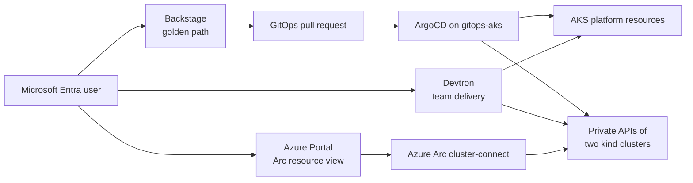
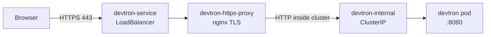

# Customer demo deployment and troubleshooting guide

This guide records the deployment approach, decisions, validation commands, and
recovery patterns used for the current WestUS2 customer demo. It is a learning
runbook: read it before changing the environment, then use the presentation
script for the customer meeting.

> Never paste Entra client secrets, GitHub tokens, Kubernetes service-account
> tokens, Terraform state, or decoded Devtron administrator passwords into Git,
> tickets, or chat. Use Key Vault, Kubernetes Secrets, or local session
> artifacts for sensitive values.

## 1. Current environment

| Item | Current value |
| --- | --- |
| Subscription | `<subscription-id>` |
| Resource group | `aks-gitops-westus2` |
| Region | `westus2` |
| Control-plane AKS | `gitops-aks` |
| Terraform branch | `zhangchl007-arc-multi-cluster-access` |
| System node pool | `system`, `Standard_D4as_v5` |
| Arc connected clusters | `arc-demo-vm`, `arc-demo-vm-2` |
| Backstage | `https://20.69.107.137` |
| Devtron | `https://4.242.109.147/dashboard/` |
| ArgoCD | `https://172.179.107.194` |
| Shared Entra app | `akspe-devtron-sso-westus2` |

The desired live settings are held in the ignored local
`terraform/target-sub.auto.tfvars`; use the tracked `terraform/tfvars` as the
sanitized configuration template. The client secret for the shared Entra app is
intentionally not committed.

## 2. Architecture and ownership



| Component | Correct responsibility |
| --- | --- |
| Backstage | Developer catalog, documentation, ownership, and templates that create governed Git changes |
| Devtron | CI/CD and app deployment to explicitly assigned team environments |
| ArgoCD | Reconciliation of platform baseline and approved GitOps state |
| Fleet Manager | AKS membership and AKS estate governance |
| Azure Arc | External Kubernetes resource inventory and Portal cluster-connect |

Do not allow Devtron and ArgoCD to manage the same Kubernetes objects. ArgoCD
owns platform namespaces and baseline applications; Devtron owns explicitly
assigned team application namespaces.

## 3. Deployment order

Use this order to avoid creating a partially configured demo.

1. Validate the active Azure subscription and Terraform configuration.
2. Apply the AKS/Fleet/network/Arc VM Terraform desired state.
3. Bring up the second VM-hosted kind cluster and onboard both kind clusters to
   Azure Arc.
4. Verify the private kind API paths from `gitops-aks`.
5. Confirm ArgoCD platform applications and Arc baseline applications.
6. Deploy Devtron on `gitops-aks`, register namespace-scoped target credentials,
   then configure projects and environments.
7. Configure shared Entra SSO for Devtron, ArgoCD, and Backstage.
8. Build/push the Backstage image, ensure AKS can pull it, and deploy Backstage.
9. Run the readiness checks before the customer meeting.

### 3.1 Terraform preflight

```powershell
az account show --query "{subscription:id,tenant:tenantId,name:name}" -o json

terraform -chdir=terraform fmt -check -recursive
terraform -chdir=terraform validate
terraform -chdir=terraform plan
```

Review the plan carefully. In particular, do not accept a plan that replaces
`arc-kind-vm`, removes Fleet resources, or destroys Backstage because an
unrelated variable was omitted.

`build_backstage` gates the complete Backstage stack. When operating on a live
Backstage environment, keep it enabled in the Terraform inputs used for the
plan and apply.

### 3.2 AKS managed Entra desired state

The current Terraform configuration declares managed Entra integration and the
AKS deployer/admin group:

```hcl
rbac_aad                        = true
rbac_aad_managed                = true
rbac_aad_admin_group_object_ids = ["<private-entra-admin-group-object-id>"]
rbac_aad_tenant_id              = "<tenant-id>"
```

Verify the live profile with the correct Azure CLI field name:

```powershell
az aks show -g aks-gitops-westus2 -n gitops-aks `
  --query "{state:provisioningState,aadProfile:aadProfile}" `
  -o json
```

Do not use `azureActiveDirectoryProfile`; the current CLI response uses
`aadProfile`.

## 4. Arc multi-cluster deployment

Terraform creates every VM-hosted kind cluster from the `arc_kind_vms` map
through the reusable `terraform/modules/arc-kind-vm` module. The current
desired map provisions `arc-kind-vm` for `arc-demo-vm` and `arc-kind-vm-2` for
`arc-demo-vm-2`.

Each VM-hosted kind cluster requires:

- a NIC in the AKS VNet;
- an NSG rule allowing the VNet to reach private TCP `6443`;
- a Standard outbound public IP for agent downloads and Azure egress;
- a VM managed identity with Arc onboarding roles;
- output data in `arc_kind_vms` for the onboarding script.

Run the generic onboarding script once per VM:

```powershell
powershell.exe -ExecutionPolicy Bypass `
  -File .\scripts\arc-kind-vm-onboard.ps1 `
  -VmName arc-kind-vm `
  -ClusterName arc-demo-vm `
  -ResourceGroup aks-gitops-westus2 `
  -ControlPlaneContext gitops-aks-admin

powershell.exe -ExecutionPolicy Bypass `
  -File .\scripts\arc-kind-vm-onboard.ps1 `
  -VmName arc-kind-vm-2 `
  -ClusterName arc-demo-vm-2 `
  -ResourceGroup aks-gitops-westus2 `
  -ControlPlaneContext gitops-aks-admin
```

The script resolves the IP in this order:

1. `arc_kind_vms[$VmName].private_ip`;
2. legacy `arc_kind_vm.private_ip` for backward compatibility;
3. explicit `-PrivateIp` for recovery or manually provisioned VMs.

Validate both management and delivery views:

```powershell
az connectedk8s list -g aks-gitops-westus2 `
  --query "[].{name:name,state:provisioningState,connectivity:connectivityStatus}" `
  -o table

kubectl --context gitops-aks-admin -n argocd get applications `
  arc-baseline-arc-demo-vm arc-baseline-arc-demo-vm-2 `
  -o custom-columns=NAME:.metadata.name,SYNC:.status.sync.status,HEALTH:.status.health.status
```

Expected: both Arc clusters are `Connected`, and both baseline applications are
`Synced` and `Healthy`.

## 5. Devtron deployment and isolation

Devtron is installed in namespace `devtroncd` on `gitops-aks`, where it can
reach the private kind APIs. It must register external clusters through the
private VNet endpoints, not the Azure Portal relay.

| Target | Private API path | Namespace | Deployer identity |
| --- | --- | --- | --- |
| `arc-demo-vm` | `https://10.52.0.4:6443` | `group1-apps` | `devtron-group1-deployer` |
| `arc-demo-vm-2` | `https://10.52.0.5:6443` | `group1-apps` | `devtron-group1-deployer` |
| `gitops-aks` | in-cluster or kubeconfig | `group2-aks-apps` | `devtron-group2-deployer` |

The upstream Devtron chart conflicted with existing Argo Workflow CRD
ownership. The POC uses a patched local chart artifact so the Devtron release
does not take ownership of platform-managed CRDs.

If the `app-sync` hook retries because an upstream chart download fails, do not
delete healthy core services. Confirm the dashboard, `devtron`, `kubelink`,
PostgreSQL, and Dex workloads are healthy before treating the hook as a demo
blocker:

```powershell
kubectl --context gitops-aks-admin -n devtroncd get pods,deploy,statefulset
kubectl --context gitops-aks-admin -n devtroncd logs deploy/devtron --tail=100
```

### Devtron HTTPS endpoint

The public Devtron endpoint is HTTPS-only for the customer demo:

```text
https://4.242.109.147/dashboard/
```

Devtron itself still listens on HTTP inside the cluster. That is acceptable
because it is cluster-internal traffic. Public access must go through the
repo-managed TLS proxy:



The durable assets are:

| Asset | Purpose |
| --- | --- |
| `gitops/apps/devtron-https/devtron-https-proxy.yaml` | Creates `devtron-internal`, `devtron-https-nginx`, `devtron-https-proxy`, and repoints the existing `devtron-service` LoadBalancer to HTTPS port `443` |
| `scripts/devtron-enable-https.ps1` | Generates a short-lived self-signed certificate with the public IP in the SAN, updates `devtron-https-tls`, applies the manifest, patches `devtron-service` to HTTPS-only, updates Devtron's saved Dex/OIDC URL from HTTP to HTTPS, and restarts Devtron/Dex when needed |

Reapply the HTTPS endpoint after a Devtron Helm upgrade, service recreation, or
certificate expiration:

```powershell
powershell.exe -ExecutionPolicy Bypass `
  -File .\scripts\devtron-enable-https.ps1 `
  -Context gitops-aks-admin
```

If the service has no external IP yet, or if a DNS name is introduced later,
pass the public host explicitly:

```powershell
powershell.exe -ExecutionPolicy Bypass `
  -File .\scripts\devtron-enable-https.ps1 `
  -Context gitops-aks-admin `
  -PublicHost <devtron-public-ip-or-dns-name>
```

Validate the endpoint:

```powershell
kubectl --context gitops-aks-admin -n devtroncd get deploy devtron-https-proxy `
  -o custom-columns=NAME:.metadata.name,READY:.status.readyReplicas,AVAILABLE:.status.availableReplicas

kubectl --context gitops-aks-admin -n devtroncd get svc devtron-service `
  -o custom-columns=NAME:.metadata.name,TYPE:.spec.type,EXTERNAL-IP:.status.loadBalancer.ingress[0].ip,PORTS:.spec.ports[*].port

curl.exe -k -s -o NUL -w "https %{http_code}`n" --max-time 30 `
  https://4.242.109.147/dashboard/

curl.exe -s -o NUL -w "http %{http_code}`n" --connect-timeout 5 --max-time 10 `
  http://4.242.109.147/dashboard/

curl.exe -k -s -w "`nstatus=%{http_code}`n" --max-time 30 `
  https://4.242.109.147/orchestrator/api/dex/.well-known/openid-configuration |
  Select-String -Pattern 'issuer|authorization_endpoint|token_endpoint|status='
```

Expected:

| Check | Expected result |
| --- | --- |
| `devtron-https-proxy` deployment | `READY` and `AVAILABLE` are `1` |
| `devtron-service` public service | only port `443` is exposed |
| HTTPS curl | HTTP status `200` |
| HTTP curl | status `000` or connection timeout |
| Dex discovery curl | HTTP status `200` and issuer URLs start with `https://4.242.109.147/orchestrator/api/dex` |

Because the certificate is self-signed for a short-lived POC, browsers will show
a certificate warning. That warning is acceptable for this demo only. Production
should use a DNS name, trusted certificate, and an ingress or application
gateway.

Troubleshooting:

| Symptom | Likely cause | Recovery |
| --- | --- | --- |
| `https://4.242.109.147/dashboard/` does not load | TLS proxy is not ready or service still points to the Devtron pod | Run `kubectl --context gitops-aks-admin -n devtroncd get pods -l app=devtron-https-proxy` and re-run `scripts/devtron-enable-https.ps1` |
| Browser reaches Devtron over HTTP | `devtron-service` was recreated by Helm with port `80` | Re-run `scripts/devtron-enable-https.ps1`; it patches `devtron-service` back to port `443` only |
| Proxy pod crash loops with nginx PID or temp-path errors | nginx is running as an unprivileged container and cannot write under `/run` | Ensure the live ConfigMap matches `gitops/apps/devtron-https/devtron-https-proxy.yaml`, which moves PID and temp paths under `/tmp` |
| OIDC login fails with `Failed to query provider "http://4.242.109.147/orchestrator/api/dex"` | Devtron's saved `url` or `dex.config` in `devtron-secret` still points to the pre-HTTPS issuer, so the backend queries port `80` | Re-run `scripts/devtron-enable-https.ps1`; it updates the `devtron-secret` URL fields to HTTPS and restarts `deployment/devtron` and `deployment/argocd-dex-server` |
| SSO loops after switching to HTTPS | Shared Entra app still has the old HTTP callback or Devtron OIDC setting was not saved | Confirm the Devtron redirect URI is `https://4.242.109.147/orchestrator/api/dex/callback`, then sign out and retry |

Use two enforcement layers:

1. Devtron project/environment RBAC limits UI and API visibility.
2. Each target environment uses a namespace-scoped Kubernetes service account.

Prove the second layer with `kubectl auth can-i` using the generated limited
kubeconfigs; an allowed action in the assigned namespace must be denied in
`default` and in the other team's namespace.

## 6. Shared Entra SSO deployment

Reuse one app registration for the POC:

| Component | Redirect URI |
| --- | --- |
| Devtron | `https://4.242.109.147/orchestrator/api/dex/callback` |
| ArgoCD | `https://172.179.107.194/auth/callback` |
| Backstage | `https://20.69.107.137/api/auth/microsoft/handler/frame` |

The app must emit `SecurityGroup` claims. Keep real group object IDs in ignored
tfvars or live secret/config automation, not in the public runbook. These group
object IDs are consumed by Devtron, ArgoCD, and Backstage policy mappings:

| Group | Object ID | POC access |
| --- | --- | --- |
| Kind deployers | `<private-kind-deployer-group-object-id>` | Devtron group 1 only |
| AKS deployers | `<private-aks-deployer-group-object-id>` | Devtron group 2, ArgoCD admin, and Backstage demo sign-in |

Persist non-secret ArgoCD OIDC and RBAC settings in
`gitops/environments/default/addons/argo-cd/values.yaml`. Store the client
secret only in the live Kubernetes Secret and secure automation storage.

Common SSO checks:

```powershell
kubectl --context gitops-aks-admin -n argocd get configmap argocd-cm -o yaml
kubectl --context gitops-aks-admin -n argocd get configmap argocd-rbac-cm -o yaml
kubectl --context gitops-aks-admin -n argocd get deploy argocd-server -o wide
```

If an SSO button is missing in Devtron, first complete and save the OIDC
configuration through the local administrator session, then sign out and test
the SSO login page. Do not expose the local administrator password while
demonstrating the feature.

## 7. Backstage deployment

Backstage uses Microsoft Entra at runtime and GitHub only for GitOps pull
requests. Its source changes are in:

- `backstage/app-config.yaml`;
- `backstage/packages/app/src/App.tsx`;
- `backstage/packages/backend/src/index.ts`;
- `backstage/packages/examples/org.yaml`.

The live image is:

```text
ancientsword.azurecr.io/backstage:customer-demo-sso
```

Before deploying a private ACR image, grant the AKS kubelet identity `AcrPull`
at the target registry scope. Then verify image access through the Backstage
rollout:

```powershell
kubectl --context gitops-aks-admin -n backstage rollout status `
  deployment/backstage-backstagechart --timeout=180s
kubectl --context gitops-aks-admin -n backstage get pods,svc
kubectl --context gitops-aks-admin -n backstage logs `
  deployment/backstage-backstagechart --tail=100
```

### Terraform Kubernetes provider recovery

Terraform successfully created Azure-side Backstage resources but the
Kubernetes/Helm provider could fail when its `kubelogin` credential execution
failed. In that case:

1. Do not repeat a broad Terraform apply until the credential failure is
   understood.
2. Verify `kubectl --context gitops-aks-admin` works.
3. Use the local Helm chart only as a controlled recovery path.
4. Reconcile Terraform desired state before the next normal apply; do not leave
   a permanent manual-only deployment.

### Backstage image build lessons

| Symptom | Cause | Recovery |
| --- | --- | --- |
| Yarn refuses to run | Workstation Node was v24 while the repo requires Node 18 or 20 | Build with a supported Node version; the Dockerfile uses Node 20 |
| `yarn build-image` cannot find `Dockerfile` | The package script runs from `packages/backend` while the Dockerfile is in `backstage/` | Run Docker from `backstage/`: `docker build . -f Dockerfile ...` or correct the script before relying on it |
| `ImagePullBackOff` | Image was in an inaccessible ACR or the kubelet lacked `AcrPull` | Use the accessible ACR and assign `AcrPull` to the kubelet identity |
| Backstage starts but login fails | Callback URI, Entra variables, group claims, or allowed-group configuration is wrong | Check the Microsoft callback, `AZURE_*` environment, `BACKSTAGE_ALLOWED_GROUP_IDS`, and the app registration `SecurityGroup` claims |
| `ERR_TLS_CERT_ALTNAME_INVALID` for `https://127.0.0.1:7007/api/catalog/...` | Backstage plugins use loopback for internal HTTPS calls, but the TLS certificate contains only the public endpoint IP | Include both `127.0.0.1` and the Terraform-managed Backstage public IP in `tls_self_signed_cert.backstage.ip_addresses`, update `my-tls-secret`, then restart the deployment |

### Backstage Microsoft Entra sign-in model

Backstage no longer requires every demo user to be pre-created as a catalog
`User`. The backend registers a custom Microsoft resolver that:

1. authenticates the user with the shared Entra app registration;
2. checks the `groups` claim against `BACKSTAGE_ALLOWED_GROUP_IDS`;
3. issues a Backstage identity from the email local part, for example
   `demouser1@contoso.com` becomes `User/default/demouser1`;
4. adds `Group/default/guests` as an ownership claim so the user can use the
   demo portal even if no matching catalog user exists yet.

Configure the allowed groups privately:

```hcl
backstage_allowed_group_object_ids = [
  "<private-backstage-demo-group-object-id>"
]
```

If Terraform manages the Backstage app registration,
`group_membership_claims = ["SecurityGroup"]` is set automatically. If the demo
reuses an existing shared app registration, set its group membership claims to
`SecurityGroup` in Entra before testing Backstage sign-in. If Entra returns a
group-overage claim instead of inline groups, limit the app registration group
claim to the Backstage demo group or add Microsoft Graph group lookup before the
customer demo.

Validate the public endpoint:

```powershell
curl.exe -k -s -o NUL -w "%{http_code} %{url_effective}`n" `
  --max-time 20 https://20.69.107.137
```

The expected root response is HTTP `200`. A direct IP certificate warning is
acceptable only for this short-lived demo; production requires a DNS name and
trusted certificate.

For the self-signed demo certificate, verify both the public endpoint and
loopback are SANs. The loopback SAN is required for the catalog lookup used
during Microsoft Entra sign-in:

```text
IP:127.0.0.1
IP:<backstage-public-ip>
```

After a certificate rotation, restart the Backstage deployment and validate the
in-pod catalog endpoint. An HTTP `401` without an auth token confirms TLS and
routing are healthy:

```powershell
$script = @'
const https = require("https");
const fs = require("fs");
https.get({
  hostname: "127.0.0.1",
  port: 7007,
  path: "/api/catalog/entities/by-name/User/default/<user-name>",
  ca: fs.readFileSync("/etc/tls/tls.crt"),
}, response => {
  console.log(`status=${response.statusCode}`);
  response.resume();
}).on("error", error => {
  console.error(error);
  process.exit(1);
});
'@

kubectl --context gitops-aks-admin -n backstage exec `
  deployment/backstage-backstagechart -- node -e $script
```

## 8. ArgoCD and GitOps troubleshooting

```powershell
kubectl --context gitops-aks-admin -n argocd get pods
kubectl --context gitops-aks-admin -n argocd get applications `
  -o custom-columns=NAME:.metadata.name,SYNC:.status.sync.status,HEALTH:.status.health.status
```

| Symptom | Investigation | Resolution |
| --- | --- | --- |
| App is `OutOfSync`, but healthy | Compare the app manifest and live resource | Determine whether the difference is intentional before syncing or pruning |
| Arc baseline is unavailable | Check Arc connectivity, ArgoCD cluster Secret, and private API reachability | Re-run the VM onboarding script only after checking its idempotent inputs |
| SSO login loops | Verify exact redirect URI, issuer tenant, app client ID, and group claim configuration | Correct the shared app configuration; do not create a duplicate app as a workaround |
| Application cannot reach a kind cluster | Test from `gitops-aks` to the private `10.52.x.x:6443` endpoint | Check VNet route, VM NIC, NSG TCP `6443`, and kind API binding |

## 9. Final readiness gate

Run this single sequence before the demo:

```powershell
$context = "gitops-aks-admin"
$resourceGroup = "aks-gitops-westus2"

az connectedk8s list -g $resourceGroup `
  --query "[].{name:name,state:provisioningState,connectivity:connectivityStatus}" `
  -o table

kubectl --context $context -n argocd get applications
kubectl --context $context -n devtroncd get pods
kubectl --context $context -n backstage get pods,svc

foreach ($url in @(
  "https://172.179.107.194",
  "https://4.242.109.147/dashboard/",
  "https://20.69.107.137"
)) {
  curl.exe -k -s -o NUL -w "%{http_code} %{url_effective}`n" --max-time 20 $url
}
```

Do not begin the customer demo if either Arc cluster is disconnected, any core
portal is unavailable, or an ArgoCD baseline application is degraded. Use the
fallback screenshots or a prior successful run instead of troubleshooting live.

## 10. Related documents

| Document | Purpose |
| --- | --- |
| `docs/customer-demo-end-to-end-runbook.md` | Presenter script and customer talk track |
| `docs/backstage-feature-demo.md` | Backstage golden-path walkthrough |
| `docs/devtron-poc-foundation.md` | Devtron POC, projects, environments, and RBAC |
| `docs/arc-kubernetes-onboarding.md` | Arc onboarding and Portal namespace demo |
| `docs/create-aks-cluster-argocd-fleet-demo.md` | AKS/Fleet/CAPZ walkthrough |
