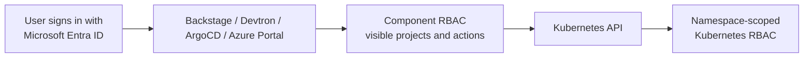

# Customer demo presentation script

This is the presenter runbook for the multi-cluster platform engineering demo.
It is deliberately concise: use the component runbooks for installation and
troubleshooting, not during the customer conversation.

## The story in one minute

> The platform lets teams deploy safely without broad cluster credentials. One
> Microsoft Entra identity signs users into purpose-built entry points:
> Backstage provides a governed golden path, Devtron provides team-scoped
> delivery, Azure Arc provides an Azure view of external Kubernetes, and ArgoCD
> reconciles approved GitOps state. Fleet manages AKS; Arc manages external
> clusters. Authorization is enforced both in the portal and in Kubernetes.

## What is live in this POC

| Capability | Live component | Presenter URL |
| --- | --- | --- |
| Developer catalog and golden path | Backstage | `https://20.69.107.137` |
| Team delivery workspace | Devtron | `https://4.242.109.147/dashboard/` |
| GitOps reconciliation | ArgoCD | `https://172.179.107.194` |
| AKS management cluster | `gitops-aks` | Azure Portal / CLI |
| External Kubernetes management | `arc-demo-vm`, `arc-demo-vm-2` | Azure Portal / Azure Arc |

The shared Microsoft Entra app registration is
`akspe-devtron-sso-westus2`. Do not create a second app for Backstage, Devtron,
or ArgoCD unless a product limitation requires one.

## Responsibility model

| Component | Owns | Does not own |
| --- | --- | --- |
| Backstage | Catalog, docs, ownership, and governed request templates | Direct production deployment or cluster administration |
| Devtron | Team app deployment workflows for assigned projects and environments | Platform add-ons or another team's namespace |
| ArgoCD | Approved GitOps reconciliation, platform add-ons, and baseline apps | Ad hoc user deployment requests |
| Azure Kubernetes Fleet Manager | AKS membership and AKS estate governance | External kind clusters |
| Azure Arc-enabled Kubernetes | External-cluster inventory and Portal cluster-connect | GitOps delivery |
| Azure Portal | Simple namespace-scoped resource inspection and edits on Arc clusters | A replacement for CI/CD |

## Identity and isolation model

Use this diagram and table to explain why SSO alone is not the authorization
model:



| Entra group | Demo permission | Allowed target |
| --- | --- | --- |
| `akspe-kind-cluster-deployers` (`<private-kind-deployer-group-object-id>`) | Devtron group 1 delivery | View all kind targets; deploy only to `arc-demo-vm/group1-apps` and `arc-demo-vm-2/group1-apps` |
| `akspe-aks-cluster-deployers` (`<private-aks-deployer-group-object-id>`) | Devtron group 2 delivery, ArgoCD admin, and Backstage demo sign-in | View AKS targets; deploy only to `gitops-aks/group2-aks-apps` |
| `akspe-arc-portal-users` (`<private-arc-portal-group-object-id>`) | Azure Portal / Arc resource view | Approved Arc namespace operations |

The enforcement is intentionally layered:

1. Entra establishes the user identity.
2. Backstage, Devtron, ArgoCD, and Azure RBAC determine what the user can see
   and start.
3. Namespace-scoped Kubernetes RBAC limits what the deployed credential can do.

## Presenter preparation

Run this before opening the meeting. It is read-only.

```powershell
$resourceGroup = "aks-gitops-westus2"
$context = "gitops-aks-admin"

az connectedk8s list -g $resourceGroup `
  --query "[].{name:name,state:provisioningState,connectivity:connectivityStatus}" `
  -o table

kubectl --context $context -n argocd get pods
kubectl --context $context -n argocd get applications
kubectl --context $context -n devtroncd get pods
kubectl --context $context -n backstage get pods,svc

foreach ($url in @(
  "https://172.179.107.194",
  "https://4.242.109.147/dashboard/",
  "https://20.69.107.137"
)) {
  curl.exe -k -s -o NUL -w "%{http_code} %{url_effective}`n" --max-time 20 $url
}
```

Expected:

- `arc-demo-vm` and `arc-demo-vm-2` are `Succeeded` and `Connected`.
- ArgoCD, Devtron, and Backstage pods are running.
- The three presentation endpoints return HTTP `200`.
- `arc-baseline-arc-demo-vm` and `arc-baseline-arc-demo-vm-2` are `Synced` and
  `Healthy`.

Open these browser tabs before presenting:

1. Azure Portal at the resource group and Arc-enabled Kubernetes resources.
2. Backstage sign-in page.
3. Devtron dashboard.
4. ArgoCD applications page.
5. The GitHub repository and a prepared pull request, if demonstrating the
   Backstage template end-to-end.

Do not use a local admin password, client secret, service-account token, or
Terraform output containing secrets in the customer demo.

## 15-minute customer walkthrough

### 1. Establish the platform boundary (2 minutes)

Show the resource group, `gitops-aks`, and the two Azure Arc-connected clusters.

```powershell
az aks show -g aks-gitops-westus2 -n gitops-aks `
  --query "{name:name,state:provisioningState,kubernetesVersion:kubernetesVersion}" `
  -o table

az connectedk8s list -g aks-gitops-westus2 `
  --query "[].{name:name,state:provisioningState,connectivity:connectivityStatus}" `
  -o table
```

Say:

> `gitops-aks` is the platform management cluster. AKS workloads are governed
> through Fleet; the two VM-hosted kind clusters are non-AKS targets governed
> through Azure Arc. We deliberately use the Azure-native management service
> appropriate to each cluster type.

### 2. Establish common identity and least privilege (2 minutes)

Show the identity-and-isolation table above. Do not show secrets or an Entra
client configuration page.

Say:

> The same Entra application provides the sign-in experience. It does not give
> every user the same access. Component RBAC constrains what they can see, and
> namespace-scoped Kubernetes RBAC constrains what an approved deployment can
> change.

### 3. Show the governed developer path in Backstage (3 minutes)

Open `https://20.69.107.137`, choose **Microsoft Entra ID**, then show
**Catalog**, **Docs**, and **Create**. Select **Deploy Application with
ArgoCD**.

Show that the template asks for application, repository, manifest path,
namespace, ownership, and GitOps details.

Say:

> Backstage is not a direct cluster console. It is the front door for a
> standardized request. The developer gets a simple experience, while the
> platform gets an auditable pull request that carries the approved GitOps
> contract.

If a pre-created template run is available, show the generated catalog entity
and ArgoCD `Application` manifest rather than creating a new pull request live.

### 4. Show GitOps reconciliation in ArgoCD (2 minutes)

Open `https://172.179.107.194`, sign in through Microsoft Entra, and show the
applications list. Highlight the two Arc baseline applications.

```powershell
kubectl --context gitops-aks-admin -n argocd get applications `
  -o custom-columns=NAME:.metadata.name,SYNC:.status.sync.status,HEALTH:.status.health.status
```

Say:

> ArgoCD turns approved Git into running state. The platform team has a single,
> reviewable reconciliation layer instead of manually applying manifests to
> clusters. ArgoCD owns platform baselines; it does not compete with Devtron for
> team application objects.

### 5. Show team-scoped delivery in Devtron (3 minutes)

Open `https://4.242.109.147/dashboard/`, sign in through Microsoft Entra, and
show the project/environment mapping:

| Project | Environment | Target |
| --- | --- | --- |
| `group1-kind-apps` | `g1-kind1` | `arc-demo-vm/group1-apps` |
| `group1-kind-apps` | `g1-kind2` | `arc-demo-vm-2/group1-apps` |
| `group2-aks-apps` | `g2-aks` | `gitops-aks/group2-aks-apps` |

Say:

> Devtron is the delivery workspace for a team that already has an approved
> project and environment. Group 1 can deploy to the two external kind clusters;
> it cannot deploy to the AKS project. Group 2 has the AKS project. The UI
> restriction is backed by a different namespace-scoped deployer credential for
> each target.

Presenter note: Devtron SSO is group-based. The shared Entra app emits
`SecurityGroup` claims, Devtron permission groups are named by private Entra
group object ID, and Dex maps Entra `preferred_username` to the standard `email`
claim for work accounts. If the login page reports `AADSTS650053` or `missing
email claim`, stop the live demo path and use the fallback table below; recover
afterward with `scripts/devtron-enable-https.ps1`.

### 6. Show Azure Arc ordinary-user access (2 minutes)

In Azure Portal, open either `arc-demo-vm` or `arc-demo-vm-2`, then open
**Kubernetes resources**. Show the `portal-demo` namespace and its safe demo
objects: Deployment, StatefulSet, ConfigMap, placeholder Secret, and Service.

Say:

> Arc gives an ordinary Azure Portal user a familiar resource experience without
> exposing the kind API on the internet. The Portal reaches the cluster through
> Arc cluster-connect and `kube-aad-proxy`; Devtron and ArgoCD use the private
> VNet API path for reliable automated delivery.

### 7. Close with outcomes (1 minute)

Say:

> The outcome is not one tool for every task. It is a governed operating model:
> Backstage standardizes requests, Devtron delivers within team boundaries,
> ArgoCD reconciles approved Git, Fleet governs AKS, and Arc makes external
> Kubernetes visible in Azure. One Entra identity provides a consistent sign-in
> experience, while layered RBAC provides least privilege.

## Questions and demonstration choices

| Customer question | Show | Key point |
| --- | --- | --- |
| How is a new app requested? | Backstage Create template | A request becomes a reviewable GitOps pull request |
| Who deploys where? | Devtron project/environment view | UI RBAC and Kubernetes RBAC work together |
| How do you manage the two kind clusters? | Azure Arc resources and ArgoCD Arc baseline apps | Arc for external-cluster management, GitOps for baseline state |
| How is AKS different from external Kubernetes? | Fleet and Arc inventory | Fleet is for AKS; Arc is for non-AKS |
| How is this audited? | Pull request plus ArgoCD history | Git is the source of truth |

## If a live step fails

Do not troubleshoot interactively in front of the customer. Use the fallback
path and continue the story:

| Symptom | Fallback |
| --- | --- |
| Backstage sign-in is unavailable | Show the prepared template output and explain the GitOps contract |
| Devtron SSO is unavailable | Show the preconfigured projects/environments using the admin session only; do not expose credentials. After the meeting, re-run `scripts/devtron-enable-https.ps1` to restore HTTPS issuer, Entra email mapping, and group-claim handling |
| ArgoCD UI is unavailable | Use `kubectl get applications` output |
| Azure Portal is slow | Use `az connectedk8s list` and the Arc baseline apps |
| A workload is not healthy | Show a previously healthy component; do not create or delete workloads during the meeting |

## Related detailed runbooks

| Document | Use it for |
| --- | --- |
| `docs/backstage-feature-demo.md` | Backstage template and GitOps pull-request walkthrough |
| `docs/devtron-poc-foundation.md` | Devtron installation, project isolation, and namespace RBAC |
| `docs/create-aks-cluster-argocd-fleet-demo.md` | AKS workload cluster and Fleet walkthrough |
| `docs/arc-kubernetes-onboarding.md` | Azure Arc onboarding and Portal resource access |
| `docs/customer-demo-deployment-and-troubleshooting.md` | Current deployment order, recovery procedures, and learning notes |
