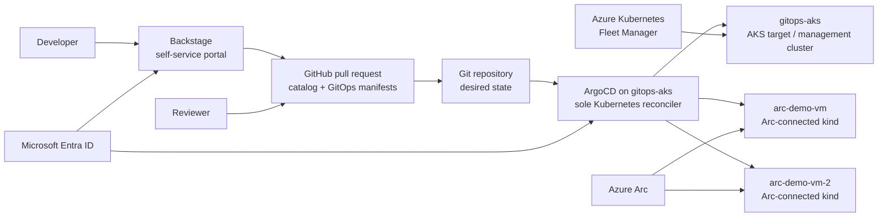

# Customer demo end-to-end runbook

Use this runbook to present the platform engineering demo to a customer. It is
the top-level script for the presentation; use the linked runbooks for deeper
operator detail.

## Demo story

The platform team provides governed self-service across AKS and external
Kubernetes:

- **Git** is the request, review, and audit surface.
- **ArgoCD** is the sole continuous Kubernetes reconciler.
- **Backstage** is the developer front door for golden-path requests.
- **Azure Kubernetes Fleet Manager** governs AKS clusters.
- **Azure Arc-enabled Kubernetes** represents external Kubernetes clusters.
- **Microsoft Entra ID** is the common identity source.

The customer should see faster delivery without standing cluster-admin access:
developers request standard changes, reviewers approve Git changes, and ArgoCD
reconciles the approved state.

## Roles in the walkthrough

| Role | What they care about | Demo focus |
| --- | --- | --- |
| Executive sponsor | Speed with governance | One platform flow across AKS and external Kubernetes |
| Platform operator / `k8sadmin` | Control, audit, troubleshooting | ArgoCD, Fleet, Arc, Backstage Catalog |
| Developer | Low-friction self-service | Backstage template and generated pull request |
| Reviewer / approver | Change control | Git review before deployment |
| External-cluster operator | Azure view of non-AKS clusters | Arc-connected kind clusters and namespace-scoped Portal demo |

## Architecture to present



Key boundaries:

- `gitops-aks` is the management and demo AKS cluster.
- `arc-demo-vm` and `arc-demo-vm-2` are external, VM-hosted kind clusters
  onboarded to Azure Arc.
- Fleet is the AKS fleet and rollout plane. Arc is the Azure management-plane
  bridge for external, hybrid, and multicloud Kubernetes.
- Backstage requests changes. ArgoCD deploys changes.

The mandatory ownership rules are in
[Project specification](./project-specification.md). If a lower-level runbook or
legacy script conflicts with that specification, follow the specification.

## Answering the Arc questions

Customers often ask whether Azure Arc should be the single operations entry
point for every Kubernetes cluster. The best answer is nuanced:

> Azure Arc is the Azure management-plane bridge for hybrid and multicloud
> Kubernetes. It is excellent for inventory, access, policy, monitoring,
> extensions, and GitOps integration. AKS remains first-class through native AKS
> and Fleet capabilities. External clusters such as TKE become visible and
> governable through Arc, but their lifecycle remains with their native
> platform. In this project, ArgoCD remains the continuous Kubernetes
> reconciler.

### Capability positioning

| Cluster type | How Azure sees it | Good Arc/Fleet use | What Arc does not replace |
| --- | --- | --- | --- |
| AKS in Azure | Native Azure managed Kubernetes resource | Fleet grouping, AKS lifecycle, Azure-native RBAC, Monitor, Defender, Policy, and GitOps integration | Arc is not needed as the primary AKS management plane; AKS lifecycle, node pools, upgrades, networking, and identity remain native AKS capabilities |
| AKS enabled by Azure Arc / Azure Local | Azure-managed Kubernetes outside Azure public cloud | Arc registration, Azure governance, policy, monitoring, and GitOps where supported | Public-cloud AKS-only lifecycle and networking features may not apply the same way |
| External Kubernetes such as TKE, EKS, GKE, OpenShift, or on-prem | Arc-connected Kubernetes resource | Inventory, tagging, Azure RBAC for cluster-connect, Azure Policy, Monitor, Defender, extensions, and GitOps integration | Native provider lifecycle, upgrades, node pools, cloud load balancers, and provider-specific networking |

### Multi-cluster permission control

Use a layered model:

| Layer | Purpose | Demo stance |
| --- | --- | --- |
| Microsoft Entra groups | Common identity and group membership | Use groups, not per-user grants |
| Azure RBAC on Arc connectedCluster resources | Controls who can view Arc resources and request cluster-connect access | Grant only the roles needed for the operator persona |
| Kubernetes RBAC inside each cluster | Final authority for Kubernetes actions | Namespace-scoped writes for ordinary users; cluster-admin only for platform admins |
| ArgoCD RBAC and AppProjects | Controls GitOps application visibility and allowed destinations | Keep delivery constrained by project, cluster, namespace, and resource kind |
| Backstage permissions and Catalog ownership | Developer-facing discovery and request flow | Backstage is a request and visibility portal, not a deployment credential |

For customer discussion, position Azure Portal / Arc as the operations view for
external clusters and simple namespace-scoped actions. Do not promise isolated
namespace-only browsing in the Portal unless the customer's browser and Arc
resource experience have been tested, because the Portal may need broader
read-only cluster discovery to render resource lists.

### Arc GitOps best practice

Azure's built-in GitOps option for AKS and Arc-enabled Kubernetes is Flux v2
through Kubernetes configuration and cluster extensions. This repository uses
ArgoCD instead because the customer demo is centered on ArgoCD app-of-apps,
AppProjects, Backstage-generated pull requests, and centralized application
health.

Do not run Flux and ArgoCD against the same Kubernetes resources unless
ownership is explicitly partitioned by namespace, path, or resource type. For
this project, ArgoCD is the only continuous reconciler for Kubernetes desired
state.

## What not to show

Do not show or copy into presentation material:

- tenant IDs, subscription IDs, group object IDs, client IDs, client secrets, PATs,
  service-account tokens, kubeconfigs, CA data, rendered ArgoCD cluster Secrets,
  VM bootstrap logs, PostgreSQL credentials, or Terraform state;
- fixed proof-of-concept public IPs or self-signed-certificate browser warnings;
- ArgoCD local admin passwords as the customer login path;
- direct `kubectl apply`, imperative patches, Helm upgrades, or Terraform applies
  against ArgoCD-owned Kubernetes resources;
- Backstage as a replacement for ArgoCD;
- Arc as an AKS governance plane.

## Parameter sheet

Prepare these values before the customer session. Keep private values in an
ignored local notes file or secure password manager, not in this repository.

| Parameter | Example placeholder |
| --- | --- |
| Azure subscription | `<subscription-name>` |
| Resource group | `<resource-group>` |
| Region | `<azure-region>` |
| Git branch watched by ArgoCD | `<gitops-revision>` |
| Backstage URL | `https://<backstage-hostname>` |
| ArgoCD URL | `https://<argocd-hostname>` |
| Fleet name | `<fleet-name>` |
| Management AKS cluster | `gitops-aks` |
| Arc clusters | `arc-demo-vm`, `arc-demo-vm-2` |
| Demo application namespace | `<demo-namespace>` |
| Entra access groups | Keep object IDs private |

## Preflight checklist

Run preflight at least one business day before the presentation, then repeat the
read-only health checks shortly before the session.

### 1. Confirm local context

```powershell
az account show --query "{name:name,user:user.name}" -o table
kubectl config current-context
kubectl --context gitops-aks-admin get nodes
git status --short
git branch --show-current
```

Expected:

- Azure account is the intended demo subscription.
- Kubernetes context is the management cluster context.
- Git branch is pushed and matches the revision watched by ArgoCD.
- Working tree is clean unless intentionally presenting a prepared change.

### 2. Validate source

```powershell
git diff --check
terraform -chdir=terraform fmt -check -recursive
terraform -chdir=terraform init -backend=false
terraform -chdir=terraform validate
helm lint gitops\clusters\capz\charts\azure-managed-cluster
helm template azure-managed-cluster gitops\clusters\capz\charts\azure-managed-cluster | Out-Null
```

For Backstage changes:

```powershell
Set-Location backstage
yarn catalog:validate
yarn tsc
Set-Location ..
```

Use `yarn test` only when code changed or time allows. Do not use live
cluster sync, prune, apply, or Terraform apply as validation unless the customer
demo owner explicitly approves it.

### 3. Verify ArgoCD and GitOps health

```powershell
kubectl --context gitops-aks-admin -n argocd get pods
kubectl --context gitops-aks-admin -n argocd get applications
kubectl --context gitops-aks-admin -n argocd get applicationsets
```

Expected:

- ArgoCD pods are running.
- `platform-access` and `backstage` are `Synced` and `Healthy`.
- Demo applications for AKS and both Arc clusters are `Synced` and `Healthy`.

### 4. Verify AKS and Fleet

```powershell
az aks show `
  -g <resource-group> `
  -n gitops-aks `
  --query "{name:name,location:location,powerState:powerState.code,provisioningState:provisioningState}" `
  -o table

az fleet show `
  -g <resource-group> `
  -n <fleet-name> `
  --query "{name:name,provisioningState:provisioningState}" `
  -o table

az fleet member list `
  -g <resource-group> `
  --fleet-name <fleet-name> `
  -o table
```

Expected:

- `gitops-aks` is running.
- Fleet exists and is healthy.
- The expected AKS members are present.

### 5. Verify Arc external clusters

```powershell
az connectedk8s list `
  -g <resource-group> `
  --query "[?name=='arc-demo-vm' || name=='arc-demo-vm-2'].{name:name,provisioningState:provisioningState,connectivityStatus:connectivityStatus,kubernetesVersion:kubernetesVersion,totalNodeCount:totalNodeCount}" `
  -o table

kubectl --context gitops-aks-admin -n argocd get secrets `
  -l "argocd.argoproj.io/secret-type=cluster,environment=arc" `
  --show-labels
```

Expected:

- Both Arc clusters are connected.
- ArgoCD has cluster Secrets for both Arc clusters with platform-access labels.

### 6. Verify Backstage and Catalog

```powershell
kubectl --context gitops-aks-admin -n backstage get pods
kubectl --context gitops-aks-admin -n backstage logs deploy/backstage-backstagechart `
  | Select-String 'Reading msgraph users and groups|Committed .*msgraph groups'
```

In the UI:

1. Sign in with Microsoft Entra ID.
2. Open **Catalog**.
3. Confirm these Resources exist:
   - `gitops-aks`
   - `arc-demo-vm`
   - `arc-demo-vm-2`
4. Confirm each Resource is owned by `group:default/k8sadmin`.

If group membership changed recently, sign out and sign back in after the
Microsoft Graph provider refresh completes.

## Demo readiness caveats

Resolve or consciously position these before the customer session:

- Do not wait for live AKS provisioning during the main presentation. Use a
  pre-created workload cluster or a prepared "before and after" flow, then show
  the GitOps definition and the resulting Azure/Fleet state.
- Fleet membership for a CAPZ-created workload cluster is currently an approved
  operator step after AKS provisioning reaches `Succeeded`; present that as an
  integration caveat, not as fully automated GitOps.
- Confirm demo Applications use the intended restricted AppProjects. If any demo
  Application still uses ArgoCD `default`, either update it before the customer
  session or explicitly frame the AppProjects as the target policy model rather
  than the enforced live state.
- Use customer-safe hostnames and certificates. Avoid direct public IPs and
  self-signed-certificate browser warnings in the customer presentation.

## Recommended 35-minute demo flow

| Time | Action | Customer proof |
| --- | --- | --- |
| 0-3 min | Show the architecture and control boundaries. | One platform flow; separate AKS, Arc, Backstage, ArgoCD responsibilities. |
| 3-7 min | Show control-plane ArgoCD and the GitOps cluster definition path. | Git to ArgoCD to CAPZ/AKS lifecycle. |
| 7-10 min | Show Fleet membership. | AKS estate is grouped for central operations. |
| 10-13 min | Explain Entra groups and least privilege. | Backstage sign-in, platform admin, and deployer permissions are separate. |
| 13-21 min | In Backstage, open **Create -> Deploy Application with ArgoCD** and show the generated PR. | Developers request a standard GitOps change; they do not get cluster write credentials. |
| 21-26 min | Merge a prepared PR or show a previously merged PR, then show ArgoCD health and workload pods. | Git review, ArgoCD reconciliation, and running workload. |
| 26-30 min | Open Backstage Catalog Resources for the three clusters. | Ownership and runtime discovery are visible in one portal. |
| 30-33 min | Show Arc-connected external clusters and optional Portal namespace demo. | External Kubernetes is visible through Azure Arc while delivery remains GitOps. |
| 33-35 min | Recap and discuss next steps. | Governed self-service with audit and least privilege. |

## Live walkthrough details

### 1. Open with the control model

Say:

> Developers do not need standing cluster-admin access. They make governed
> requests through Backstage or Git. Reviewers approve the change in Git. ArgoCD
> is the only continuous Kubernetes reconciler.

Show the project specification if the customer asks how ownership is enforced:

```text
docs/project-specification.md
```

### 2. Show ArgoCD as the Kubernetes control loop

```powershell
kubectl --context gitops-aks-admin -n argocd get applications -o wide
```

Point out:

- `platform-access`
- `backstage`
- AKS demo applications
- Arc/kind demo applications

Do not manually sync unless that has been approved for the demo.

### 3. Show Fleet for AKS

```powershell
az fleet member list `
  -g <resource-group> `
  --fleet-name <fleet-name> `
  -o table
```

Talking point:

> Fleet is the Azure governance view for AKS. We do not use Arc to manage AKS in
> this demo.

### 4. Show Backstage as the developer entry point

1. Open `https://<backstage-hostname>`.
2. Choose **Microsoft Entra ID**.
3. Open **Create**.
4. Select **Deploy Application with ArgoCD**.
5. Show fields for application name, owner, namespace, source repository, and
   GitOps repository.
6. Show the generated pull request.

Use a prepared PR if network, OAuth consent, or GitHub rate limits could slow
the session.

Talking point:

> Backstage is not deploying directly. It produces a reviewable GitOps change.

### 5. Show approval and reconciliation

After the PR is merged or when showing a prepared merge:

```powershell
kubectl --context gitops-aks-admin -n argocd get application <application-name> -o wide
kubectl --context gitops-aks-admin -n <demo-namespace> get all
```

Expected:

- ArgoCD Application is `Synced` and `Healthy`.
- Workload pods are running.

### 6. Show Catalog ownership and Kubernetes visibility

In Backstage:

1. Open **Catalog**.
2. Open `gitops-aks`, `arc-demo-vm`, and `arc-demo-vm-2`.
3. Show ownership by `k8sadmin`.
4. Show Kubernetes workload visibility if the entity has matching workload
   annotations.

Talking point:

> Backstage uses read-only technical credentials for visibility. These are not
> human deployment credentials.

### 7. Show Azure Arc external clusters

```powershell
az connectedk8s list `
  -g <resource-group> `
  --query "[].{name:name,provisioningState:provisioningState,connectivityStatus:connectivityStatus}" `
  -o table
```

In Azure Portal, show:

- `arc-demo-vm`
- `arc-demo-vm-2`
- Kubernetes resources view
- optional `portal-demo` namespace-scoped resources

Talking point:

> Arc gives Azure management-plane visibility for non-AKS clusters. ArgoCD still
> owns continuous workload delivery.

## Approval gates

Get named approval before any of these actions:

- merging GitOps changes for the live demo;
- creating or deleting AKS clusters;
- adding or removing Fleet members;
- registering a new ArgoCD target cluster;
- changing Entra groups, Graph permissions, Azure RBAC, or Kubernetes RBAC;
- creating or rotating Backstage runtime or identity Secrets;
- manual ArgoCD sync, prune, or rollback;
- teardown or resource-group deletion.

Scripts that mint cluster-admin service accounts or ArgoCD cluster Secrets are
privileged. Do not run them during a customer session unless the demo owner and
security owner have approved the action.

## Fallback plan

| Symptom | Safe response |
| --- | --- |
| ArgoCD app missing | Check ApplicationSet, cluster Secret labels, watched branch, and repo path. Do not apply manifests manually. |
| ArgoCD app OutOfSync | Inspect app diff and repo-server/application-controller logs. Prefer a Git fix or approved manual sync. |
| AKS provisioning slow | Use the pre-created cluster result. Show CAPZ resource status and Azure provisioning state. |
| Fleet member missing | Confirm AKS provisioning is `Succeeded`, then use an approved operator retry. |
| Arc cluster disconnected | Show the other connected Arc cluster and inspect Arc agent state after the session. |
| Backstage login fails | Check Entra assignment, callback URL, Backstage logs, and Graph sync. Have the user sign out/in after group changes. |
| Catalog owner missing | Verify Microsoft Graph provider committed groups. Do not add static production Groups. |
| GitHub PR creation fails | Use a prepared PR and explain the generated files. |

## Teardown

Normal teardown is GitOps-first:

1. Open an approved pull request that removes the demo desired state.
2. Merge after review.
3. Let ArgoCD and CAPZ reconcile the removal.
4. Verify the workload, Fleet member, AKS cluster, Arc registration, and resource
   group state with read-only commands.

Break-glass cleanup, such as direct `kubectl delete`, `az fleet member delete`,
`az aks delete`, or resource-group deletion, requires explicit human approval
and should not be presented as the normal operating model.

## Related runbooks

- [Project specification](./project-specification.md)
- [Create a new AKS workload cluster with ArgoCD and Fleet Manager](./create-aks-cluster-argocd-fleet-demo.md)
- [Azure Arc Kubernetes onboarding](./arc-kubernetes-onboarding.md)
- [Backstage application deployment with ArgoCD](./backstage-feature-demo.md)
- [Backstage operations](./backstage.md)

## Presenter checklist

- [ ] Browser profile is signed in with the correct Entra account.
- [ ] Backstage and ArgoCD URLs use customer-safe hostnames.
- [ ] Prepared PR is ready.
- [ ] ArgoCD apps are `Synced/Healthy`.
- [ ] Fleet member list is clean.
- [ ] Both Arc clusters are connected.
- [ ] Backstage Catalog resolves all three cluster Resources and `k8sadmin`.
- [ ] No secrets, object IDs, tokens, kubeconfigs, or fixed POC IPs are visible.
- [ ] Fallback screenshots or prepared outputs are available.
