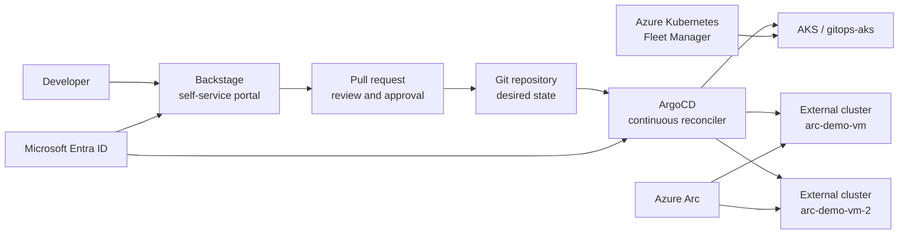

# Customer demo guide: governed multi-cluster platform on Azure

This guide is the customer-facing storyline for demonstrating the platform
engineering solution. It explains the architecture, control boundaries, and demo
flow without exposing environment-specific credentials or implementation-only
details.

For the Chinese version, see
[客户演示指南：Azure 上的多集群平台工程方案](./customer-demo-end-to-end-runbook.zh-cn.md).

## Executive summary

The demo shows how a platform team can provide governed self-service across AKS
and external Kubernetes clusters:

- **Backstage** gives developers a guided self-service portal.
- **GitHub pull requests** provide review, approval, and audit.
- **ArgoCD** continuously reconciles approved Kubernetes desired state.
- **Azure Kubernetes Fleet Manager** supports AKS fleet-level operations.
- **Azure Arc-enabled Kubernetes** extends Azure governance to external,
  hybrid, and multicloud Kubernetes clusters.
- **Microsoft Entra ID** provides the shared identity foundation.

The key message is simple: developers do not need standing cluster-admin access.
They request standard changes, reviewers approve those changes in Git, and the
platform reconciles the approved state through GitOps.

## Architecture

### Control boundaries

| Area | Role in the demo |
| --- | --- |
| Backstage | Developer-facing portal for service discovery and standardized deployment requests |
| GitHub | Reviewable change control and audit trail |
| ArgoCD | Sole continuous reconciler for Kubernetes desired state in this project |
| AKS | Azure-native managed Kubernetes platform |
| Azure Kubernetes Fleet Manager | Fleet-level AKS grouping, governance, and rollout plane |
| Azure Arc-enabled Kubernetes | Azure management-plane bridge for external, hybrid, and multicloud Kubernetes |
| Microsoft Entra ID | Shared identity and group membership source |

## Azure Arc positioning

Azure Arc is valuable as a unified Azure management-plane entry point for
external and multicloud Kubernetes. It should not be presented as a replacement
for native AKS management.

| Cluster type | Recommended positioning | What remains platform-native |
| --- | --- | --- |
| AKS in Azure | First-class Azure managed Kubernetes. Use AKS and Fleet for Azure-native lifecycle and fleet operations. | AKS lifecycle, node pools, upgrades, networking, managed identity, and Azure-native integrations |
| AKS enabled by Azure Arc / Azure Local | Azure-managed Kubernetes outside Azure public cloud, with Arc governance where supported. | Local infrastructure lifecycle and the supported AKS Arc capability set |
| External Kubernetes such as TKE, EKS, GKE, OpenShift, or on-prem | Connect to Azure Arc for inventory, access, policy, monitoring, extensions, and GitOps integration. | Provider-specific lifecycle, upgrades, node pools, cloud load balancers, and networking |

Best-practice message:

> Azure Arc brings external Kubernetes clusters into Azure governance. AKS
> remains first-class through native Azure and Fleet capabilities. In this demo,
> ArgoCD remains the continuous Kubernetes reconciler.

## Multi-cluster access model

The solution uses layered authorization instead of broad, standing admin access.

| Layer | Purpose |
| --- | --- |
| Microsoft Entra groups | Common identity and group membership |
| Azure RBAC on Arc resources | Controls Azure Portal visibility and cluster-connect access |
| Kubernetes RBAC | Final authorization for actions inside each cluster |
| ArgoCD RBAC and AppProjects | Controls GitOps application access and allowed destinations |
| Backstage Catalog | Provides ownership, discovery, and request entry points |

For ordinary users, the recommended write model is namespace-scoped Kubernetes
RBAC. Platform administrators retain elevated access only where operationally
required and audited.

## GitOps model

Azure supports GitOps for AKS and Arc-enabled Kubernetes with Flux v2. This
project uses ArgoCD as the chosen GitOps implementation because the demo focuses
on centralized application health, app-of-apps patterns, AppProjects, and
Backstage-generated pull requests.

Do not run multiple GitOps controllers against the same Kubernetes resources
unless ownership is explicitly partitioned by namespace, path, resource type, or
cluster.

## Demo flow

| Time | Demo segment | Customer proof point |
| --- | --- | --- |
| 0-3 min | Introduce the platform architecture and control boundaries. | One governed operating model across AKS and external Kubernetes. |
| 3-7 min | Show ArgoCD and the GitOps source of truth. | Kubernetes desired state is versioned and continuously reconciled. |
| 7-10 min | Show AKS and Fleet membership. | AKS clusters are governed through Azure-native fleet capabilities. |
| 10-13 min | Explain Microsoft Entra group-based access. | Access is group-based and least-privilege oriented. |
| 13-21 min | Use Backstage to show a standardized deployment request and pull request. | Developers use a guided workflow instead of direct cluster credentials. |
| 21-26 min | Show the approved Git change reconciled by ArgoCD. | Review, audit, and deployment are connected. |
| 26-30 min | Show Backstage Catalog ownership and runtime visibility. | Services and clusters have discoverable ownership. |
| 30-33 min | Show Azure Arc-connected external clusters. | External Kubernetes can be visible and governable from Azure. |
| 33-35 min | Recap architecture and next steps. | Clear path from demo to production hardening. |

## Demo preparation checklist

Prepare the environment before the customer session:

- Confirm the management AKS cluster, ArgoCD, Fleet, Backstage, and Arc-connected
  clusters are healthy.
- Confirm `gitops-aks`, `arc-demo-vm`, and `arc-demo-vm-2` appear in the
  Backstage Catalog with the expected ownership.
- Use customer-safe hostnames and certificates for user-facing portals.
- Prepare a reviewed pull request or a rehearsed Backstage template flow.
- Avoid waiting for live AKS provisioning during the main presentation; use a
  prepared before-and-after flow.
- Keep all tenant IDs, object IDs, tokens, kubeconfigs, and secrets out of the
  presentation.

## Suggested talk track

1. **Start with the operating model.** The platform gives teams self-service
   without direct admin credentials.
2. **Show the separation of concerns.** Backstage requests, GitHub reviews,
   ArgoCD reconciles, Fleet governs AKS, and Arc extends Azure governance to
   external clusters.
3. **Show proof, not internals.** Focus on Git history, ArgoCD health, Fleet
   membership, Arc connectivity, and Backstage Catalog ownership.
4. **Address Arc clearly.** Arc is the Azure bridge for external Kubernetes; AKS
   remains Azure-native and first-class.
5. **Close with production considerations.** Discuss policy, monitoring,
   identity, secrets, certificate/DNS hardening, and rollout governance.

## Production considerations

Before using this pattern in production, align on:

- identity group design and approval workflows;
- Git branch protection and pull-request policy;
- namespace and AppProject boundaries;
- certificate, DNS, and ingress design for Backstage and ArgoCD;
- secret management strategy;
- monitoring, policy, and Defender coverage;
- cluster lifecycle ownership for AKS and external Kubernetes platforms;
- clear ownership partitioning if both Flux and ArgoCD are used.

## Related documents

- [Project specification](./project-specification.md)
- [AKS workload cluster with ArgoCD and Fleet Manager](./create-aks-cluster-argocd-fleet-demo.md)
- [Azure Arc Kubernetes onboarding](./arc-kubernetes-onboarding.md)
- [Backstage application deployment with ArgoCD](./backstage-feature-demo.md)
- [Backstage operations](./backstage.md)
