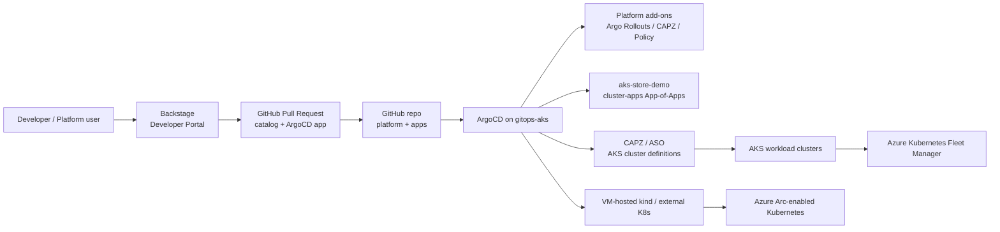

# Customer demo end-to-end runbook

This runbook prepares, deploys, validates, presents, and tears down the
multi-cluster platform engineering customer demo in this repository.

It is intentionally an operator runbook: use it to get the environment ready for
a customer conversation, verify every component before the meeting, drive the
demo story, and delete Azure resources afterwards.

> Do not paste GitHub tokens, OAuth client secrets, service account tokens, or
> Terraform state output into chat, tickets, or commits. Use environment
> variables and placeholders such as `<github-oauth-client-secret>`.

## 1. Demo scope

The demo shows a practical platform engineering model for AKS and external
Kubernetes clusters:

| Capability | Demo component |
| --- | --- |
| Developer portal | Backstage |
| GitOps control loop | ArgoCD |
| Progressive delivery | Argo Rollouts |
| AKS multi-cluster governance | Azure Kubernetes Fleet Manager |
| Infrastructure as a Service | CAPZ / ASO in the current demo; Crossplane as an option |
| External / non-AKS governance | Azure Arc-enabled Kubernetes |
| Identity | Microsoft Entra ID for Azure resources and Arc portal access; GitHub OAuth for Backstage sign-in |
| Secrets | Azure Key Vault + CSI Driver pattern; sensitive values via Terraform env vars |
| Observability | Azure Monitor, Managed Prometheus, Managed Grafana, OpenTelemetry story |
| Policy | Azure Policy and Gatekeeper story |

Boundary rules:

- Backstage is the developer portal for application deployment and ownership. It
  does not create AKS clusters in this demo.
- Azure Portal / Arc is the ordinary-user entry point for simple
  namespace-scoped Kubernetes operations.
- Azure Kubernetes Fleet Manager governs AKS clusters.
- Azure Arc-enabled Kubernetes governs external / non-AKS clusters.
- ArgoCD is the common GitOps reconciliation layer for platform add-ons and apps.

## 2. Architecture at a glance



Current known-good environment names:

| Item | Value |
| --- | --- |
| Resource group | `aks-gitops` |
| Control-plane AKS | `gitops-aks` |
| ArgoCD namespace | `argocd` |
| Fleet Manager | `gitops-fleet` |
| Backstage namespace | `backstage` |
| Backstage service | `backstage-backstagechart` |
| Git branch for demo | `zhangchl007-azure-arc-onboarding` |
| Backstage image | `amllearning02.azurecr.io/backstage:github-idp-fix2` |
| Optional Arc VM cluster | `arc-demo-vm` |

## 3. Prerequisites

### 3.1 Azure subscription

You need an Azure identity with permission to:

- create and delete the demo resource group;
- create AKS, networking, managed identities, role assignments, public IPs, ACR
  references, PostgreSQL, Fleet Manager, and Arc resources;
- register Azure resource providers if they are not already registered.

Confirm Azure context:

```powershell
az account show -o table
az account set --subscription "<subscription-id-or-name>"
```

Confirm or register providers:

```powershell
$providers = @(
  "Microsoft.ContainerService",
  "Microsoft.Kubernetes",
  "Microsoft.KubernetesConfiguration",
  "Microsoft.ExtendedLocation",
  "Microsoft.PolicyInsights",
  "Microsoft.ManagedIdentity",
  "Microsoft.Network",
  "Microsoft.OperationalInsights"
)

foreach ($provider in $providers) {
  az provider show -n $provider --query "{namespace:namespace,state:registrationState}" -o table
}
```

If a required provider is not registered:

```powershell
az provider register -n <provider-namespace>
```

### 3.2 Workstation tools

Required:

```powershell
az version
terraform version
kubectl version --client=true
gh --version
git --version
```

Install or update the Arc extension when using the Arc demo path:

```powershell
az extension add --name connectedk8s --upgrade --only-show-errors
```

### 3.3 GitHub access

Prepare:

- GitHub CLI authenticated with access to this repository.
- A GitHub token that Backstage can use to create GitOps pull requests.
- The demo branch pushed and readable by ArgoCD:
  `zhangchl007-azure-arc-onboarding`.

Check GitHub CLI:

```powershell
gh auth status
$env:GITHUB_TOKEN = gh auth token
$env:TF_VAR_github_token = $env:GITHUB_TOKEN
```

### 3.4 Backstage GitHub OAuth app

Backstage uses GitHub OAuth for demo sign-in.

Recommended demo flow: use the guided setup script. It reserves the static
Backstage Public IP first, prints the exact OAuth URLs, pauses while you update
the GitHub OAuth App in the browser, then continues to deploy Backstage with the
OAuth credentials.

```powershell
.\scripts\setup-backstage-oauth-flow.ps1 -AutoApprove
```

The script prints these values for the GitHub OAuth App:

| Field | Value |
| --- | --- |
| Homepage URL | printed `backstage_base_url` |
| Authorization callback URL | printed `backstage_github_oauth_callback_url` |

Manual fallback: reserve the static IP first and read the outputs yourself. The
reserve step intentionally targets only the public IP, because a broad apply
with `build_backstage=false` can remove an existing Backstage deployment.

```powershell
terraform -chdir=terraform apply `
  -refresh=false `
  -target 'azurerm_public_ip.backstage_public_ip[0]' `
  -var build_backstage=false `
  -var reserve_backstage_public_ip=true `
  -var gitops_addons_org=https://github.com/zhangchl007 `
  -var gitops_addons_revision=zhangchl007-azure-arc-onboarding `
  -var backstage_image_repository=amllearning02.azurecr.io/backstage `
  -var backstage_image_tag=github-idp-fix2

terraform -chdir=terraform output -raw backstage_base_url
terraform -chdir=terraform output -raw backstage_github_oauth_callback_url
```

If the secret is exposed, rotate it in the GitHub UI and re-apply Backstage. See
`docs/backstage-terraform-troubleshooting.md` for the rotation procedure.

Product recommendation: a raw public IP is acceptable only for a short-lived
demo. For production, publish Backstage through a stable DNS name
(`https://backstage.<customer-domain>`) behind Application Gateway, Azure Front
Door, or an ingress controller with a trusted TLS certificate. Use that DNS name
as the GitHub OAuth homepage and callback host.

## 4. Setup plan

Use this sequence for a clean setup:

1. Validate Azure, GitHub, Terraform, and Kubernetes tooling.
2. Run the guided Backstage OAuth setup script.
3. Configure the GitHub OAuth App with the printed homepage and callback URLs.
4. Verify the control-plane AKS and ArgoCD bootstrap.
5. Verify the ArgoCD Server-Side Diff setting for Kubernetes 1.35+ compatibility.
6. Verify Backstage, GitHub OAuth, and the public endpoint.
7. Verify `cluster-apps` and the `aks-store-demo` workload.
8. Verify Fleet Manager and AKS membership.
9. Optionally run the Arc VM-hosted kind onboarding flow.
10. Prepare browser tabs and CLI windows for the customer demo.

## 5. Implementation

### 5.1 Clone and select the branch

```powershell
git clone https://github.com/zhangchl007/aks-platform-engineering.git
cd aks-platform-engineering
git checkout zhangchl007-azure-arc-onboarding
```

### 5.2 Set required environment variables

```powershell
$env:GITHUB_TOKEN = gh auth token
$env:TF_VAR_github_token = $env:GITHUB_TOKEN
```

The guided script prompts for the Backstage GitHub OAuth client ID and client
secret after the static public IP has been reserved and the OAuth URLs are known.

### 5.3 Apply Terraform with the guided OAuth flow

From the repository root:

```powershell
.\scripts\setup-backstage-oauth-flow.ps1 -AutoApprove
```

What the script does:

1. Runs Terraform init.
2. Applies Terraform with `-refresh=false`, targeted to
   `azurerm_public_ip.backstage_public_ip[0]`, with `build_backstage=false` and
   `reserve_backstage_public_ip=true`. This reserves or keeps the static
   Backstage Public IP without deleting an existing Backstage deployment or
   applying unrelated refresh drift.
3. Prints `backstage_public_ip`, `backstage_base_url`, and
   `backstage_github_oauth_callback_url`.
4. Pauses while you configure the GitHub OAuth App.
5. Prompts for the OAuth client ID and secret without writing the secret to disk.
6. Applies Terraform with `build_backstage=true` and
   `reserve_backstage_public_ip=true` to deploy Backstage using the reserved IP.

Manual fallback:

```powershell
terraform -chdir=terraform apply `
  -refresh=false `
  -target 'azurerm_public_ip.backstage_public_ip[0]' `
  -var build_backstage=false `
  -var reserve_backstage_public_ip=true `
  -var gitops_addons_org=https://github.com/zhangchl007 `
  -var gitops_addons_revision=zhangchl007-azure-arc-onboarding `
  -var backstage_image_repository=amllearning02.azurecr.io/backstage `
  -var backstage_image_tag=github-idp-fix2

terraform -chdir=terraform output -raw backstage_base_url
terraform -chdir=terraform output -raw backstage_github_oauth_callback_url

# Configure the GitHub OAuth App in the browser, then set:
$env:TF_VAR_backstage_github_client_id = "<github-oauth-client-id>"
$env:TF_VAR_backstage_github_client_secret = "<github-oauth-client-secret>"

terraform -chdir=terraform apply `
  -var build_backstage=true `
  -var reserve_backstage_public_ip=true `
  -var gitops_addons_org=https://github.com/zhangchl007 `
  -var gitops_addons_revision=zhangchl007-azure-arc-onboarding `
  -var backstage_image_repository=amllearning02.azurecr.io/backstage `
  -var backstage_image_tag=github-idp-fix2
```

Important notes:

- Always pass `-var build_backstage=true` when you expect Backstage to exist. In
  this repo that variable gates the Backstage stack, not only an image build.
- Keep `-var reserve_backstage_public_ip=true` across the reserve and deploy
  steps so the same static IP is reused by the Backstage LoadBalancer.
- Never run a broad `terraform apply` with `build_backstage=false` in an
  environment where Backstage should remain. Use the guided script or the
  targeted public IP command for the reserve step.
- The reserve step uses `-refresh=false` so unrelated Azure refresh drift, such
  as AKS Defender defaults, is not applied while only preparing OAuth URLs.
- Do not routinely use `-target`. Use targeted applies only for exceptional
  repair operations.
- Keep `gitops_addons_revision` aligned with the branch ArgoCD should track.
- Use `terraform output backstage_github_oauth_callback_url` to configure the
  GitHub OAuth App instead of manually discovering the LoadBalancer IP.
- Before running a broad `terraform apply`, review the plan carefully. If the
  local checkout is missing Terraform files for resources that still exist in
  state, Terraform can propose unwanted destroys. For output-only refreshes, use
  a narrow target such as `-target 'azurerm_public_ip.backstage_public_ip[0]'`.

### 5.4 Load kubeconfig

Terraform writes a kubeconfig under `terraform\kubeconfig`. You can also refresh
credentials through Azure CLI:

```powershell
az aks get-credentials -g aks-gitops -n gitops-aks --overwrite-existing
kubectl config get-contexts
kubectl --context gitops-aks get nodes
```

### 5.5 Confirm ArgoCD bootstrap

```powershell
kubectl --context gitops-aks -n argocd get pods
kubectl --context gitops-aks -n argocd get applications.argoproj.io `
  -o custom-columns='NAME:.metadata.name,SYNC:.status.sync.status,HEALTH:.status.health.status'
```

Expected:

- ArgoCD pods are `Running`.
- Core apps such as `cluster-addons`, `cluster-apps`, and `aks-store-demo` are
  `Synced / Healthy`.

For Kubernetes 1.35+ clusters, confirm Server-Side Diff is enabled:

```powershell
kubectl --context gitops-aks -n argocd get cm argocd-cmd-params-cm `
  -o jsonpath='{.data.controller\.diff\.server\.side}'
```

Expected:

```text
true
```

### 5.6 Verify Backstage

```powershell
kubectl --context gitops-aks -n backstage get pods
kubectl --context gitops-aks -n backstage get svc backstage-backstagechart -o wide
```

Get the Terraform-published URL values:

```powershell
$backstageUrl = terraform -chdir=terraform output -raw backstage_base_url
$backstageCallbackUrl = terraform -chdir=terraform output -raw backstage_github_oauth_callback_url
$backstageUrl
$backstageCallbackUrl
```

Check the app and GitHub auth endpoint:

```powershell
curl.exe -k -I --max-time 20 $backstageUrl
curl.exe -k -I --max-time 20 "$backstageUrl/api/auth/github/start?env=development"
```

Expected:

- Backstage URL returns `HTTP 200`.
- GitHub auth start returns `HTTP 302`.
- Browser sign-in succeeds with the GitHub account represented in Backstage's
  catalog user data.

### 5.7 Verify AKS workload cluster registration in ArgoCD

The control-plane ArgoCD registers `aks-customer-demo` through an ArgoCD cluster
Secret. That Secret contains a service-account token minted from the workload
AKS API. After an AKS stop/start, restart, recreate, or credential-changing
operation, validate and refresh the registration before the customer demo.

Root cause observed in this environment:

- The `aks-customer-demo` ArgoCD cluster Secret still existed in `gitops-aks`.
- The token stored in that Secret was rejected by the workload AKS API as
  `Unauthorized` after the AKS restart.
- Because the cluster credential was invalid, ArgoCD could not reliably show or
  manage the workload cluster.
- The previous registration helper did not validate the token after writing the
  ArgoCD cluster Secret, so an invalid or stale registration could survive until
  the next ArgoCD reconcile or UI refresh.

Prevent it by running the idempotent registration helper after any workload AKS
restart or before any customer demo:

```powershell
powershell.exe -ExecutionPolicy Bypass `
  -File .\scripts\register-aks-workload-cluster.ps1 `
  -ClusterName aks-customer-demo `
  -ResourceGroupName aks-customer-demo `
  -ControlPlaneContext gitops-aks
```

The helper now:

1. Uses an isolated admin kubeconfig for the workload AKS cluster.
2. Ensures the `argocd-manager` service account and `cluster-admin` binding
   exist in namespace `argocd-managed`.
3. Mints a fresh service-account token.
4. Validates the fresh token before updating ArgoCD.
5. Applies the ArgoCD cluster Secret in the control-plane cluster.
6. Reads the stored Secret back from ArgoCD and validates that the stored token
   can list namespaces.

Verify the cluster Secret is present:

```powershell
kubectl --context gitops-aks -n argocd get secrets `
  -l argocd.argoproj.io/secret-type=cluster `
  -o custom-columns=NAME:.metadata.name,ENV:.metadata.labels.environment,PROVIDER:.metadata.labels.provider
```

Expected includes:

```text
aks-customer-demo   workload   aks
```

Verify the demo workload is managed from the control-plane ArgoCD and deployed
to `aks-customer-demo`:

```powershell
kubectl --context gitops-aks -n argocd get applications aks-store-demo `
  -o custom-columns=NAME:.metadata.name,SYNC:.status.sync.status,HEALTH:.status.health.status,DEST:.spec.destination.name
```

Expected:

```text
aks-store-demo   Synced   Healthy   aks-customer-demo
```

### 5.8 Verify public access NSG rules

The AKS subnet NSG must allow the public demo endpoints:

```powershell
az network nsg rule list `
  -g aks-gitops `
  --nsg-name vnet1-aks-nsg-eastus2 `
  -o table
```

Expected demo rules:

- TCP/443 inbound allow for Backstage HTTPS.
- TCP/80 inbound allow when using the AKS Store Demo public storefront.

### 5.9 Verify AKS Store Demo from GitOps

```powershell
kubectl --context gitops-aks -n argocd get application aks-store-demo
kubectl --context gitops-aks -n aks-store-demo get pods
kubectl --context gitops-aks -n aks-store-demo get svc
```

Expected:

- ArgoCD Application `aks-store-demo` is `Synced / Healthy`.
- All AKS Store Demo pods are `Running`.
- Storefront service has an external IP.

Open the storefront:

```powershell
$storeIp = kubectl --context gitops-aks -n aks-store-demo get svc store-front `
  -o jsonpath='{.status.loadBalancer.ingress[0].ip}'
curl.exe -I --max-time 20 "http://$storeIp"
```

Expected: `HTTP 200`.

### 5.10 Verify Fleet Manager

```powershell
az fleet show -g aks-gitops -n gitops-fleet `
  --query "{name:name,provisioningState:provisioningState}" `
  -o table

az fleet member list `
  -g aks-gitops `
  --fleet-name gitops-fleet `
  -o table
```

Expected:

- Fleet `gitops-fleet` exists.
- Control-plane and any workload AKS clusters intended for the demo are listed as
  Fleet members.

### 5.11 Optional: onboard an external cluster with Azure Arc

Use this only when the customer demo includes non-AKS governance.

Follow:

```text
docs/arc-k8s-onboarding-runbook.md
```

Fast checks after onboarding:

```powershell
az connectedk8s show -g aks-gitops -n arc-demo-vm `
  --query "{name:name,connectivityStatus:connectivityStatus,provisioningState:provisioningState}" `
  -o table

kubectl --context gitops-aks -n argocd get secret arc-demo-vm
kubectl --context gitops-aks -n argocd get application arc-baseline-arc-demo-vm
```

Expected:

- Arc connected cluster is `Connected`.
- ArgoCD cluster Secret exists.
- Arc baseline app is `Synced / Healthy`.

## 6. Full verification checklist

Run this before the customer call.

### 6.1 Terraform configuration

```powershell
terraform -chdir=terraform fmt -check -recursive
terraform -chdir=terraform validate
```

Known warnings about deprecated provider attributes may appear. They are not
demo blockers if validation succeeds.

### 6.2 ArgoCD applications

```powershell
kubectl --context gitops-aks -n argocd get applications.argoproj.io `
  -o custom-columns='NAME:.metadata.name,SYNC:.status.sync.status,HEALTH:.status.health.status'
```

All demo apps should be `Synced / Healthy`:

- `cluster-addons`
- `cluster-apps`
- `addon-gitops-aks-argo-cd`
- `addon-gitops-aks-cert-manager`
- `addon-gitops-aks-capi-operator`
- `addon-gitops-aks-argo-rollouts`
- `addon-gitops-aks-argo-events`
- `addon-gitops-aks-argo-workflows`
- `addon-gitops-aks-kargo`
- `aks-store-demo`

Check for ArgoCD conditions:

```powershell
$apps = kubectl --context gitops-aks -n argocd get applications.argoproj.io -o json | ConvertFrom-Json
$apps.items |
  Where-Object { $_.status.conditions } |
  ForEach-Object {
    $_.metadata.name
    $_.status.conditions | ForEach-Object { "  $($_.type): $($_.message)" }
  }
```

Expected: no error conditions.

### 6.3 Backstage

```powershell
kubectl --context gitops-aks -n backstage get deploy,pods,svc
kubectl --context gitops-aks -n backstage logs deploy/backstage-backstagechart --tail=100
```

Expected:

- Deployment available.
- Pod `1/1 Running`.
- Logs contain `Configuring auth provider: github`.

### 6.4 AKS Store Demo

```powershell
kubectl --context gitops-aks -n aks-store-demo get pods
kubectl --context gitops-aks -n aks-store-demo get svc
```

Expected:

- All pods running.
- `store-front` is reachable over HTTP.

### 6.5 Fleet

```powershell
az fleet member list -g aks-gitops --fleet-name gitops-fleet -o table
```

Expected: demo AKS clusters are listed.

### 6.6 Arc, if included

```powershell
az connectedk8s list -g aks-gitops -o table
kubectl --context gitops-aks -n argocd get applications | Select-String arc
```

Expected: Arc cluster and baseline ArgoCD app are healthy.

## 7. Customer demo script

Use this flow for the live presentation.

### 7.1 Opening

Talk track:

> Today we are showing how a platform team can give developers a self-service
> experience while keeping infrastructure, security, and multi-cluster operations
> governed through GitOps.

Show:

- The slide deck `multi-cluster-platform-engineering-aks.pptx`.
- The repo structure: `terraform`, `gitops`, `backstage`, `docs`.

### 7.2 Platform control plane

Show:

```powershell
az aks show -g aks-gitops -n gitops-aks `
  --query "{name:name,location:location,powerState:powerState.code}" `
  -o table

kubectl --context gitops-aks get nodes
```

Message:

> The management AKS cluster hosts the platform control loop. Teams do not need
> direct Azure access to deploy through the paved road.

### 7.3 ArgoCD as GitOps control loop

Show:

```powershell
kubectl --context gitops-aks -n argocd get applications.argoproj.io `
  -o custom-columns='NAME:.metadata.name,SYNC:.status.sync.status,HEALTH:.status.health.status'
```

Message:

> ArgoCD continuously reconciles platform add-ons and applications from Git.
> Platform state is reviewable, repeatable, and auditable.

### 7.4 Backstage developer portal

Open:

```text
terraform output backstage_base_url
```

Show:

- GitHub sign-in.
- Catalog / Docs / Create.
- Template: **Deploy Application with ArgoCD**.

Message:

> Backstage is the front door. It turns the platform standards into a guided
> developer workflow that produces GitOps changes.

For detailed steps, use `docs/backstage-feature-demo.md`.

### 7.5 Application GitOps

Show:

```powershell
kubectl --context gitops-aks -n argocd get application aks-store-demo
kubectl --context gitops-aks -n aks-store-demo get pods
```

Open the storefront:

```text
http://<AKS_STORE_FRONT_PUBLIC_IP>
```

Message:

> The app was not deployed manually. It is managed through the `cluster-apps`
> App-of-Apps pattern from `gitops/apps`.

### 7.6 AKS multi-cluster governance with Fleet Manager

Show:

```powershell
az fleet show -g aks-gitops -n gitops-fleet -o table
az fleet member list -g aks-gitops --fleet-name gitops-fleet -o table
```

Message:

> Fleet Manager gives the platform team a native Azure control plane for AKS
> cluster membership and fleet-level operations.

For the workload-cluster creation flow, use
`docs/create-aks-cluster-argocd-fleet-demo.md`.

### 7.7 External cluster governance with Azure Arc

If enabled, show:

```powershell
az connectedk8s list -g aks-gitops -o table
kubectl --context gitops-aks -n argocd get application arc-baseline-arc-demo-vm
```

Message:

> AKS clusters use Fleet Manager. Non-AKS clusters use Azure Arc. ArgoCD remains
> the GitOps control loop across both paths.

For the Arc flow, use `docs/arc-k8s-onboarding-runbook.md`.

### 7.8 Close

Close with:

> The platform gives developers one portal, operators one GitOps workflow, and
> the business a governed path across AKS and external Kubernetes clusters.

## 8. Troubleshooting quick checks

| Symptom | Fast check | Reference |
| --- | --- | --- |
| Backstage GitHub login fails | Check OAuth callback URL and pod env/logs | `docs/backstage-terraform-troubleshooting.md` |
| Backstage public IP does not respond | Check NSG TCP/443 and service external IP | `docs/backstage-terraform-troubleshooting.md` |
| ArgoCD app shows `terminatingReplicas` ComparisonError | Confirm `controller.diff.server.side=true` | `docs/backstage-terraform-troubleshooting.md` |
| `cluster-addons` OutOfSync on ApplicationSet schema | Confirm misplaced `preserveResourcesOnDeletion` is not present | `docs/backstage-terraform-troubleshooting.md` |
| `aks-store-demo` documentdb crash loops | Confirm documentdb CPU/memory patch in app spec | `gitops/apps/aks-store-demo/aks-store-demo-app.yaml` |
| Terraform wants to delete Backstage | Confirm `-var build_backstage=true` is set | `docs/backstage-terraform-troubleshooting.md` |
| Helm release stuck `pending-upgrade` | Check Helm release secrets in namespace | `docs/backstage-terraform-troubleshooting.md` |

## 9. Teardown: delete all Azure resources

Use this section after the demo. It is destructive.

### 9.1 Pre-teardown checklist

Confirm with the team:

- The customer demo is finished.
- No one needs the running Backstage, ArgoCD, Fleet, AKS, Arc, PostgreSQL, or VM
  resources.
- Any important screenshots, logs, or Terraform outputs are saved outside the
  resource group.
- No secrets are copied into the runbook or repo.

Save a final inventory:

```powershell
az resource list -g aks-gitops -o table
az aks list -g aks-gitops -o table
az fleet list -g aks-gitops -o table
az connectedk8s list -g aks-gitops -o table
```

### 9.2 Optional clean application-level registrations

If Arc was enabled:

```powershell
az connectedk8s delete `
  --name arc-demo-vm `
  --resource-group aks-gitops `
  --yes

kubectl --context gitops-aks -n argocd delete secret arc-demo-vm --ignore-not-found
```

If a workload cluster was created for the Fleet demo, delete its Fleet member and
cluster resource according to `docs/create-aks-cluster-argocd-fleet-demo.md`.

### 9.3 Terraform destroy

Use the same important variables used during apply so Terraform evaluates the
same resource graph:

> Stop if the destroy plan is not limited to resources that should be removed.
> In particular, confirm the local checkout contains the Terraform files for all
> state-managed resources before approving a broad destroy.

```powershell
$env:GITHUB_TOKEN = gh auth token
$env:TF_VAR_github_token = $env:GITHUB_TOKEN
$env:TF_VAR_backstage_github_client_id = "<github-oauth-client-id>"
$env:TF_VAR_backstage_github_client_secret = "<github-oauth-client-secret>"

terraform -chdir=terraform destroy `
  -var build_backstage=true `
  -var gitops_addons_org=https://github.com/zhangchl007 `
  -var gitops_addons_revision=zhangchl007-azure-arc-onboarding `
  -var backstage_image_repository=amllearning02.azurecr.io/backstage `
  -var backstage_image_tag=github-idp-fix2
```

Review the plan carefully before typing `yes`.

### 9.4 Fallback resource-group cleanup

If Terraform destroy is blocked or this is a short-lived disposable demo
subscription, delete the resource group after confirming all demo assets are
inside it:

```powershell
az group delete `
  --name aks-gitops `
  --yes `
  --no-wait
```

Monitor deletion:

```powershell
az group exists --name aks-gitops
```

Expected after deletion completes:

```text
false
```

### 9.5 Check for orphaned Azure resources

After destroy or resource-group deletion:

```powershell
az resource list --query "[?resourceGroup=='aks-gitops'].[name,type,resourceGroup]" -o table
az network public-ip list --query "[?resourceGroup=='aks-gitops'].[name,ipAddress,resourceGroup]" -o table
az disk list --query "[?resourceGroup=='aks-gitops'].[name,resourceGroup,diskState]" -o table
```

If AKS created a node resource group, confirm it is gone as well:

```powershell
az group list --query "[?contains(name, 'MC_aks-gitops')].[name,location]" -o table
```

### 9.6 Clean local state

Remove sensitive environment variables:

```powershell
Remove-Item Env:\TF_VAR_backstage_github_client_id -ErrorAction SilentlyContinue
Remove-Item Env:\TF_VAR_backstage_github_client_secret -ErrorAction SilentlyContinue
Remove-Item Env:\TF_VAR_github_token -ErrorAction SilentlyContinue
Remove-Item Env:\GITHUB_TOKEN -ErrorAction SilentlyContinue
```

Remove stale kubeconfig contexts if desired:

```powershell
kubectl config delete-context gitops-aks
kubectl config delete-cluster gitops-aks
```

## 10. Related documents

| Document | Purpose |
| --- | --- |
| `docs/backstage-terraform-troubleshooting.md` | Known-good deployment, Backstage fixes, ArgoCD diff fixes |
| `docs/backstage-feature-demo.md` | Backstage application deployment walkthrough |
| `docs/create-aks-cluster-argocd-fleet-demo.md` | AKS workload cluster + Fleet Manager demo |
| `docs/arc-k8s-onboarding-runbook.md` | Azure Arc-enabled Kubernetes onboarding |
| `docs/presentations/multi-cluster-platform-engineering-aks.pptx` | Customer presentation deck |
