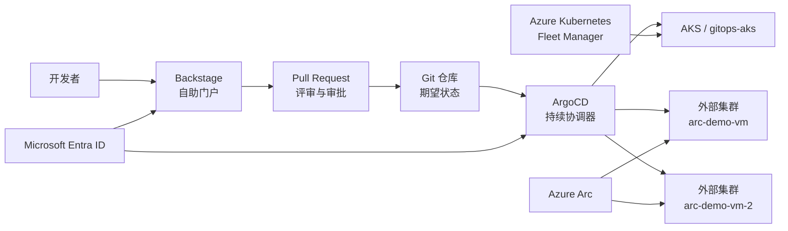

# 客户演示指南：Azure 上的多集群平台工程方案

本文档用于面向客户介绍本平台工程演示方案。内容聚焦架构价值、控制边界和演示流程，不包含环境专属凭据、内部操作细节或不适合分享的敏感信息。

英文版本请参见
[Customer demo guide: governed multi-cluster platform on Azure](./customer-demo-end-to-end-runbook.md)。

如需现场演示逐步操作手册，请参见
[客户-端到端演示手册：统一身份、多集群 GitOps 与 Azure Arc 多云治理](./customer-demo-step-by-step-runbook.zh-cn.md)。

## 一、方案概述

本演示展示平台团队如何在 AKS 与外部 Kubernetes 集群之间提供统一、可治理的自助服务能力：

- **Backstage** 提供开发者自助门户和标准化交付入口。
- **GitHub Pull Request** 承载变更评审、审批和审计。
- **ArgoCD** 持续同步已经审批的 Kubernetes 期望状态。
- **Azure Kubernetes Fleet Manager** 支撑 AKS 集群的 fleet 级治理和编排。
- **Azure Arc-enabled Kubernetes** 将外部、混合云和多云 Kubernetes 纳入 Azure 管理平面。
- **Microsoft Entra ID** 提供统一身份和组成员关系来源。

核心信息是：开发者无需长期持有 cluster-admin 权限。开发者通过标准化入口提交请求，平台团队通过 Git 审批变更，ArgoCD 按照审批后的期望状态进行持续协调。

## 二、架构视图

### 控制边界

| 能力域 | 在演示中的定位 |
| --- | --- |
| Backstage | 面向开发者的服务发现、自助申请和标准化部署入口 |
| GitHub | 变更评审、审批和审计记录 |
| ArgoCD | 本项目中唯一的 Kubernetes 期望状态持续协调器 |
| AKS | Azure 原生托管 Kubernetes 平台 |
| Azure Kubernetes Fleet Manager | AKS 集群的 fleet 级分组、治理和发布平面 |
| Azure Arc-enabled Kubernetes | 外部、混合云和多云 Kubernetes 接入 Azure 管理平面的桥梁 |
| Microsoft Entra ID | 统一身份与组成员关系来源 |

## 三、Azure Arc 的定位

Azure Arc 适合作为外部和多云 Kubernetes 的 Azure 管理平面入口，但不应被描述为 AKS 原生管理能力的替代品。

| 集群类型 | 推荐定位 | 仍由原平台负责的能力 |
| --- | --- | --- |
| Azure 中的 AKS | Azure 原生一等公民，使用 AKS 与 Fleet 进行生命周期和 fleet 级治理 | AKS 生命周期、节点池、升级、网络、托管身份和 Azure 原生集成 |
| AKS enabled by Azure Arc / Azure Local | Azure 公有云外的 Azure 管理型 Kubernetes，可结合 Arc 做治理 | 本地基础设施生命周期和对应 AKS Arc 能力范围 |
| TKE、EKS、GKE、OpenShift、on-prem 等外部 Kubernetes | 通过 Azure Arc 纳入 Azure 资产、访问、策略、监控、扩展和 GitOps 管理视图 | 原云厂商或平台的集群生命周期、升级、节点池、负载均衡和网络能力 |

建议面向客户的表述：

> Azure Arc 将外部 Kubernetes 纳入 Azure 治理体系；AKS 仍然通过原生 AKS 与 Fleet 能力保持 Azure 一等公民地位。在本演示中，ArgoCD 是 Kubernetes 期望状态的持续协调器。

## 四、多集群权限模型

本方案采用分层授权模型，避免通过长期管理员权限解决日常操作问题。

| 层级 | 作用 |
| --- | --- |
| Microsoft Entra 组 | 统一身份和角色分组 |
| Arc connectedCluster 上的 Azure RBAC | 控制 Azure Portal 可见性和 cluster-connect 访问 |
| 集群内 Kubernetes RBAC | 决定用户在每个集群内可以执行的最终操作 |
| ArgoCD RBAC 与 AppProject | 控制 GitOps 应用可见性和允许的目标集群/命名空间 |
| Backstage Catalog | 提供服务发现、所有者关系和自助申请入口 |

普通用户的推荐写入模型是 namespace-scoped Kubernetes RBAC。平台管理员仅在明确运维需要下保留受控、可审计的高权限。

## 五、GitOps 模型

Azure 在 AKS 和 Arc-enabled Kubernetes 上支持基于 Flux v2 的 GitOps。本项目选择 ArgoCD 作为 GitOps 实现，是因为演示重点包括集中式应用健康视图、app-of-apps 模式、AppProject 策略边界以及 Backstage 生成 Pull Request 的开发者体验。

如果客户同时使用 Flux 和 ArgoCD，必须明确划分所有权边界，例如按命名空间、仓库路径、资源类型或集群划分，避免两个控制器同时协调同一批 Kubernetes 资源。

## 六、推荐演示流程

| 时间 | 演示环节 | 客户可看到的价值 |
| --- | --- | --- |
| 0-3 分钟 | 介绍整体架构与控制边界 | 一套治理模型覆盖 AKS 与外部 Kubernetes |
| 3-7 分钟 | 展示 ArgoCD 与 GitOps 期望状态 | Kubernetes 配置可版本化、可审计、可持续协调 |
| 7-10 分钟 | 展示 AKS 与 Fleet 成员关系 | AKS 集群通过 Azure 原生能力进行 fleet 级治理 |
| 10-13 分钟 | 说明 Entra 组与最小权限模型 | 权限按组管理，避免长期管理员凭据 |
| 13-21 分钟 | 通过 Backstage 展示标准化部署申请和 PR | 开发者通过门户提交标准请求，不直接操作集群 |
| 21-26 分钟 | 展示审批后的 Git 变更由 ArgoCD 同步 | 评审、审计与部署形成闭环 |
| 26-30 分钟 | 展示 Backstage Catalog 的所有者和运行时可见性 | 服务、集群和责任关系可发现 |
| 30-33 分钟 | 展示 Azure Arc 连接的外部集群 | 外部 Kubernetes 可纳入 Azure 治理视图 |
| 33-35 分钟 | 总结架构价值和后续生产化方向 | 从演示过渡到落地规划 |

## 七、演示准备清单

演示前请确认：

- 管理 AKS 集群、ArgoCD、Fleet、Backstage 和 Arc 连接集群均处于健康状态。
- Backstage Catalog 中可以看到 `gitops-aks`、`arc-demo-vm` 和 `arc-demo-vm-2`，并具备正确的所有者关系。
- Backstage 展示两个独立部署模板：AKS 发布人员只能看到 `deploy-aks-application`，Arc/kind 发布人员只能看到 `deploy-kind-application`。
- 演示用 ArgoCD Application 使用受限的 `aks-team-delivery` 或 `kind-team-delivery` AppProject，而不是不受限的 `default` project。
- 对客户展示的门户使用正式或客户可接受的域名与证书。
- 准备一个已评审的 Pull Request，或提前演练 Backstage 模板流程。
- 不在主演示流程中等待现场创建 AKS 集群；建议使用准备好的前后状态对比。
- 演示材料中不出现 tenant ID、object ID、token、kubeconfig、密钥或其他敏感信息。

## 八、建议讲解话术

1. **先讲运行模式。** 平台提供自助能力，但不向开发者发放长期管理员权限。
2. **再讲职责分离。** Backstage 负责申请体验，GitHub 负责评审，ArgoCD 负责协调，Fleet 负责 AKS fleet 治理，Arc 负责外部 Kubernetes 的 Azure 管理视图。
3. **展示证据而非内部细节。** 重点展示 Git 变更、ArgoCD 健康状态、Fleet 成员、Arc 连接状态和 Backstage Catalog 所有者关系。
4. **清晰回答 Arc 定位。** Arc 是外部 Kubernetes 接入 Azure 治理的桥梁；AKS 仍然是 Azure 原生一等公民。
5. **以生产化建议收尾。** 讨论策略、监控、身份、密钥、证书/DNS 和发布治理。

## 九、生产化关注点

正式落地前建议与客户确认：

- 身份组设计与审批流程；
- Git 分支保护和 Pull Request 策略；
- namespace 与 AppProject 边界；
- Backstage 按组限制集群和模板可见性的 permission policy；
- Backstage 和 ArgoCD 的证书、DNS 与入口设计；
- 密钥管理策略；
- Azure Policy、Defender 和 Monitor 覆盖范围；
- AKS 与外部 Kubernetes 的生命周期责任边界；
- 如果同时使用 Flux 和 ArgoCD，必须定义清晰的资源所有权边界。

## 十、相关文档

- [项目规范](./project-specification.md)
- [使用 ArgoCD 与 Fleet Manager 创建 AKS 工作负载集群](./create-aks-cluster-argocd-fleet-demo.md)
- [Azure Arc Kubernetes 接入](./arc-kubernetes-onboarding.md)
- [Backstage 与 ArgoCD 应用部署演示](./backstage-feature-demo.md)
- [Backstage 运维说明](./backstage.md)
