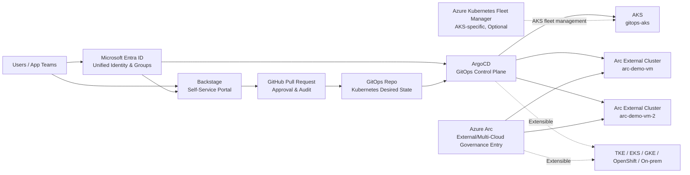

# Customer End-to-End Demo Runbook: Unified Identity, Multi-Cluster GitOps, and Azure Arc Multi-Cloud Governance

This document is a detailed operational runbook to use before a customer demo. It complements the
[Customer Demo Guide](./customer-demo-end-to-end-runbook.zh-cn.md) and is intended for demo rehearsal,
live presentation, and Q&A. It contains no tenant IDs, object IDs, tokens, kubeconfigs,
passwords, or fixed environment IPs.

## 1. Recommended Target Architecture

We recommend the following positioning:

- **ArgoCD**: The application delivery and Kubernetes desired-state continuous reconciliation plane across AKS and external Kubernetes.
- **Azure Arc-enabled Kubernetes**: The bridge that connects external, hybrid, and multi-cloud Kubernetes into the Azure management plane.
- **Microsoft Entra ID**: The single source of unified identity, user groups, and enterprise application access control.
- **Backstage**: The self-service portal for developers and application teams.
- **GitHub Pull Request**: Change review, approval, and audit records.
- **Azure Kubernetes Fleet Manager**: AKS-specific fleet grouping, governance, and rollout capabilities; optional, and not a prerequisite for multi-cloud GitOps.

We recommend explaining it to customers this way:

> ArgoCD is the cross-cluster application delivery and Kubernetes desired-state control plane; Azure Arc is the management-plane bridge that connects external and multi-cloud Kubernetes into the Azure governance system; Fleet is well-suited to AKS-specific fleet governance, but it is not a required component of ArgoCD multi-cluster GitOps.

## 2. Reference Architecture



Key boundaries:

| Capability | Recommended Owner | Notes |
| --- | --- | --- |
| Application delivery & Kubernetes desired state | ArgoCD | The only continuous reconciler in this project |
| Azure management view for external/multi-cloud Kubernetes | Azure Arc | Inventory, access, policy, monitoring, Defender, extensions |
| AKS-specific fleet governance | Fleet (optional) | Good for AKS fleet grouping and rollout; not responsible for multi-cloud GitOps |
| Self-service entry point | Backstage | Generates standard GitOps PRs; does not hold write-cluster credentials for regular users |
| Identity & groups | Microsoft Entra ID | Single source of users and permissions |
| Approval & audit | GitHub PR | Branch protection and manual/automated review |

## 3. Pre-Demo Checklist

### 1. Control-Plane Health Check

```powershell
kubectl --context gitops-aks-admin -n argocd get applications
kubectl --context gitops-aks-admin -n backstage get pods
kubectl --context gitops-aks-admin -n platform-access-system get sa,role,rolebinding,configmap
```

Expected results:

- ArgoCD core applications are `Synced` / `Healthy`.
- Backstage Pods are running normally.
- The `platform-access-system` namespace contains the ServiceAccount/RBAC for the Backstage reader
  and connection registry, and the `platform-access-policy` ConfigMap.
- `backstage-connection-registry` is an ArgoCD Sync hook; on success the Job/Pod is cleaned up per
  `HookSucceeded`, so it is normal for this namespace to have no long-running Pods.

### 2. ArgoCD AppProject Check

```powershell
kubectl --context gitops-aks-admin -n argocd get appproject kind-team-delivery
kubectl --context gitops-aks-admin -n argocd get appproject aks-team-delivery
```

Expected boundaries:

| AppProject | Allowed Destinations |
| --- | --- |
| `kind-team-delivery` | `arc-demo-vm/group1-apps`, `arc-demo-vm-2/group1-apps` |
| `aks-team-delivery` | `gitops-aks/group2-aks-apps` |

### 3. Backstage Catalog Check

```powershell
Set-Location backstage
yarn catalog:validate
```

Expected results:

- `resource:default/gitops-aks`
- `resource:default/arc-demo-vm`
- `resource:default/arc-demo-vm-2`
- `template:default/deploy-aks-application`
- `template:default/deploy-kind-application`

Owners should resolve to `group:default/k8sadmin`.

### 4. Entra Group Sync Check

```powershell
kubectl --context gitops-aks-admin -n backstage logs deploy/backstage-backstagechart `
  | Select-String 'Reading msgraph users and groups|Committed .*msgraph groups'
```

Expected results:

- The Microsoft Graph provider has imported the approved Entra groups.
- After the user signs in again, the Backstage token contains the correct group entitlements.

### 5. Arc Connected Cluster Check

```powershell
az connectedk8s list -g <resource-group> -o table
```

Expected results:

- `arc-demo-vm`
- `arc-demo-vm-2`

Status is Connected, or another health state acceptable to the customer.

## 4. Unified Identity and Access Configuration

### 1. Identity Group Design

| Entra Group | Purpose |
| --- | --- |
| `akspe-backstage-users` | Unified Backstage sign-in entry group |
| `k8sadmin` | Platform administrators with operational rights on all registered targets |
| `akspe-kind-cluster-deployers` | Can only initiate application delivery to Arc/kind targets via Backstage/ArgoCD |
| `akspe-aks-cluster-deployers` | Can only initiate application delivery to AKS targets via Backstage/ArgoCD |

Recommendations:

- Add regular users to a specific persona group.
- Add the persona groups as members of `akspe-backstage-users`.
- `akspe-backstage-users` only means "allowed to sign in to Backstage"; it does not imply administrator privileges.
- `k8sadmin` must be mapped as an independent authorization group to `group:default/k8sadmin`
  in the Backstage token.
- Do not grant regular users long-lived cluster-admin.
- Do not write private group object IDs into Git.

### 2. Configuration Script Responsibilities

`scripts/configure-k8sadmin-access.ps1` is responsible for:

| Configuration Item | Description |
| --- | --- |
| Entra group resolution | Resolves `k8sadmin`, AKS deployer, kind deployer, and Backstage users |
| Enterprise App assignment | Sets the shared Backstage/ArgoCD enterprise application to require assignment, and directly assigns the sign-in entry group and persona groups |
| Microsoft Graph permissions | Configures `User.Read.All` and `GroupMember.Read.All` and requires admin consent |
| Backstage group mapping Secret | Writes the mapping from private object IDs to Backstage group refs, and explicitly writes the admin group object ID |
| ArgoCD cluster Secret annotations | Writes the private group object IDs onto the target cluster Secrets |
| Default AKS deployment target label | Marks `gitops-aks` as the currently approved AKS demo deployment target |

### 3. Backstage Identity Resolution

Key files:

- `backstage/packages/backend/src/index.ts`
- `backstage/packages/backend/src/extensions/platformAccessPermissionPolicy.ts`

Flow:

1. The user signs in to Backstage via Microsoft Entra ID.
2. A custom Microsoft resolver uses Microsoft Graph to query the user's transitive group membership.
3. The resolver maps approved Entra group object IDs to Backstage group refs.
4. The `ent` claims in the Backstage token contain the user and groups.
5. The permission policy uses these group entitlements to control the visibility of Catalog Resources and templates.

If a user can sign in but sees no protected resources, first check whether the user actually belongs to
`k8sadmin`, rather than only to `akspe-backstage-users` or some deployer group. The `relations.ownedBy`
filter in the backend logs should include `group:default/k8sadmin`; only then will the administrator view
show all cluster Resources and all delivery templates.

In the current demo environment, `demouser1` is an AKS deployer persona, not a k8sadmin persona;
if you sign in as `demouser1`, you should only validate the AKS delivery entry point and should not
expect to see all clusters. To demonstrate the platform administrator view, use an account that actually
belongs to the `k8sadmin` Entra group, or add a dedicated administrator test account to `k8sadmin`
through the change process before the demo.

### 3.1 ArgoCD Identity Resolution

Unlike the Backstage resolver, ArgoCD does not proactively call Microsoft Graph to perform a transitive
group lookup; it only consumes the `groups` claim in the sign-in token. The current Entra App uses
`groupMembershipClaims = ApplicationGroup`, so only groups **directly assigned to that Enterprise
Application** enter the token.

`scripts/configure-k8sadmin-access.ps1` must directly assign the following groups to the same Enterprise
Application:

- `akspe-backstage-users`
- `k8sadmin`
- `akspe-kind-cluster-deployers`
- `akspe-aks-cluster-deployers`

If `jimmy@noeltech.net` is already a member of `k8sadmin` but sees no Applications after signing in to
ArgoCD, first check whether `k8sadmin` is also directly assigned to the Enterprise Application.
Assigning only `akspe-backstage-users` to the Enterprise Application is not enough, because ArgoCD
RBAC is bound to the `k8sadmin` group object ID.

### 4. Backstage Permission Policy

| User Group | Cluster Resource Visibility | Template Visibility |
| --- | --- | --- |
| `k8sadmin` | All protected and non-protected resources | All templates |
| `akspe-aks-cluster-deployers` | AKS resources, e.g. `gitops-aks` | `deploy-aks-application`, `update-aks-application` |
| `akspe-kind-cluster-deployers` | Arc/kind resources, e.g. `arc-demo-vm`, `arc-demo-vm-2` | `deploy-kind-application`, `update-kind-application` |
| Unauthorized users | Should not see protected resources | Should not see protected template parameters/steps |

Protected resources are identified via Catalog annotations:

```yaml
platform-access.akspe.io/protected: "true"
platform-access.akspe.io/allow-aks-deployers: "true"
platform-access.akspe.io/allow-kind-deployers: "true"
```

### 5. ArgoCD Permission Boundaries

Key files:

- `gitops/apps/platform-access/manifests/delivery-appprojects.yaml`
- `gitops/apps/platform-access/manifests/platform-demo-apps-appset.yaml`

Enforced rules:

| AppProject | Allowed Destinations | Allowed Resources |
| --- | --- | --- |
| `aks-team-delivery` | `gitops-aks/group2-aks-apps` | Deployment, StatefulSet, ConfigMap, Secret, Service |
| `kind-team-delivery` | `arc-demo-vm/group1-apps`, `arc-demo-vm-2/group1-apps` | Deployment, StatefulSet, ConfigMap, Secret, Service |

Regular users are not allowed to use `project: default` when delivering an Application.

ArgoCD UI visibility is controlled by team/persona boundaries:

| Entra Group | ArgoCD-Visible Applications |
| --- | --- |
| `k8sadmin` | All Applications and AppProjects |
| `akspe-aks-cluster-deployers` | `aks-team-delivery/*` |
| `akspe-kind-cluster-deployers` | `kind-team-delivery/*` |

Applications generated by Backstage carry requester, persona, and target annotations for audit and
future extension. If a customer requires that "each user can only see the Applications they created,"
you would additionally adopt username prefixes and per-user ArgoCD RBAC; for the demo we recommend
starting with team/persona visibility, which better matches enterprise management practices.

### 6. Kubernetes RBAC

Key files:

- `gitops/apps/platform-target-baseline/templates/rbac.yaml`

| Object | Permission |
| --- | --- |
| `k8sadmin` group object ID | `cluster-admin` on every registered target |
| `akspe-aks-cluster-deployers` group object ID | `view` on AKS targets |
| `backstage-kubernetes-reader` ServiceAccount | Read-only inventory required by the Backstage Kubernetes plugin |

A regular deployer's writes are not performed through direct Kubernetes credentials, but through:

```text
Backstage -> GitHub PR -> ArgoCD AppProject -> target namespace
```

### 7. Azure Arc RBAC and Portal Permissions

Arc Portal operations use two layers of authorization: Azure RBAC + Kubernetes RBAC:

| Layer | Purpose |
| --- | --- |
| Azure RBAC on connectedCluster | Determines whether a user can see Arc resources in the Azure Portal and request cluster-connect |
| Kubernetes RBAC | Determines whether, once connected, the user can operate on resources within a namespace |

For regular Portal users, we recommend granting only namespace-scoped operations, not Azure Arc Kubernetes Cluster Admin.

### 8. Who Should Manage Unified SSO/RBAC Configuration

Conclusion: You can hand the **identity-consuming Kubernetes and platform application configuration** to
ArgoCD to manage in a unified way, but do not hand the Entra tenant objects themselves to ArgoCD.

| Configuration | Recommended Owner | Verification |
| --- | --- | --- |
| Entra groups, group membership, app registration, client secret | Entra / Azure bootstrap / approved Azure IaC | Entra Portal or Azure CLI; show only group names, not object IDs/secrets |
| Azure RBAC on Arc connectedCluster | Azure RBAC / Azure IaC | Whether a user can see Arc resources in the Portal and can start cluster-connect |
| ArgoCD OIDC and `argocd-rbac-cm` | ArgoCD GitOps + private overlay | Sign in to ArgoCD as different personas and confirm you only see the allowed Projects/Applications |
| `aks-team-delivery`, `kind-team-delivery` AppProjects | ArgoCD GitOps | `kubectl --context gitops-aks-admin -n argocd get appproject` |
| AKS / Arc target namespace RBAC | ArgoCD GitOps | `kubectl auth can-i`, or verify namespace-scoped permissions after Arc cluster-connect |
| Backstage template visibility / permission inputs | ArgoCD GitOps | Sign in to Backstage as AKS deployer, kind deployer, and `k8sadmin` to verify template visibility |
| Secret values | Key Vault / External Secrets / secure bootstrap | Only Secret references appear in Git, never secret values |

On-site talk track:

> Entra is the single identity source; Azure RBAC governs the Azure entry point; Kubernetes RBAC governs in-cluster actions;
> ArgoCD continuously manages AppProjects, RBAC, Backstage configuration, and namespace boundaries; Backstage only
> generates reviewed PRs and never holds regular users' write-cluster credentials.

## 5. End-to-End Demo Flow

### Step 1: Opening — Explain the Architecture

Key talking points:

- One platform model covers both AKS and external Kubernetes.
- External Kubernetes can come from TKE, EKS, GKE, OpenShift, or on-prem.
- ArgoCD provides unified application GitOps.
- Arc provides Azure management-plane connectivity.
- Fleet is an AKS-specific capability and is optional.

### Step 2: Show ArgoCD as the Only Continuous Reconciler

Open ArgoCD and show:

- `platform-access`
- `platform-target-baseline-*`
- `platform-demo-aks-*`

Explanation:

> All Kubernetes desired state goes into Git and, after PR approval, is continuously reconciled by ArgoCD. Terraform and scripts are not the continuous Kubernetes configuration managers. Arc/kind application workloads only appear after Backstage generates a PR; there are no pre-seeded `platform-demo-kind-*` noise applications.

### Step 3: Show the Unified Identity Groups

Show or explain the Entra groups:

- `akspe-backstage-users`
- `k8sadmin`
- `akspe-aks-cluster-deployers`
- `akspe-kind-cluster-deployers`

Do not show object IDs. Show only group names and their purpose.

### Step 4: Sign in to Backstage as the AKS Deployer Persona

Expected:

- You can see AKS-related Resources.
- You can see `deploy-aks-application`.
- You should not see the Arc/kind delivery entry point.

Explanation:

> The AKS application team can only choose the AKS release path. The template always generates `aks-team-delivery`, and the destination is fixed to the approved AKS namespace.

### Step 5: Generate a GitOps PR via the AKS Template

In Backstage, select:

- Template: `deploy-aks-application`
- Target: `gitops-aks/group2-aks-apps`
- Repo/path: use the prepared sample application

After the PR is generated, show:

- The ArgoCD Application manifest uses `project: aks-team-delivery`
- The destination is `name: gitops-aks`
- The namespace is `group2-aks-apps`

### Step 6: Show PR Approval and ArgoCD Sync

Explanation:

- The PR is the approval gate.
- ArgoCD is the executor.
- The user has no direct write-cluster credentials.

If merging the PR live is not appropriate, use a pre-prepared PR or an already-synced Application to demonstrate.

### Step 6.1: Verify the Backstage/PR Deployment Result on AKS

After the PR is merged, first confirm the ArgoCD Application on the control plane, then verify the actual
Kubernetes resources in the target AKS namespace. The commands below use the application name from the
Backstage form as a variable:

```powershell
$appName = "aks-store-demo"

kubectl --context gitops-aks-admin -n argocd get application $appName -o wide
kubectl --context gitops-aks-admin -n argocd describe application $appName

kubectl --context gitops-aks-admin -n group2-aks-apps get deploy,sts,svc,cm,secret,pod
kubectl --context gitops-aks-admin -n group2-aks-apps get events --sort-by=.lastTimestamp
kubectl --context gitops-aks-admin -n group2-aks-apps get pod -l app.kubernetes.io/name=$appName
```

Key points for the customer:

- The ArgoCD Application should belong to `aks-team-delivery`.
- The target cluster is `gitops-aks` and the namespace is `group2-aks-apps`.
- The user has no long-lived credentials to write directly to AKS; the application is created by ArgoCD based on the Git desired state.
- If Pods are not Running, first look at `describe application`, Pod events, and image pull
  status; do not manually modify objects directly in the cluster.

### Step 7: Sign in to Backstage as the kind Deployer Persona

Expected:

- You can see `arc-demo-vm`, `arc-demo-vm-2`.
- You can see `deploy-kind-application`.
- You should not see the AKS delivery entry point.

Explanation:

> The external cluster team uses the same Backstage + PR + ArgoCD model, but the destination is restricted to the `group1-apps` namespace on the Arc/kind clusters.

### Step 8: Generate a GitOps PR via the kind Template

Select:

- Template: `deploy-kind-application`
- Target: `kind-arc-demo-vms-group1`

Check the generated result:

- `project: kind-team-delivery`
- Generates an ArgoCD ApplicationSet that a cluster generator expands to `arc-demo-vm` and `arc-demo-vm-2`
  based on the ArgoCD cluster Secret labels
- The namespace is `group1-apps`

### Step 8.1: Verify the Backstage/PR Deployment Result on the Arc/kind Targets

The kind template generates an ArgoCD ApplicationSet. The ApplicationSet selects Arc/kind cluster Secrets
labeled `platform_backstage_delivery_enabled=true` and expands into child Applications targeting
`arc-demo-vm` and `arc-demo-vm-2`. After the PR is merged, still look at the ApplicationSet and ArgoCD
Applications on the control plane first, then enter the two kind target namespaces to verify the resources.

Note: Merging the PR only means the desired state has entered the Git branch that ArgoCD watches; it does not mean the target clusters are already deployed.
After merging, you still need to wait for `backstage-delivery-apps` to discover the new commit, the ApplicationSet to generate the child Applications,
the two child Applications to sync to the remote kind clusters, and Pod readiness to complete. This can take a few minutes;
the deployment is only complete once both the child Applications and the target workloads are healthy.

To speed up the live demo, you can trigger an ArgoCD refresh immediately after the PR is merged instead of waiting for the next poll:

```powershell
.\scripts\refresh-backstage-delivery.ps1 -ApplicationName kind-store-demo
```

This script does not change the Git desired state and is not a new deployment controller; it simply makes ArgoCD immediately read and sync
the already-merged GitOps change.

```powershell
$appName = "kind-store-demo"

kubectl --context gitops-aks-admin -n argocd get application backstage-delivery-apps `
  -o jsonpath="{.status.sync.status} {.status.health.status} {.status.sync.revision}{'\n'}"
kubectl --context gitops-aks-admin -n argocd get applicationset $appName -o wide
kubectl --context gitops-aks-admin -n argocd get application "$appName-arc-demo-vm" -o wide
kubectl --context gitops-aks-admin -n argocd get application "$appName-arc-demo-vm-2" -o wide
kubectl --context gitops-aks-admin -n argocd describe application "$appName-arc-demo-vm"
kubectl --context gitops-aks-admin -n argocd describe application "$appName-arc-demo-vm-2"
```

Then verify the target kind clusters via Azure Arc cluster-connect. Do not use
`arc-demo-vm-admin` or `arc-demo-vm-2-admin` directly unless you have already manually imported those
contexts into your local kubeconfig. `scripts/arc-kind-vm-onboard.ps1` registers the kind clusters with
ArgoCD, but it does not create a local admin context on your machine.

In the first PowerShell window, start an Arc proxy, connecting to one cluster at a time:

```powershell
$clusterName = "arc-demo-vm" # switch to arc-demo-vm-2 later and run again
$kubeconfig = Join-Path $env:TEMP "$clusterName-proxy.kubeconfig"
$arcCluster = az connectedk8s list --query "[?name=='$clusterName'] | [0]" -o json | ConvertFrom-Json
if (-not $arcCluster) {
  az account show -o table
  throw "Cannot find Arc connectedCluster '$clusterName' in the current Azure subscription. Switch to the correct subscription first with az account set --subscription <id>."
}
$resourceGroup = $arcCluster.resourceGroup

az connectedk8s proxy `
  --resource-group $resourceGroup `
  --name $clusterName `
  --file $kubeconfig
```

In the second PowerShell window, use the kubeconfig generated by the proxy to verify the resources:

```powershell
$clusterName = "arc-demo-vm" # keep consistent with the proxy window
$kubeconfig = Join-Path $env:TEMP "$clusterName-proxy.kubeconfig"

kubectl --kubeconfig $kubeconfig -n group1-apps get deploy,sts,svc,cm,secret,pod
kubectl --kubeconfig $kubeconfig -n group1-apps get events --sort-by=.lastTimestamp
kubectl --kubeconfig $kubeconfig -n group1-apps get pod -l app.kubernetes.io/name=argocd-kind-demo
```

Key points for the customer:

- The ArgoCD Application should belong to `kind-team-delivery`.
- The target clusters come from the ArgoCD cluster Secret label selector, not hard-coded in the Backstage template.
- The target namespace is fixed to `group1-apps`.
- Arc provides the Azure management-plane view; the application desired state is still continuously reconciled by ArgoCD from Git.
- To judge completion, look at ArgoCD and the workloads, not just the PR: `backstage-delivery-apps` has synced to the
  merge revision, the parent ApplicationSet exists, both `kind-store-demo-arc-demo-vm` and
  `kind-store-demo-arc-demo-vm-2` are `Synced/Healthy`, and the workloads in both `group1-apps`
  namespaces are ready.

If you add a third Arc/kind cluster later, you do not need to modify the Backstage template; as long as the ArgoCD cluster
Secret after onboarding carries the following labels, it will be automatically selected by the ApplicationSet:

```yaml
provider: arc
platform_cluster_type: kind
platform_access_enabled: "true"
platform_backstage_delivery_enabled: "true"
```

### Step 8.2: Show the Backstage Update and Delete Lifecycle

Customers often ask, "Can Backstage only deploy once?" Recommended answer:

> Backstage is not a one-shot deployment tool. Initial creation, subsequent modification, and deletion can all be initiated
> from Backstage, but they all generate GitHub PRs; after a PR is merged, ArgoCD still handles unified sync and prune.

Current template responsibilities and visibility:

| Lifecycle | Backstage Template | Visible User Groups | Result |
| --- | --- | --- | --- |
| Initial AKS deployment | `deploy-aks-application` | `k8sadmin`, `akspe-aks-cluster-deployers` | Adds `gitops/apps/backstage-delivery/<app-name>/` and a Catalog descriptor; generates an ArgoCD Application under `aks-team-delivery` |
| Initial Arc/kind deployment | `deploy-kind-application` | `k8sadmin`, `akspe-kind-cluster-deployers` | Adds `gitops/apps/backstage-delivery/<app-name>/` and a Catalog descriptor; generates an ApplicationSet under `kind-team-delivery` that ArgoCD expands by cluster labels |
| Subsequent AKS update | `update-aks-application` | `k8sadmin`, `akspe-aks-cluster-deployers` | Modifies an existing AKS delivery manifest, e.g. source revision, manifest path, or approved target; if the application does not exist or the rendered result is unchanged, the task fails instead of creating an empty PR |
| Subsequent Arc/kind update | `update-kind-application` | `k8sadmin`, `akspe-kind-cluster-deployers` | Modifies an existing Arc/kind delivery ApplicationSet; if the application does not exist or the rendered result is unchanged, the task fails instead of creating an empty PR |

On-site recommendations:

- If you want to repeatedly demo "creation" for multiple customers, use different app names, e.g.
  `contoso-kind-store-demo`.
- If an app with the same name already exists, do not re-run the create template; use the update template.
- To clean up the environment, use `.\scripts\cleanup-app.ps1` to generate a platform cleanup PR instead of running
  `kubectl delete` first. If the desired state in Git is not removed, ArgoCD may recreate the resources.
- `cleanup-app.ps1 -CreatePR` only creates a PR; it does not merge and does not enable auto-merge; a platform
  reviewer still needs to manually review and merge it.
- Before merging the cleanup PR, you must confirm in GitHub **Files changed** that
  `gitops/apps/backstage-delivery/<app-name>/`, `backstage/generated/<app-name>/`,
  and the corresponding target in `backstage/catalog/catalog-info.yaml` are actually deleted;
  a cleanup PR with `changed_files = 0` or that only deletes the Catalog target is invalid and cannot trigger a full ArgoCD prune.
- Do not delete the `gitops/apps/backstage-delivery` root directory itself. If this is the last generated application, keep
  `gitops/apps/backstage-delivery/.keep`. Otherwise `backstage-delivery-apps` will report
  `app path does not exist`, ArgoCD cannot generate an empty desired state, and therefore will not prune the old
  ApplicationSet/Application.

### Step 9: Show the Azure Arc External Cluster Management View

Open the Azure Portal:

- View the Arc-enabled Kubernetes resources.
- Show `arc-demo-vm` and `arc-demo-vm-2`.
- Explain Arc's role: Azure management plane, access entry point, policy, monitoring, Defender, extensions.

Emphasize:

> Arc brings external Kubernetes into the Azure governance view, but does not turn them into AKS. The cluster lifecycle remains the responsibility of the original platform.

### Step 10: Show namespace-scoped Portal Operations (Optional)

If the environment is healthy, show the Azure Portal Kubernetes resources:

- Namespace
- Deployment
- StatefulSet
- ConfigMap
- Secret
- Service

Show only the demo namespace; avoid showing real, sensitive Secret contents.

### Step 11: Show the k8sadmin Platform View

Using the `k8sadmin` persona, explain:

- The platform administrator can see all targets.
- The platform administrator can validate the AKS and Arc/kind create/update templates and the AppProjects.
- High privileges are limited to a small scope and audited use.

### Step 12: Explain Whether Fleet Is Needed

If the customer has not enabled Fleet, explain:

> The core multi-cluster application delivery capability in this demo does not depend on Fleet. ArgoCD can already perform multi-cluster GitOps for both AKS and external Kubernetes. Fleet's value lies in AKS-specific fleet governance, such as AKS cluster grouping, AKS fleet-level rollout, or AKS-related platform operations.

## 6. Fleet Decision Guidance

| Customer Need | Recommendation |
| --- | --- |
| Multi-cloud Kubernetes application delivery, covering TKE/EKS/GKE/OpenShift/on-prem | ArgoCD + Azure Arc |
| Unified Azure Portal view of external Kubernetes inventory and governance | Azure Arc |
| AKS multi-cluster grouping, AKS fleet-level governance or rollout | Fleet can be introduced |
| Already standardized on ArgoCD for managing applications | Keep ArgoCD as the application GitOps plane |
| Want to use Azure-native GitOps configuration | You can evaluate Flux v2, but you must partition resource ownership with ArgoCD |

Recommended conclusions:

- **Customer prioritizes multi-cloud**: ArgoCD + Arc is the main line.
- **Customer prioritizes AKS fleet governance**: add Fleet on top of the main line.
- **Do not treat Fleet as a prerequisite for multi-cloud GitOps.**

## 7. Troubleshooting and Fallback

| Issue | On-Site Response |
| --- | --- |
| Backstage sign-in fails | Show prepared screenshots and explain the Entra group mapping and Graph sync flow |
| Sign-in succeeds but no resources/templates are visible | Check whether the user's token entitlements include `group:default/k8sadmin`; `akspe-backstage-users` is only the sign-in entry group |
| Graph sync has not refreshed in time | Show the logs and explain that the provider uses a persistent schedule; have the user sign in again to refresh the token |
| Generating a PR live is too risky | Use a pre-prepared PR |
| The create template reports `dest already exists` | The app name already exists; use `update-aks-application` / `update-kind-application` for subsequent changes, or use a new app name to demo initial creation |
| ArgoCD sync is slow | Show the Application desired state and historical health status |
| Arc Portal cluster-connect is slow | Show the Arc inventory and ArgoCD's sync results for the external clusters |
| Fleet is not enabled | Make clear that Fleet is optional; ArgoCD + Arc already cover the multi-cloud GitOps main line |

## 8. Answers to Common Customer Questions

### Q1: Can Arc be used as a unified operations entry point for multi-cloud, multi-cluster?

Yes, but position it accurately. Arc is the Azure management-plane entry point, suited to inventory, access, policy, monitoring, Defender, extensions, and Portal visibility. In this solution, application delivery and Kubernetes desired state are handled uniformly by ArgoCD.

### Q2: Is AKS a first-class citizen on Arc?

AKS in Azure is already an Azure-native first-class citizen and does not need Arc to become an Azure resource. Arc's focus is connecting external or hybrid-cloud Kubernetes into the Azure management plane. The AKS lifecycle, node pools, upgrades, networking, and managed identity should continue to use native AKS capabilities.

### Q3: Can you do multi-cluster management without Fleet?

Yes. ArgoCD can manage multiple Kubernetes target clusters, and AppProjects can restrict the target cluster/namespace/resource. Fleet is an AKS-specific fleet governance capability, not a prerequisite for ArgoCD multi-cluster GitOps.

### Q4: How do you ensure different users can only deploy to different clusters?

This project uses three layers of control:

1. The Backstage permission policy controls which cluster Resources and Software Templates a user can see.
2. Separate Backstage templates deterministically generate different AppProjects and target namespaces.
3. ArgoCD AppProjects enforce restrictions on cluster, namespace, and resource kind.

Even if someone bypasses the UI and manually submits an incorrect Application, the ArgoCD AppProject will reject unauthorized targets.

### Q5: Can Backstage later modify or delete an already-deployed application?

It can modify; deletion/cleanup is done by the platform using a script to generate a reviewed cleanup PR. The recommended model is:

```text
Backstage update template -> GitHub PR -> ArgoCD sync
```

In other words, Backstage standardizes day-2 updates into PRs; deletion/cleanup is done by the platform running
`.\scripts\cleanup-app.ps1` to generate a PR that removes the GitOps/Catalog trio; GitHub retains approval and audit;
and ArgoCD remains the only continuous Kubernetes reconciler. Do not design Backstage as a button that directly modifies cluster resources.

## 9. Recommended Path to Production After the Demo

1. Define the customer's Entra groups, approval chains, and naming conventions.
2. Set up production gates for GitHub branch protection, CODEOWNERS, and PR policies.
3. Incorporate External Secrets / Key Vault into the Secret management design.
4. Uniformly enable Monitor, Defender, and Policy for Arc-connected external clusters.
5. Define the resource ownership boundary between ArgoCD and any Flux v2 configuration.
6. If AKS fleet governance is a customer priority, then evaluate Fleet's rollout and governance capabilities.
7. Replace the demo's kind external clusters with the customer's real TKE/EKS/GKE/OpenShift/on-prem clusters for a pilot.

## 10. Deletion and Reset for Repeated Customer Demos

We recommend prefixing each customer demo's application name with the customer or session, e.g.:

- `contoso-aks-store-demo`
- `contoso-kind-store-demo`

This avoids multiple sessions overwriting each other's Backstage PR branches, ArgoCD Applications, and Kubernetes
resources.

### 1. Preferred Cleanup Method: Use the Cleanup Script to Generate a PR That Removes the Git Desired State

Applications generated by Backstage are managed by Git and ArgoCD, so cleanup should also change Git first. Do not use
`kubectl delete` as the routine deletion method; otherwise ArgoCD may recreate the resources according to the Git desired state.
Also do not commit directly to `zhangchl007-arc-multi-cluster-access`. This branch is the GitOps control-plane branch that ArgoCD
watches; deployments, updates, and cleanups should all enter through PRs, preserving the same audit and review model.

The example below uses `kind-store-demo`; for AKS applications, simply replace `-AppName` with the AKS application name.

```powershell
# Option A: Only prepare the cleanup branch and stage the changes for review first; does not commit/push/create a PR.
.\scripts\cleanup-app.ps1 -AppName "kind-store-demo"

# Review what the script is about to delete.
git status --short
git diff --cached --name-status
git diff --cached

# Option B: From a clean worktree, commit, push, and create the PR in one shot; the script does not merge the PR and does not enable auto-merge.
.\scripts\cleanup-app.ps1 -AppName "kind-store-demo" -CreatePR

# If you need to create the cleanup PR from a different base branch, combine it with either option above.
.\scripts\cleanup-app.ps1 -AppName "kind-store-demo" -BaseBranch "main"
.\scripts\cleanup-app.ps1 -AppName "kind-store-demo" -BaseBranch "main" -CreatePR
```

Then manually review and merge the PR on GitHub. Before merging, you must see three kinds of changes in **Files changed**:

```text
gitops/apps/backstage-delivery/<app-name>/
backstage/generated/<app-name>/
backstage/catalog/catalog-info.yaml
```

If this is the last generated app, you must also see:

```text
gitops/apps/backstage-delivery/.keep
```

`cleanup-app.ps1` automatically deletes the delivery directory, the generated descriptor, and the Catalog target, and keeps
`.keep` when the last generated app is deleted. A PR that only deletes the Catalog target, only deletes the generated descriptor,
or deletes the entire `gitops/apps/backstage-delivery` root directory is an incomplete cleanup. When the root directory does not exist,
`backstage-delivery-apps` reports `app path does not exist`, ArgoCD cannot generate an empty desired
state, and therefore will not prune the old ApplicationSet/Application.

If recreating an application with the same name reports `Catalog target for application "<app-name>" already
exists`, it means `backstage/catalog/catalog-info.yaml` still has a leftover
`../generated/<app-name>/catalog-info.yaml`, but the corresponding generated descriptor or delivery
manifest is already incomplete. The fix is to use `cleanup-app.ps1` to generate another platform cleanup PR that removes this
leftover target, and confirm that `backstage/generated/<app-name>/` and
`gitops/apps/backstage-delivery/<app-name>/` also do not exist.

We recommend setting up branch protection on `zhangchl007-arc-multi-cluster-access`: prohibit direct
push, require PRs, and require at least one platform owner review. Break-glass direct fixes are only allowed for live incident
recovery; afterward you must add a record or a follow-up PR explaining why the normal PR process was bypassed.

### 2. Verify the AKS Cleanup Result

```powershell
$appName = "aks-store-demo"

kubectl --context gitops-aks-admin -n argocd get application backstage-delivery-apps `
  -o jsonpath="{.status.sync.status} {.status.health.status} {.status.sync.revision}{'\n'}"
kubectl --context gitops-aks-admin -n argocd get application $appName
kubectl --context gitops-aks-admin -n group2-aks-apps get deploy,sts,svc,pod
kubectl --context gitops-aks-admin -n group2-aks-apps get events --sort-by=.lastTimestamp
```

The `group2-aks-apps` namespace can be retained; it carries the demo RBAC and subsequent repeated demos, so we do not recommend
deleting the namespace each time.

### 3. Verify the Arc/kind Cleanup Result

```powershell
$appName = "kind-store-demo"

kubectl --context gitops-aks-admin -n argocd get application backstage-delivery-apps `
  -o jsonpath="{.status.sync.status} {.status.health.status} {.status.sync.revision}{'\n'}"
kubectl --context gitops-aks-admin -n argocd get applicationset $appName
kubectl --context gitops-aks-admin -n argocd get application "$appName-arc-demo-vm"
kubectl --context gitops-aks-admin -n argocd get application "$appName-arc-demo-vm-2"

# Do not assume a local *-admin context exists for the Arc/kind target clusters.
# Generate $kubeconfig using the az connectedk8s proxy method above, then verify:
$clusterName = "arc-demo-vm" # keep consistent with the proxy window; then switch to arc-demo-vm-2 and repeat
$kubeconfig = Join-Path $env:TEMP "$clusterName-proxy.kubeconfig"

kubectl --kubeconfig $kubeconfig -n group1-apps get deploy,sts,svc,pod
```

The expected result is that `backstage-delivery-apps` is `Synced/Healthy`, while the `$appName`
ApplicationSet and both child Applications return `NotFound`. The `group1-apps` namespace
should likewise be retained; only delete the application resources and the Git desired state.

### 4. Clean Up the PR Branches Generated by Backstage

The Backstage templates use the following branch naming by default:

- AKS: `backstage/aks/<app-name>`
- Arc/kind: `backstage/kind/<app-name>`

If the PR is merged but the branch was not automatically deleted, you can delete it in the GitHub UI or use:

```powershell
git push origin --delete backstage/aks/<app-name>
git push origin --delete backstage/kind/<app-name>
```

### 5. Emergency Manual Deletion Boundary

Only when the desired state has already been deleted in Git but you need to quickly restore the UI on-site should you consider
manually deleting the ArgoCD Application or target resources:

```powershell
kubectl --context gitops-aks-admin -n argocd delete application <app-name>
```

If the corresponding `gitops/apps/backstage-delivery/<app-name>` still exists in Git, ArgoCD or the upper-level ApplicationSet may
recreate it. During customer demos, make it clear: **the recommended production path is Git deletion + ArgoCD prune, not manually
modifying the cluster.**

## 11. Related Files

| File | Purpose |
| --- | --- |
| [project-specification.md](./project-specification.md) | Mandatory project specification |
| [customer-demo-end-to-end-runbook.zh-cn.md](./customer-demo-end-to-end-runbook.zh-cn.md) | Customer overview demo guide |
| [backstage.md](./backstage.md) | Backstage identity, Catalog, template, and Kubernetes reader notes |
| [arc-kubernetes-onboarding.md](./arc-kubernetes-onboarding.md) | Azure Arc onboarding and Portal permission notes |
| [create-aks-cluster-argocd-fleet-demo.md](./create-aks-cluster-argocd-fleet-demo.md) | AKS, ArgoCD, and Fleet technical runbook |
| `backstage/packages/backend/src/extensions/platformAccessPermissionPolicy.ts` | Backstage permission policy |
| `backstage/packages/backend/src/extensions/platformDeliveryActions.ts` | Restricted delivery update action; fails when the manifest is missing or there is no GitOps change, preventing empty PRs |
| `backstage/packages/templates/deploy-aks-application/template.yaml` | AKS application delivery template |
| `backstage/packages/templates/deploy-kind-application/template.yaml` | Arc/kind application delivery template |
| `backstage/packages/templates/update-aks-application/template.yaml` | AKS application update template |
| `backstage/packages/templates/update-kind-application/template.yaml` | Arc/kind application update template |
| `gitops/apps/platform-access/manifests/delivery-appprojects.yaml` | ArgoCD AppProject boundaries |
