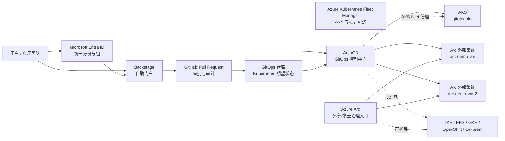

# 客户端到端演示手册：统一身份、多集群 GitOps 与 Azure Arc 多云治理

本文档是面向客户演示前的详细操作手册。它补充
[客户演示指南](./customer-demo-end-to-end-runbook.zh-cn.md)，用于演示排练、
现场讲解和问题应答。文档不包含 tenant ID、object ID、token、kubeconfig、
密码或固定环境 IP。

## 一、最佳架构建议

建议采用以下定位：

- **ArgoCD**：跨 AKS 与外部 Kubernetes 的应用交付和 Kubernetes 期望状态持续协调平面。
- **Azure Arc-enabled Kubernetes**：外部、混合云、多云 Kubernetes 接入 Azure 管理平面的桥梁。
- **Microsoft Entra ID**：统一身份、用户组和企业应用访问控制来源。
- **Backstage**：面向开发者和应用团队的自助门户。
- **GitHub Pull Request**：变更评审、审批和审计记录。
- **Azure Kubernetes Fleet Manager**：AKS 专项 fleet 分组、治理和发布能力；可选，不是多云 GitOps 的前提。

推荐对客户这样解释：

> ArgoCD 是跨集群应用交付和 Kubernetes 期望状态控制平面；Azure Arc 是外部和多云 Kubernetes 接入 Azure 治理体系的管理平面桥梁；Fleet 适合 AKS fleet 专项治理，但不是 ArgoCD 多集群 GitOps 的必需组件。

## 二、参考架构



关键边界：

| 能力 | 推荐负责人 | 说明 |
| --- | --- | --- |
| 应用交付与 Kubernetes 期望状态 | ArgoCD | 本项目唯一持续协调器 |
| 外部/多云 Kubernetes 的 Azure 管理视图 | Azure Arc | 资产、访问、策略、监控、Defender、扩展 |
| AKS fleet 专项治理 | Fleet，可选 | 适合 AKS fleet 分组和发布，不负责多云 GitOps |
| 自助入口 | Backstage | 生成标准 GitOps PR，不持有普通用户写集群凭据 |
| 身份与组 | Microsoft Entra ID | 统一用户和权限来源 |
| 审批审计 | GitHub PR | 分支保护和人工/自动评审 |

## 三、演示前检查清单

### 1. 控制面健康检查

```powershell
kubectl --context gitops-aks-admin -n argocd get applications
kubectl --context gitops-aks-admin -n backstage get pods
kubectl --context gitops-aks-admin -n platform-access-system get sa,role,rolebinding,configmap
```

期望结果：

- ArgoCD 核心应用为 `Synced` / `Healthy`。
- Backstage Pod 正常运行。
- `platform-access-system` 中存在 Backstage reader、connection registry 的
  ServiceAccount/RBAC 和 `platform-access-policy` ConfigMap。
- `backstage-connection-registry` 是 ArgoCD Sync hook，成功后 Job/Pod 会按
  `HookSucceeded` 清理，因此该 namespace 没有常驻 Pod 是正常现象。

### 2. ArgoCD AppProject 检查

```powershell
kubectl --context gitops-aks-admin -n argocd get appproject kind-team-delivery
kubectl --context gitops-aks-admin -n argocd get appproject aks-team-delivery
```

期望边界：

| AppProject | 允许目标 |
| --- | --- |
| `kind-team-delivery` | `arc-demo-vm/group1-apps`、`arc-demo-vm-2/group1-apps` |
| `aks-team-delivery` | `gitops-aks/group2-aks-apps` |

### 3. Backstage Catalog 检查

```powershell
Set-Location backstage
yarn catalog:validate
```

期望结果：

- `resource:default/gitops-aks`
- `resource:default/arc-demo-vm`
- `resource:default/arc-demo-vm-2`
- `template:default/deploy-aks-application`
- `template:default/deploy-kind-application`

所有者应解析到 `group:default/k8sadmin`。

### 4. Entra 组同步检查

```powershell
kubectl --context gitops-aks-admin -n backstage logs deploy/backstage-backstagechart `
  | Select-String 'Reading msgraph users and groups|Committed .*msgraph groups'
```

期望结果：

- Microsoft Graph provider 已导入批准的 Entra 组。
- 用户重新登录后，Backstage token 中包含正确组 entitlement。

### 5. Arc 连接集群检查

```powershell
az connectedk8s list -g <resource-group> -o table
```

期望结果：

- `arc-demo-vm`
- `arc-demo-vm-2`

状态为 Connected 或客户可接受的健康状态。

## 四、统一身份与权限配置

### 1. 身份组设计

| Entra 组 | 作用 |
| --- | --- |
| `akspe-backstage-users` | Backstage 统一登录入口组 |
| `k8sadmin` | 平台管理员，拥有所有已注册目标的运维权限 |
| `akspe-kind-cluster-deployers` | 只能通过 Backstage/ArgoCD 向 Arc/kind 目标发起应用交付 |
| `akspe-aks-cluster-deployers` | 只能通过 Backstage/ArgoCD 向 AKS 目标发起应用交付 |

建议：

- 普通用户加入具体 persona 组。
- persona 组作为成员加入 `akspe-backstage-users`。
- `akspe-backstage-users` 只表示“允许登录 Backstage”，不等于管理员权限。
- `k8sadmin` 必须作为独立授权组映射到 Backstage token 中的
  `group:default/k8sadmin`。
- 不给普通用户长期 cluster-admin。
- 不将私有 group object ID 写入 Git。

### 2. 配置脚本职责

`scripts/configure-k8sadmin-access.ps1` 负责：

| 配置项 | 说明 |
| --- | --- |
| Entra group 解析 | 解析 `k8sadmin`、AKS deployer、kind deployer、Backstage users |
| Enterprise App assignment | 将 Backstage/ArgoCD 共用企业应用设置为需要分配，并直接分配登录入口组和 persona 组 |
| Microsoft Graph 权限 | 配置 `User.Read.All`、`GroupMember.Read.All` 并要求管理员 consent |
| Backstage group mapping Secret | 写入私有 object ID 到 Backstage group ref 的映射，并显式写入 admin group object ID |
| ArgoCD cluster Secret annotations | 给目标集群 Secret 写入私有 group object ID |
| 默认 AKS 部署目标标签 | 标记 `gitops-aks` 为当前批准的 AKS demo 部署目标 |

### 3. Backstage 身份解析

关键文件：

- `backstage/packages/backend/src/index.ts`
- `backstage/packages/backend/src/extensions/platformAccessPermissionPolicy.ts`

流程：

1. 用户通过 Microsoft Entra ID 登录 Backstage。
2. 自定义 Microsoft resolver 使用 Microsoft Graph 查询用户 transitive group membership。
3. resolver 将批准的 Entra group object ID 映射为 Backstage group ref。
4. Backstage token 的 `ent` claims 包含用户和组。
5. permission policy 根据这些 group entitlement 控制 Catalog Resource 和模板可见性。

如果用户能登录但看不到任何受保护资源，优先检查该用户是否真的属于
`k8sadmin`，而不是只属于 `akspe-backstage-users` 或某个 deployer 组。后台日志
中的 `relations.ownedBy` 过滤条件应包含 `group:default/k8sadmin`，管理员视角才
会显示全部 cluster Resources 和全部交付模板。

当前演示环境中，`demouser1` 是 AKS deployer persona，不是 k8sadmin persona；
如果使用 `demouser1` 登录，应只验证 AKS 交付入口，而不应期待看到全部集群。
要演示平台管理员视角，请使用实际属于 `k8sadmin` Entra 组的账号，或在演示前
按变更流程将专用管理员测试账号加入 `k8sadmin`。

### 3.1 ArgoCD 身份解析

ArgoCD 不会像 Backstage resolver 一样主动调用 Microsoft Graph 做 transitive
group lookup，它只消费登录 token 中的 `groups` claim。当前 Entra App 使用
`groupMembershipClaims = ApplicationGroup`，因此只有**直接分配给该 Enterprise
Application** 的组会进入 token。

`scripts/configure-k8sadmin-access.ps1` 必须直接分配以下组到同一个 Enterprise
Application：

- `akspe-backstage-users`
- `k8sadmin`
- `akspe-kind-cluster-deployers`
- `akspe-aks-cluster-deployers`

如果 `jimmy@noeltech.net` 已经是 `k8sadmin` 成员，但登录 ArgoCD 后看不到任何
Application，优先检查 `k8sadmin` 是否也被直接分配给 Enterprise Application。
只把 `akspe-backstage-users` 分配给 Enterprise Application 不够，因为 ArgoCD
RBAC 绑定的是 `k8sadmin` group object ID。

### 4. Backstage 权限策略

| 用户组 | Cluster Resource 可见性 | Template 可见性 |
| --- | --- | --- |
| `k8sadmin` | 所有受保护和非受保护资源 | 所有模板 |
| `akspe-aks-cluster-deployers` | AKS 资源，例如 `gitops-aks` | `deploy-aks-application`、`update-aks-application`、`delete-delivered-application` |
| `akspe-kind-cluster-deployers` | Arc/kind 资源，例如 `arc-demo-vm`、`arc-demo-vm-2` | `deploy-kind-application`、`update-kind-application`、`delete-delivered-application` |
| 未授权用户 | 不应看到受保护资源 | 不应看到受保护模板参数/步骤 |

受保护资源通过 Catalog annotations 标识：

```yaml
platform-access.akspe.io/protected: "true"
platform-access.akspe.io/allow-aks-deployers: "true"
platform-access.akspe.io/allow-kind-deployers: "true"
```

### 5. ArgoCD 权限边界

关键文件：

- `gitops/apps/platform-access/manifests/delivery-appprojects.yaml`
- `gitops/apps/platform-access/manifests/platform-demo-apps-appset.yaml`

强制规则：

| AppProject | 允许目标 | 允许资源 |
| --- | --- | --- |
| `aks-team-delivery` | `gitops-aks/group2-aks-apps` | Deployment、StatefulSet、ConfigMap、Secret、Service |
| `kind-team-delivery` | `arc-demo-vm/group1-apps`、`arc-demo-vm-2/group1-apps` | Deployment、StatefulSet、ConfigMap、Secret、Service |

普通用户交付 Application 不允许使用 `project: default`。

ArgoCD UI 可见性按 team/persona 边界控制：

| Entra 组 | ArgoCD 可见 Application |
| --- | --- |
| `k8sadmin` | 全部 Application 和 AppProject |
| `akspe-aks-cluster-deployers` | `aks-team-delivery/*` |
| `akspe-kind-cluster-deployers` | `kind-team-delivery/*` |

Backstage 生成的 Application 会写入 requester、persona 和 target annotations，
用于审计和后续扩展。如果客户要求“每个用户只能看到自己创建的 Application”，需要
进一步采用用户名前缀和 per-user ArgoCD RBAC；推荐 demo 先采用更符合企业管理
习惯的 team/persona 可见性。

### 6. Kubernetes RBAC

关键文件：

- `gitops/apps/platform-target-baseline/templates/rbac.yaml`

| 对象 | 权限 |
| --- | --- |
| `k8sadmin` group object ID | 每个注册目标上 `cluster-admin` |
| `akspe-aks-cluster-deployers` group object ID | AKS 目标上 `view` |
| `backstage-kubernetes-reader` ServiceAccount | Backstage Kubernetes plugin 所需 read-only inventory |

普通 deployer 的写入不通过直接 Kubernetes credential 完成，而是通过：

```text
Backstage -> GitHub PR -> ArgoCD AppProject -> 目标 namespace
```

### 7. Azure Arc RBAC 与 Portal 权限

Arc Portal 操作使用 Azure RBAC + Kubernetes RBAC 双层授权：

| 层级 | 作用 |
| --- | --- |
| Azure RBAC on connectedCluster | 决定用户能否在 Azure Portal 看到 Arc 资源、请求 cluster-connect |
| Kubernetes RBAC | 决定用户拿到连接后能否在 namespace 内操作资源 |

普通 Portal 用户建议只授予 namespace-scoped 操作，不授予 Azure Arc Kubernetes Cluster Admin。

## 五、端到端演示流程

### Step 1：开场说明架构

讲解重点：

- 一套平台模型覆盖 AKS 和外部 Kubernetes。
- 外部 Kubernetes 可来自 TKE、EKS、GKE、OpenShift、on-prem。
- ArgoCD 统一做应用 GitOps。
- Arc 提供 Azure 管理平面接入。
- Fleet 是 AKS 专项能力，可选。

### Step 2：展示 ArgoCD 作为唯一持续协调器

打开 ArgoCD，展示：

- `platform-access`
- `platform-target-baseline-*`
- `platform-demo-aks-*`

说明：

> 所有 Kubernetes 期望状态进入 Git，经 PR 审批后由 ArgoCD 持续协调。Terraform 和脚本不作为持续 Kubernetes 配置管理者。Arc/kind 的应用工作负载通过 Backstage 生成 PR 后再出现，不预置 `platform-demo-kind-*` 噪音应用。

### Step 3：展示统一身份组

展示或讲解 Entra 组：

- `akspe-backstage-users`
- `k8sadmin`
- `akspe-aks-cluster-deployers`
- `akspe-kind-cluster-deployers`

不要展示 object ID。只展示组名和用途。

### Step 4：以 AKS deployer persona 登录 Backstage

预期：

- 能看到 AKS 相关 Resource。
- 能看到 `deploy-aks-application`。
- 不应看到 Arc/kind 交付入口。

讲解：

> AKS 应用团队只能选择 AKS 发布路径。模板固定生成 `aks-team-delivery`，目标固定为批准的 AKS namespace。

### Step 5：通过 AKS 模板生成 GitOps PR

在 Backstage 选择：

- Template：`deploy-aks-application`
- Target：`gitops-aks/group2-aks-apps`
- Repo/path：使用准备好的示例应用

生成 PR 后展示：

- ArgoCD Application manifest 使用 `project: aks-team-delivery`
- destination 为 `name: gitops-aks`
- namespace 为 `group2-aks-apps`

### Step 6：展示 PR 审批与 ArgoCD 同步

说明：

- PR 是审批门。
- ArgoCD 是执行者。
- 用户没有直接写集群凭据。

如果现场不适合合并 PR，使用预先准备的 PR 或已同步 Application 展示。

### Step 6.1：在 AKS 上验证 Backstage/PR 部署结果

PR 合并后，先在控制面确认 ArgoCD Application，再到目标 AKS namespace 验证实际
Kubernetes 资源。以下命令使用 Backstage 表单中的应用名作为变量：

```powershell
$appName = "aks-store-demo"

kubectl --context gitops-aks-admin -n argocd get application $appName -o wide
kubectl --context gitops-aks-admin -n argocd describe application $appName

kubectl --context gitops-aks-admin -n group2-aks-apps get deploy,sts,svc,cm,secret,pod
kubectl --context gitops-aks-admin -n group2-aks-apps get events --sort-by=.lastTimestamp
kubectl --context gitops-aks-admin -n group2-aks-apps get pod -l app.kubernetes.io/name=$appName
```

客户讲解重点：

- ArgoCD Application 应属于 `aks-team-delivery`。
- 目标 cluster 是 `gitops-aks`，namespace 是 `group2-aks-apps`。
- 用户没有直接写 AKS 的长期凭据；应用由 ArgoCD 根据 Git 期望状态创建。
- 如果 Pod 没有 Running，优先看 `describe application`、Pod events 和 image pull
  状态，不要直接在集群里手工改对象。

### Step 7：以 kind deployer persona 登录 Backstage

预期：

- 能看到 `arc-demo-vm`、`arc-demo-vm-2`。
- 能看到 `deploy-kind-application`。
- 不应看到 AKS 交付入口。

讲解：

> 外部集群团队使用同一套 Backstage + PR + ArgoCD 模型，但目标被限制在 Arc/kind 集群的 `group1-apps` namespace。

### Step 8：通过 kind 模板生成 GitOps PR

选择：

- Template：`deploy-kind-application`
- Target：`kind-arc-demo-vms-group1`

检查生成结果：

- `project: kind-team-delivery`
- 生成一个 ArgoCD ApplicationSet，由 cluster generator 根据 ArgoCD cluster Secret
  labels 展开到 `arc-demo-vm` 和 `arc-demo-vm-2`
- namespace 为 `group1-apps`

### Step 8.1：在 Arc/kind 目标上验证 Backstage/PR 部署结果

kind 模板生成一个 ArgoCD ApplicationSet。ApplicationSet 会选择带有
`platform_backstage_delivery_enabled=true` 的 Arc/kind cluster Secrets，并展开成面向
`arc-demo-vm` 和 `arc-demo-vm-2` 的子 Application。PR 合并后，仍然先在控制面看
ApplicationSet 和 ArgoCD Applications，再进入两个 kind 目标 namespace 验证资源。

注意：PR 合并和 `Validate Backstage delivery lifecycle` 成功只说明 Git/Catalog
结构正确，不代表目标集群已经部署完成。合并后还要等待
`backstage-delivery-apps` 发现新 commit、ApplicationSet 生成子 Application、两个
子 Application 分别同步远端 kind 集群，以及 Pod readiness 完成。这个过程可能需要
几分钟；只有子 Application 和目标 workload 都健康后，才算部署完成。

为了加快现场演示，PR 合并后可以立即触发 ArgoCD refresh，而不是等下一次轮询：

```powershell
.\scripts\refresh-backstage-delivery.ps1 -ApplicationName kind-store-demo
```

这个脚本不改变 Git desired state，也不是新的部署控制器；它只是让 ArgoCD 立刻读取并同步
已经合并的 GitOps 变更。

不要在校验完成前手动合并 Backstage PR。ArgoCD 监听的是合并后的目标分支，不会等待
GitHub Actions；如果跳过 CI 直接合并，错误的 GitOps/Catalog 结构也可能先被 ArgoCD
读取。建议把 `Validate Backstage delivery lifecycle` 设为必需检查。

```powershell
$appName = "kind-store-demo"

kubectl --context gitops-aks-admin -n argocd get application backstage-delivery-apps `
  -o jsonpath="{.status.sync.status} {.status.health.status} {.status.sync.revision}{'\n'}"
kubectl --context gitops-aks-admin -n argocd get applicationset $appName -o wide
kubectl --context gitops-aks-admin -n argocd get application "$appName-arc-demo-vm" -o wide
kubectl --context gitops-aks-admin -n argocd get application "$appName-arc-demo-vm-2" -o wide
kubectl --context gitops-aks-admin -n argocd describe application "$appName-arc-demo-vm"
kubectl --context gitops-aks-admin -n argocd describe application "$appName-arc-demo-vm-2"

kubectl --context arc-demo-vm-admin -n group1-apps get deploy,sts,svc,cm,secret,pod
kubectl --context arc-demo-vm-admin -n group1-apps get events --sort-by=.lastTimestamp
kubectl --context arc-demo-vm-admin -n group1-apps get pod -l app.kubernetes.io/name=$appName

kubectl --context arc-demo-vm-2-admin -n group1-apps get deploy,sts,svc,cm,secret,pod
kubectl --context arc-demo-vm-2-admin -n group1-apps get events --sort-by=.lastTimestamp
kubectl --context arc-demo-vm-2-admin -n group1-apps get pod -l app.kubernetes.io/name=$appName
```

客户讲解重点：

- ArgoCD Application 应属于 `kind-team-delivery`。
- 目标 cluster 来自 ArgoCD cluster Secret 标签选择器，而不是 Backstage 模板硬编码。
- 目标 namespace 固定为 `group1-apps`。
- Arc 提供 Azure 管理平面视图；应用期望状态仍由 ArgoCD 从 Git 持续协调。
- 判断完成时看 ArgoCD 和 workload，不只看 PR：`backstage-delivery-apps` 已同步到
  merge revision，父 ApplicationSet 存在，`kind-store-demo-arc-demo-vm` 和
  `kind-store-demo-arc-demo-vm-2` 都是 `Synced/Healthy`，两个 `group1-apps`
  namespace 中的 workload ready。

如果以后增加第三个 Arc/kind cluster，不需要修改 Backstage 模板；只要 onboarding 后的
ArgoCD cluster Secret 带有以下 labels，就会被 ApplicationSet 自动选中：

```yaml
provider: arc
platform_cluster_type: kind
platform_access_enabled: "true"
platform_backstage_delivery_enabled: "true"
```

### Step 8.2：展示 Backstage 的更新和删除生命周期

客户常问：“Backstage 是否只能部署一次？” 推荐回答：

> Backstage 不是一次性部署工具。首次创建、后续修改和删除都可以从 Backstage 发起，
> 但它们都生成 GitHub PR；PR 合并后仍由 ArgoCD 统一同步和 prune。

当前模板分工和可见性：

| 生命周期 | Backstage 模板 | 可见用户组 | 结果 |
| --- | --- | --- | --- |
| 首次 AKS 部署 | `deploy-aks-application` | `k8sadmin`、`akspe-aks-cluster-deployers` | 新增 `gitops/apps/backstage-delivery/<app-name>/` 和 Catalog descriptor；生成 `aks-team-delivery` 下的 ArgoCD Application |
| 首次 Arc/kind 部署 | `deploy-kind-application` | `k8sadmin`、`akspe-kind-cluster-deployers` | 新增 `gitops/apps/backstage-delivery/<app-name>/` 和 Catalog descriptor；生成 `kind-team-delivery` 下的 ApplicationSet，由 ArgoCD 按 cluster labels 展开 |
| 后续 AKS 更新 | `update-aks-application` | `k8sadmin`、`akspe-aks-cluster-deployers` | 修改已有 AKS delivery manifest，例如 source revision、manifest path 或批准目标；如果应用不存在或渲染结果无变化，任务会失败而不会创建空 PR |
| 后续 Arc/kind 更新 | `update-kind-application` | `k8sadmin`、`akspe-kind-cluster-deployers` | 修改已有 Arc/kind delivery ApplicationSet；如果应用不存在或渲染结果无变化，任务会失败而不会创建空 PR |
| 删除清理 | `delete-delivered-application` | `k8sadmin`、`akspe-aks-cluster-deployers`、`akspe-kind-cluster-deployers` | 删除整个生成的 ArgoCD delivery 目录、生成的 Catalog descriptor 目录和 Catalog index target；如果任何必需 artifact 缺失或删除后仍残留，任务会失败而不会创建空 PR |

现场建议：

- 如果要重复给多个客户演示“创建”，使用不同 app name，例如
  `contoso-kind-store-demo`。
- 如果同名 app 已经存在，不要重复运行 create 模板；使用 update 模板。
- 如果要清理环境，优先使用 `delete-delivered-application` 生成删除 PR，而不是先
  `kubectl delete`。Git 中的 desired state 不删除，ArgoCD 可能会把资源重新创建。
- 合并删除 PR 前，必须在 GitHub **Files changed** 中确认
  `gitops/apps/backstage-delivery/<app-name>/`、`backstage/generated/<app-name>/`
  和 `backstage/catalog/catalog-info.yaml` 中对应 target 确实被删除；
  `changed_files = 0` 或只删除 Catalog target 的删除 PR 无效，不能触发完整
  ArgoCD prune。
- 删除模板必须使用每次唯一的 PR 分支，不能复用固定
  `backstage/delete/<app-name>` 分支。CI 会额外检查 Backstage delete PR 的文件形状；
  如果没有同时删除 delivery manifest、generated descriptor 和 Catalog target，
  即使 PR 描述写着“complete cleanup”也必须视为无效。

### Step 9：展示 Azure Arc 外部集群管理视图

打开 Azure Portal：

- 查看 Arc-enabled Kubernetes 资源。
- 展示 `arc-demo-vm` 和 `arc-demo-vm-2`。
- 讲解 Arc 的作用：Azure 管理平面、访问入口、策略、监控、Defender、扩展。

强调：

> Arc 让外部 Kubernetes 进入 Azure 治理视图，但不把它们变成 AKS。集群生命周期仍由原平台负责。

### Step 10：展示 namespace-scoped Portal 操作（可选）

如果环境健康，展示 Azure Portal Kubernetes resources：

- Namespace
- Deployment
- StatefulSet
- ConfigMap
- Secret
- Service

只展示 demo namespace，避免展示真实敏感 Secret 内容。

### Step 11：展示 k8sadmin 平台视角

以 `k8sadmin` persona 说明：

- 平台管理员可见所有目标。
- 平台管理员可验证 AKS、Arc/kind 创建/更新模板、共享删除模板和 AppProjects。
- 高权限仅限小范围、审计使用。

### Step 12：说明 Fleet 是否需要

如果客户未启用 Fleet，说明：

> 本演示的核心多集群应用交付能力不依赖 Fleet。ArgoCD 已经能对 AKS 和外部 Kubernetes 做多集群 GitOps。Fleet 的价值在 AKS fleet 专项治理，例如 AKS 集群分组、AKS fleet 级发布或 AKS 相关平台操作。

## 六、Fleet 决策建议

| 客户诉求 | 推荐 |
| --- | --- |
| 多云 Kubernetes 应用交付，覆盖 TKE/EKS/GKE/OpenShift/on-prem | ArgoCD + Azure Arc |
| Azure Portal 统一查看外部 Kubernetes 资产和治理 | Azure Arc |
| AKS 多集群分组、AKS fleet 级治理或发布 | 可引入 Fleet |
| 已经标准化 ArgoCD 管理应用 | 保持 ArgoCD 为应用 GitOps 平面 |
| 想用 Azure 原生 GitOps 配置 | 可评估 Flux v2，但必须与 ArgoCD 做资源所有权分区 |

建议结论：

- **客户多云优先**：ArgoCD + Arc 是主线。
- **客户 AKS fleet 治理优先**：在主线之外加入 Fleet。
- **不要把 Fleet 作为多云 GitOps 的前提**。

## 七、故障与 fallback

| 问题 | 现场应对 |
| --- | --- |
| Backstage 登录失败 | 展示准备好的截图，说明 Entra group mapping 与 Graph sync 流程 |
| 登录成功但看不到资源/模板 | 检查用户 token entitlement 是否包含 `group:default/k8sadmin`；`akspe-backstage-users` 只是登录入口组 |
| Graph sync 未及时刷新 | 展示日志，说明 provider 使用持久化调度；让用户重新登录刷新 token |
| PR 生成现场风险高 | 使用预先准备的 PR |
| create 模板报 `dest already exists` | 应用名已存在；使用 `update-aks-application` / `update-kind-application` 做后续变更，或换一个新 app name 演示首次创建 |
| ArgoCD 同步慢 | 展示 Application desired state 和历史健康状态 |
| Arc Portal cluster-connect 慢 | 展示 Arc inventory 和 ArgoCD 对外部集群的同步结果 |
| Fleet 未启用 | 明确 Fleet 可选；ArgoCD + Arc 已覆盖多云 GitOps 主线 |

## 八、客户常见问题回答

### Q1：能否用 Arc 作为多云多集群统一运维入口？

可以，但要准确定位。Arc 是 Azure 管理平面入口，适合资产、访问、策略、监控、Defender、扩展和 Portal 可见性。应用交付和 Kubernetes 期望状态在本方案中由 ArgoCD 统一负责。

### Q2：AKS 在 Arc 上是一等公民吗？

Azure 中的 AKS 本身就是 Azure 原生一等公民，不需要通过 Arc 才成为 Azure 资源。Arc 的重点是把外部或混合云 Kubernetes 接入 Azure 管理平面。AKS 的生命周期、节点池、升级、网络和托管身份应继续使用 AKS 原生能力。

### Q3：不用 Fleet 能不能做多集群管理？

可以。ArgoCD 可以管理多个 Kubernetes 目标集群，AppProjects 可以限制目标 cluster/namespace/resource。Fleet 是 AKS fleet 专项治理能力，不是 ArgoCD 多集群 GitOps 的前提。

### Q4：如何保证不同用户只能部署到不同集群？

本项目使用三层控制：

1. Backstage permission policy 控制用户能看到的 cluster Resource 和 Software Template。
2. 分开的 Backstage 模板固定生成不同 AppProject 和目标 namespace。
3. ArgoCD AppProjects 强制限制 cluster、namespace 和 resource kind。

即使有人绕过 UI 手工提交错误 Application，ArgoCD AppProject 也会拒绝未授权目标。

### Q5：Backstage 后续能修改或删除已经部署的应用吗？

可以。推荐模型是：

```text
Backstage update/delete template -> GitHub PR -> ArgoCD sync/prune
```

也就是说，Backstage 负责把 day-2 操作标准化成 PR；GitHub 保留审批和审计；ArgoCD
仍是唯一持续 Kubernetes 协调器。不要把 Backstage 设计成直接修改集群资源的按钮。

## 九、演示后建议的生产化路线

1. 明确客户的 Entra 组、审批链和命名规范。
2. 为 GitHub 分支保护、CODEOWNERS、PR 策略设定生产门禁。
3. 将 External Secrets / Key Vault 纳入 Secret 管理设计。
4. 对 Arc-connected external clusters 统一启用 Monitor、Defender、Policy。
5. 明确 ArgoCD 与任何 Flux v2 配置之间的资源所有权边界。
6. 如果 AKS fleet 治理是客户重点，再评估 Fleet 的 rollout 和治理能力。
7. 将 demo 中的 kind 外部集群替换为客户真实 TKE/EKS/GKE/OpenShift/on-prem 集群进行试点。

## 十、重复客户演示的删除与重置

推荐把每次客户演示的应用名加上客户或场次前缀，例如：

- `contoso-aks-store-demo`
- `contoso-kind-store-demo`

这样可以避免多场演示互相覆盖 Backstage PR 分支、ArgoCD Application 和 Kubernetes
资源。

### 1. 首选清理方式：通过 Git 删除期望状态

Backstage 生成的应用由 Git 和 ArgoCD 管理，因此清理也应先改 Git。不要把
`kubectl delete` 作为常规删除方式，否则 ArgoCD 可能会按 Git 期望状态重新创建资源。

```powershell
$appName = "aks-store-demo"

git rm -r gitops/apps/backstage-delivery/$appName
# 同时删除该 PR 生成的 catalog descriptor；路径以 PR diff 为准，
# 当前模板常见为 backstage/generated/<app-name>/catalog-info.yaml。
git rm <generated-catalog-info-path>
git commit -m "Remove $appName demo application"
git push
```

如果清理的是 kind 演示应用，把 `$appName` 换成对应 kind 应用名即可。合并清理 PR
后，ArgoCD 的 automated prune 会删除对应 Application 管理的目标资源。

删除任务在发布 PR 前会验证生成的 Application/ApplicationSet manifest 是否存在。
如果任务失败或 PR 的 `Files changed` 为空，先确认应用名和 ArgoCD 监听分支；不要合并
空 PR，也不要尝试用 `kubectl delete` 绕过 Git desired state。

### 2. 验证 AKS 清理结果

```powershell
$appName = "aks-store-demo"

kubectl --context gitops-aks-admin -n argocd get application $appName
kubectl --context gitops-aks-admin -n group2-aks-apps get deploy,sts,svc,pod
kubectl --context gitops-aks-admin -n group2-aks-apps get events --sort-by=.lastTimestamp
```

`group2-aks-apps` namespace 可以保留；它承载 demo RBAC 和后续重复演示，不建议每次
删除 namespace。

### 3. 验证 Arc/kind 清理结果

```powershell
$appName = "kind-store-demo"

kubectl --context gitops-aks-admin -n argocd get application $appName
kubectl --context arc-demo-vm-admin -n group1-apps get deploy,sts,svc,pod
kubectl --context arc-demo-vm-2-admin -n group1-apps get deploy,sts,svc,pod
```

`group1-apps` namespace 同样建议保留，只删除应用资源和 Git 期望状态。

### 4. 清理 Backstage 生成的 PR 分支

Backstage 模板默认使用以下分支命名：

- AKS：`backstage/aks/<app-name>`
- Arc/kind：`backstage/kind/<app-name>`

如果 PR 已合并但分支未自动删除，可以在 GitHub UI 删除，或使用：

```powershell
git push origin --delete backstage/aks/<app-name>
git push origin --delete backstage/kind/<app-name>
```

### 5. 应急手工删除边界

只有在 Git 已经删除期望状态、但现场需要快速恢复 UI 时，才考虑手工删除 ArgoCD
Application 或目标资源：

```powershell
kubectl --context gitops-aks-admin -n argocd delete application <app-name>
```

如果 Git 中仍然存在对应 `gitops/apps/backstage-delivery/<app-name>`，ArgoCD 或上层 ApplicationSet 可能
再次创建它。客户演示时要明确：**生产推荐路径是 Git 删除 + ArgoCD prune，不是手工
改集群。**

## 十一、相关文件

| 文件 | 用途 |
| --- | --- |
| [project-specification.md](./project-specification.md) | 项目强制规范 |
| [customer-demo-end-to-end-runbook.zh-cn.md](./customer-demo-end-to-end-runbook.zh-cn.md) | 客户概览版演示指南 |
| [backstage.md](./backstage.md) | Backstage 身份、Catalog、模板和 Kubernetes reader 说明 |
| [arc-kubernetes-onboarding.md](./arc-kubernetes-onboarding.md) | Azure Arc 接入和 Portal 权限说明 |
| [create-aks-cluster-argocd-fleet-demo.md](./create-aks-cluster-argocd-fleet-demo.md) | AKS、ArgoCD、Fleet 技术运行手册 |
| `backstage/packages/backend/src/extensions/platformAccessPermissionPolicy.ts` | Backstage 权限策略 |
| `backstage/packages/backend/src/extensions/platformDeliveryActions.ts` | 受限的 delivery update/delete action；缺少 manifest 或无 GitOps 变化时失败，防止空 PR |
| `backstage/packages/templates/deploy-aks-application/template.yaml` | AKS 应用交付模板 |
| `backstage/packages/templates/deploy-kind-application/template.yaml` | Arc/kind 应用交付模板 |
| `backstage/packages/templates/update-aks-application/template.yaml` | AKS 应用更新模板 |
| `backstage/packages/templates/update-kind-application/template.yaml` | Arc/kind 应用更新模板 |
| `backstage/packages/templates/delete-delivered-application/template.yaml` | AKS 和 Arc/kind deployer 共用的删除清理模板 |
| `gitops/apps/platform-access/manifests/delivery-appprojects.yaml` | ArgoCD AppProject 边界 |
